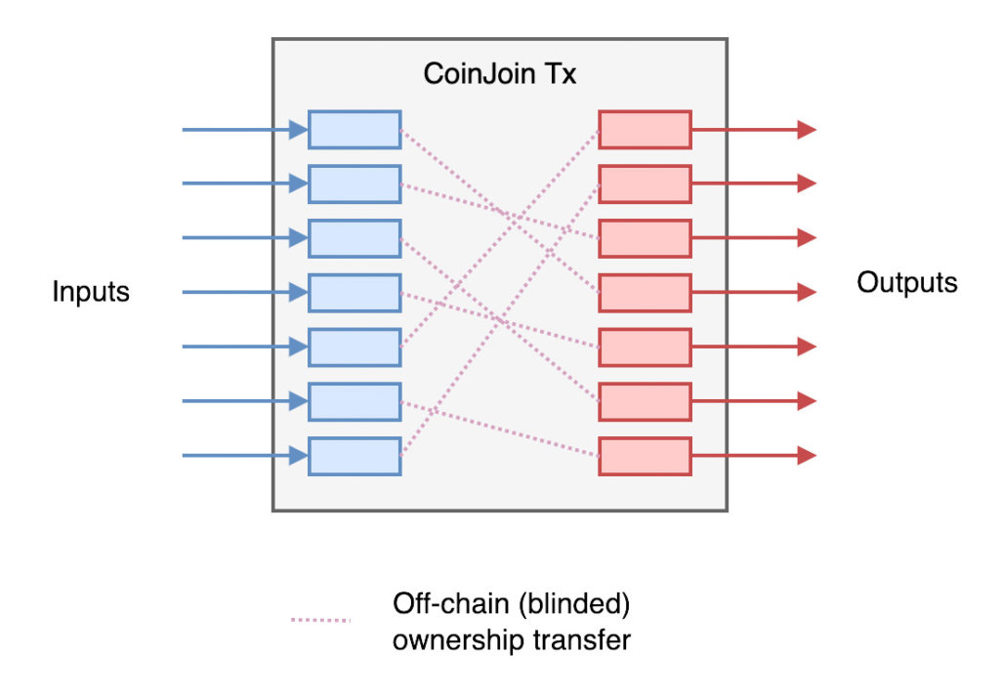

+++
date = '2025-03-06T07:27:26-05:00'
draft = false
title = 'New to Bitcoin?'
+++

<h1 style="text-align:center">Frequently Asked Questions</h1>

 

        

<h2 class="align-left" style="display: inline-block">Am I Late to Bitcoin?</h2>

 

 

 

People have been asking this since Bitcoin’s early days, convinced they’ve missed the train, but here’s the good news: <b>No, you’re not too late!</b> Bitcoin is the future of money, not a casino for getting rich quick, so it isn’t about getting into it at the perfect time—it’s about how long you can stay aboard. As the investment guru Kenneth Fisher put it, “Time <i>in</i> the market beats tim<i>ing</i> the market.” History shows that holding bitcoin for at least 4 years is long enough to see it grow in value, no matter when you start. Many Bitcoiners recommend holding (or, as they like to say, <i>"hodling"</i>) for even longer than that, as the point of Bitcoin is not to give you more dollars, but to <i>replace</i> the dollar.

 

 

 

Why 4 years? Bitcoin’s supply is capped at 21 million coins (each one divisible to a hundred-millionth, or even smaller if needed), while demand keeps rising as education spreads. When increasing demand meets Bitcoin’s unchangeable limit, prices trend up and to the right—though not without a few dips along the way. Every 4 years or so, the rate of new bitcoin being mined is cut in half, so the same (or rising) demand must then chase after half the amount of new coins.

 

 

 

This leads to a cycle of new highs, burnout, and cooldown, while usually remaining higher than the peaks of the previous round. So don’t think of Bitcoin as a way to get more dollars, but as a way to escape rising prices in the dollar system, and the ultimate savings vehicle. We’re still <i>incredibly</i> early in Bitcoin’s overall adoption—roughly only 3% of the world’s population has adopted it—so it has plenty of room to grow to the upside!

 

 

 

        

<h2 class="align-left" style="display: inline-block">What About Other Cryptocurrencies?</h2>

 

At Bitcoin Chatt, our focus is only on Bitcoin (BTC), and here’s why: Bitcoin stands alone as the only money—crypto or otherwise—with everything you’d want in a currency (more on that in the <a href="https://www.bitcoinchatt.org/new-to-bitcoin/table-of-contents/">following pages</a>). There are millions of other “cryptos” designed to muddy the waters and prey on the unaware; they churn out tokens with no real value, ripe for insider trading and gambling. If that’s your thing, fine; it’s just not part of the purpose of Bitcoin Chatt.

 

 

 

Bitcoin is different. It has no CEO, no headquarters, and no fancy foundation pulling strings. It’s owned and run by us—its users—built from the ground up to replace the broken banking system, not reinvent a worse version of it like cryptos do. Phil Geiger,  <a target="_blank" href="https://www.unchained.com/">Unchained Capital</a>, summarized it perfectly: "<b>Fiat:</b> <i>only central bankers</i> can print money. <b>Crypto:</b> <i>everyone</i> can print money. <b>Bitcoin:</b> <i>nobody</i> can print money." That’s the level of integrity that Bitcoin represents, which is why we’re laser-focused on it.

 

 

 

If you still think that other cryptocurrencies have potential, here are some videos that dive deeper into this question:

<h3 style="text-align:center">Why All Cryptos—Shitcoins—Will Fail</h3>
<iframe width="700" height="394" src="https://www.youtube.com/embed/TIkqBZnrKJM" title="YouTube video player" frameborder="0" allow="accelerometer; autoplay; clipboard-write; encrypted-media; gyroscope; picture-in-picture; web-share" referrerpolicy="strict-origin-when-cross-origin" allowfullscreen></iframe>

 

<h3 style="text-align:center">Bitcoin, Not Crypto — Part 1: In Search of a Finite Monetary Policy</h3>
<iframe width="700" height="394" src="https://www.youtube.com/embed/19LA7ReARCQ" title="YouTube video player" frameborder="0" allow="accelerometer; autoplay; clipboard-write; encrypted-media; gyroscope; picture-in-picture; web-share" referrerpolicy="strict-origin-when-cross-origin" allowfullscreen></iframe>

 

<h3 style="text-align:center">Bitcoin, Not Crypto — Part 2: Bitcoin, Not Blockchain</h3>
<iframe width="700" height="394" src="https://www.youtube.com/embed/YroOIC8eDrk" title="YouTube video player" frameborder="0" allow="accelerometer; autoplay; clipboard-write; encrypted-media; gyroscope; picture-in-picture; web-share" referrerpolicy="strict-origin-when-cross-origin" allowfullscreen></iframe>

 

<h3 style="text-align:center">Bitcoin, Not Crypto — Part 3: Everything Else Will Be Built on Bitcoin</h3>
<iframe width="700" height="394" src="https://www.youtube.com/embed/ZsgZjAPjxDU" title="YouTube video player" frameborder="0" allow="accelerometer; autoplay; clipboard-write; encrypted-media; gyroscope; picture-in-picture; web-share" referrerpolicy="strict-origin-when-cross-origin" allowfullscreen></iframe>

 

        

<h2 class="align-left" style="display: inline-block">Is Bitcoin Bad for the Environment?</h2>

 

No, Bitcoin is not bad for the environment—actually, <b><i>it’s the game-changer we need to clean it up!</i></b> Bitcoin protects its transactions by primarily using energy that would otherwise go to waste. This isn’t just smart; it flips the script on environmental damage, turning a problem into a solution. Bitcoin miners are incentivized to find cheap energy, which helps fund and build reliable and clean sources of energy, sparking innovation that cuts humanity's carbon footprint significantly.

 

 

 

<b>For any form of money to be worth anything, it must rely on energy.</b> Gold needs mining rigs to tear up the earth, and fiat currencies have banks, armored trucks, dishonest politicians, and even wars to back them up—all messy and wasteful. But Bitcoin fulfills the role of money more cleanly, efficiently, and peacefully than any type of money before it. Its energy use is a feature, not a bug, as it keeps the network ironclad and decentralized while pushing us toward a greener future.

 

Watch this video to learn more:

<iframe width="700" height="394" src="https://www.youtube.com/embed/b-7dMVcVWgc?si=I9uPekJbxRyX-1x0" title="YouTube video player" frameborder="0" allow="accelerometer; autoplay; clipboard-write; encrypted-media; gyroscope; picture-in-picture; web-share" referrerpolicy="strict-origin-when-cross-origin" allowfullscreen></iframe>

 

        

<h2 class="align-left" style="display: inline-block">What If the Power Grid or Internet Go Down?</h2>

 

Don’t worry—Bitcoin’s got this covered! Its genius lies in its decentralized design, meaning it’s not shackled to a single server or location. Copies of Bitcoin’s transaction history and protocol are scattered across <i>thousands</i> of computers—known as nodes—worldwide, so even if parts of the power grid or internet were to crash, the network keeps running, wherever nodes are still active. And as long as your private key is safe, your bitcoin will waiting for you when power is restored.

 

 

 

If the internet goes dark, that won't be a problem, either: Bitcoin is just information that's secured through work, so it would still be accessible through satellites, radio waves, USB drives, and any other communications medium. So just like with a power outage, if your private key is safe, your bitcoin will be safe and ready for you when connections are reestablished.

 

What about a worst-case scenario in which every single computer everywhere somehow gets shuts down, and they can't be restarted? It's true that in <i>that</i> situation, Bitcoin would be gone (until society is rebuilt and the nodes are turned back on), but the truth is that we’d have <i>much</i> bigger problems than not having digital, censorship resistant, and perfectly sound money. Cash, gold, and other stores of value would be similarly useless, since the need for immediate survival would trump everything else.

 

 

 

But until a day like that comes, Bitcoin's decentralized backbone and multi-medium flexibility will keep it prepared for whatever the future throws at it.

 

        

<h2 class="align-left" style="display: inline-block">Is Bitcoin a Scam/Ponzi Scheme?</h2>

 

Bitcoin is often labeled a scam or Ponzi scheme, but when you look at it more closely, that claim doesn’t hold up. A Ponzi scheme is a fraud where early investors get paid by a central scammer with money from new investors, while the truth remains hidden until the whole scheme collapses. Bitcoin could hardly be more different: It uses a transparent ledger known as the Timechain (often called a "blockchain"), in which every transaction is visible. There is no central figure pulling strings, and its creator, Satoshi Nakamoto, didn't give himself any bitcoin for free, but it can be proven that he followed all the same mining rules as everyone else. Bitcoin has been around since 2009 and hit a multi-trillion-dollar market cap recently, which no scam could sustain for long.

 

 

 

It's true that Bitcoin's price has increased substantially over the years, but the rising demand for it comes from the real problems it solves: its fixed supply of 21 million coins makes it impossible to debase, its public audit approximately every 10 minutes eliminates the possibility of fraud, and its decentralized network lets you transact globally without fear of censorship or confiscation. So as long as anyone wants to save their hard-earned money without its purchasing power being drained away by inflation, or have the assurance that there will never be a chargeback, or send and receive money without fear of it being frozen, then there will always be demand for bitcoin. And when that rising demand meets Bitcoin's fixed supply, its price goes up.

 

<b>That's not a Ponzi scheme; that's simple supply-and-demand economics.</b>

 

Learn more here: https://www.lynalden.com/bitcoin-ponzi-scheme/

 

        

<h2 class="align-left" style="display: inline-block">Isn’t Bitcoin Used for Illegal Activities?</h2>

 

While it's true that some criminals have used bitcoin for illegal activities, it would be wrong to conclude that Bitcoin is uniquely designed for criminal activity. Criminals and terrorists still overwhelmingly prefer to use the US dollar for illicit dealings, with estimates suggesting that up to 30% of all physical cash in circulation is tied to illegal activity <a target="_blank" href="https://www.philadelphiafed.org/-/media/frbp/assets/working-papers/2017/wp17-02.pdf">1</a>. In contrast, a Chainalysis report from 2022 shows that only about 0.12% of bitcoin transactions were linked to illicit purposes<a target="_blank" href="https://go.chainalysis.com/2022-Crypto-Crime-Report.html">2</a>. That’s a minuscule fraction by comparison, and likely due to the fact that Bitcoin's Timechain (often called a "blockchain") is public and frequently audited. So, if we’re pointing fingers at tools of crime, the dollar is far ahead in the race, yet no one’s calling it “bad” because of that (it's bad for other reasons, but not that one).

 

 

 

Even if criminals and terrorists suddenly switched to using bitcoin more than anything else, it wouldn’t mean bitcoin itself is flawed. Criminals also use oxygen to breathe, water to drink, and roads to travel—does that make those things evil? Of course not. <b>Tools are neutral; it’s the intent behind their use that matters.</b> Sure, bad actors might choose to use it badly, just as they might do with anything else, but that’s a poor reason to dismiss a technology with such transformative potential.

 

        

<h2 class="align-left" style="display: inline-block">What is Bitcoin Backed By?</h2>

 

The question of what “backs” Bitcoin often trips people up because we’ve been trained by the fiat system to think money needs something tangible propping it up. The US dollar used to be tied to gold, <a target="_blank" href="https://wtfhappenedin1971.com/">until that link was severed in 1971</a>, leaving it “backed” by nothing but trust in untrustworthy leaders of governments and central banks. Today’s dollars are just paper promises, propped up by force and fear, not any hard asset. So when we ask what backs Bitcoin, we’re starting from a flawed premise built on our experiences with dollars and gold. But here's something most people don't think to ask: what backs the value of gold?

 

 

 

Gold is backed by the time and energy it takes to dig it out of the earth, refine it, and shape it into coins or bars. The scarcity and the effort required to get it are what make it precious; it doesn't have "intrinsic value" (nothing does). The same goes for bitcoin. It’s "mined" through computational work, using energy to guess the answer to a math problem that, once found, can be used to easily prove that work was done to find the correct number. Thousands of computers around the world run these numbers approximately every 10 minutes to verify all bitcoin in circulation, and ensure that all transactions are legitimate. This means that Bitcoin is ultimately backed by immutable math, unbreakable energy, and unchangeable code, which are <i>infinitely</i> more reliable than corrupt bureaucrats.

 

        

<h2 class="align-left" style="display: inline-block">How Will Miners Get Paid After All the Bitcoin is Mined?</h2>

 

Bitcoin miners are powerful computers that expend a lot of electricity to rapidly guess huge numbers. When one finds a winning number, its user receives the reward of new bitcoin, along with transaction fees. At first, the reward was 50 new bitcoin for every new block. About 4 years later, that was automatically cut down to 25 bitcoin. Then, 4 years after that, it was cut to 12.5 new bitcoin, then 6.25, and then 3.125. Eventually, sometime around the year 2136, only 1 sat (0.00000001 BTC) will be awarded to the miners for every block, and then, around 2140, the last sat will be mined, and no new bitcoin will ever exist.

 

 

 

Sometime between now and then, the amount awarded from transaction fees will gradually pass the amount of new bitcoin awarded. And then, after all the bitcoin that will ever exist has been issued, transaction fees will become the only source of income for the miners.

 

If that's not enough for some miners, then they will drop off the network, and only those who will still be profitable in that situation (i.e., they have very cheap or free electricity) will continue mining. This won't affect Bitcoin negatively, though, since it has a built-in mechanism called the Difficulty Adjustment. This automatically adjusts the difficulty of mining new blocks every 2 weeks, so whether miners join or leave, the heartbeat of Bitcoin's timechain/blockchain can continue beating.

 

        

<h2 class="align-left" style="display: inline-block">How Can Bitcoin be Used as Money When Its Price is So Volatile?</h2>

 

Bitcoin is still very, very young, so volatility should be expected while the global market figures out what it's really worth. Bitcoin still has a <i>lot</i> of upside ahead of it, so you can think of its volatility as the "price of admission" for this wild ride!

 

For anything to become money, it has to grow through 3 stages, and in this order:
<ul>
<li>Store of Value</li>
<li>Medium of Exchange</li>
<li>Unit of Account</li>
</ul>

 

 

 

Bitcoin has already graduated past the <b>Store of Value</b> phase. This isn't about its current exchange rate, but about how well it can stick to its issuance schedule and overall maximum of just under 21 million coins. Bitcoin is currently entering its <b>Medium of Exchange</b> phase, as <a href="https://www.bitcoinchatt.org/map">more businesses are accepting it for payment,</a> but it's not fully there yet. And only when Bitcoin has become a language in our minds, and we're all fluent in it—when everyone intuitively understands the value of any given number of sats, the way you know how much $100 is worth—that's when Bitcoin will become a <b>Unit of Account</b>

 

Once Bitcoin is a Unit of Account, you can expect its price to be less volatile, though it will still gradually increase according to global GDP. By that time, we won't be measuring bitcoin in dollars, but everything else will be priced in bitcoin, and their prices will gradually fall with Bitcoin's appreciation. Until then, it will often be difficult to use bitcoin as money, but your reward for doing so is exposure to the greatest asymmetric trade in the history of humanity.

 

        

<h2 class="align-left" style="display: inline-block">Can Bitcoin Be Hacked?</h2>

 

Bitcoin has never been hacked since it started running in 2009, and it’s designed to stay that way forever. It runs on a network of thousands of computers—called nodes—worldwide, each with a full copy of its protocol and ledger, the Timechain (often called a "blockchain"). To hack Bitcoin, someone would need to control every single node—not just most, but <i><b>all</b></i>—simultaneously, and change its rules without anyone noticing. The impossibility of such a task cannot be overstated; even one honest node restarting with the original rules would undo the attack.

 

 

 

Hacks happen <i>around</i> Bitcoin—think stolen private keys or breached exchanges—but that’s not a hack on Bitcoin itself, just like a bank heist doesn’t break the dollar system. Bitcoin’s security relies on miners using energy to confirm transactions, making it too expensive and complex to ever reverse. Plus, its public ledger checks itself and updates approximately every 10 minutes, so any attempt at tampering would be quickly exposed.

 

Cryptography could theoretically be cracked in the future as new tech is developed, but Bitcoin probably wouldn't be an attackers first target, since bank accounts and nuclear launch codes are likewise protected by cryptography, and Bitcoin can always adapt around any new development. With no central weak spot and a global defensive network of nodes run by an ever-vigilant cohort of Bitcoiners, Bitcoin is a nearly unshakable fortress that can only fall if every node fails at the same time, and are never rebooted, which is unlikely to happen any time soon, if ever.

 

        

<h2 class="align-left" style="display: inline-block">How Private is Bitcoin?</h2>

 

Bitcoin’s privacy is not absolute, but it provides strong, practical protection for most users. <b>No system can ever offer perfect anonymity</b>—traces can always be found with enough effort, whether we're talking about cash or a cryptocurrency. Some cryptocurrencies claim to have enhanced privacy, but their small user bases make individuals easier to identify, and their centralized governance leave them prone to control and failure. Bitcoin’s large, decentralized network delivers reliable privacy that withstands real-world scrutiny.

 

On-chain Bitcoin transactions are publicly recorded on its Timechain (often called a "blockchain"), where they're visible and verifiable for all, but they do not inherently reveal anyone's personal identity. However, if a user were to identify themselves to an exchange that requires their personal information, anyone working at that exchange would be able to link that user's identity to their coins. While most exchanges are required to adhere to KYC ("Know Your Customer") and AML ("Anti Money Laundering") laws, there are still <a target="_blank" href="https://kycnot.me/?t=&q=&btc=on&ln=on&fiat=on&cash=on">many methods</a> of acquiring bitcoin without giving up your personal information.

 

 

 

To enhance Bitcoin's privacy, a process known as <a target="_blank" href="https://bitcoinmagazine.com/technical/a-comprehensive-bitcoin-coinjoin-guide">CoinJoin</a> can mix bitcoin from multiple users in a transaction and obscure their history and future ownership. Additionally, the <a target="_blank" href="https://lightning.network/">Lightning Network</a> enables off-chain payments hidden from the public ledger, with even network nodes unable to trace the full path between the sender and receiver. Additionally, locking up bitcoin in an <a target="_blank" href="https://cashu.space/">ecash</a> token allows it to be transferred privately via any medium, like email or a piece of paper, without necessarily leaving a digital trail. Bitcoin’s layered privacy tools offer a robust, adaptable solution that outperforms overhyped alternatives.

 

        

<h2 class="align-left" style="display: inline-block">Why is Bitcoin Important?</h2>

 

Bitcoin is important because it offers a decentralized alternative to traditional money, operating on a network that no single authority controls. This structure lets people send and receive funds without needing permission from banks or governments, ensuring transactions remain private and secure. For Chattanoogans, this means <b>we can use our own money without worrying about it being frozen or seized</b>—an advantage in an era where financial oversight is on the rise.

 

 

 

Local businesses in Chattanooga can benefit from Bitcoin, too. In order to accept credit card payments, businesses must pay fees of 2-3% to cover possible fraud and chargebacks. But <b>no fraudulent transaction has <i>ever</i> been confirmed on Bitcoin's ledger,</b> the Timechain (often called a "blockchain"), and all bitcoin transactions are <i>final</i>. So a business that accepts bitcoin can avoid those costs, potentially lowering prices for customers, increasing business profits, and keeping more revenue in the community.

 

Bitcoin’s fixed supply of 21 million coins makes it truly unique. Unlike dollars, which lose value when more are printed, <b>Bitcoin can’t be debased</b>. If the amount you own is the numerator in the fraction of the total supply, then the denominator will forever be 21 million. As more people learn about what Bitcoin can do, demand for it will continue to rise, and as that rising demand meets its unchangeable supply, the price goes up. Historically, it's wise to hold your bitcoin for at least 4 years, so for many Chattanoogans, this is the long-term savings vehicle they desperately need, as a shield against inflation’s steady erosion of their purchasing power.

 

 

 

Bitcoin's price increasing with time also ties into a concept called <i>time preference</i>, which measures how much the present is prioritized over the future. Like in <a target="_blank" href="https://youtu.be/2xMgHKxukr0">Stanford University's famous marshmallow test</a>, those with high time preference cannot delay gratification, and quickly eat the marshmallow, but those with low time preference are able to delay gratification, and work hard in the present to receive a greater reward (like a second marshmallow) in the future. Bitcoin’s limited supply, immutable code, and increasing value <b>train its users to lower their time preference,</b> leading to greater success, joy, and fulfilment in all areas of life.

 

 

 

<b>Bitcoin's importance lies in its ability to offer freedom, hope, and increased personal responsibility for its users, letting them decide for themselves how it best fits their needs.</b>

 

        

<h2 class="align-left" style="display: inline-block">What Does "Est. 703,083" on Bitcoin Chattanooga's Logo Mean?</h2>

 

"Est. 703,083" is a reference to Bitcoin's block height at the time when the first Bitcoin Chatt meetup began.

 

Bitcoin runs on an open and widely copied and shared ledger, known as the timechain (or blockchain). Each "page" of this ledger is called a "block", and an encrypted version of each block is included in the one that follows it, which forms a chain. Even one small change to a previous block would completely change its encrypted form, and thereby change all the other blocks after it, so as new blocks are added, older blocks become more permanent. In fact, to say it would be "set in stone" would be a <i>massive</i> understatement!

 

 

 

This makes Bitcoin's timechain an extremely reliable method for marking significant moments in history. When Bitcoin Chattanooga's creator, Jason Sellers, started the first meeting in the Edney Building downtown, at 6pm on October 1st 2021, the most recent block was number 703,083. So this is a fun way to say when Bitcoin Chattanooga started, while simultaneously giving a nod to Bitcoin's timechain.

 

 

