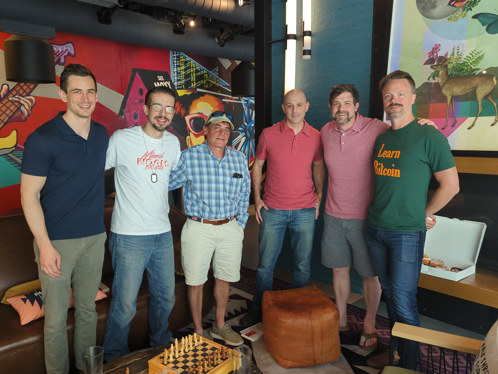

+++
date = '2025-02-19T07:27:26-05:00'
draft = false
title = 'About'
+++

# *Welcome to Bitcoin Chattanooga—“Bitcoin Chatt” for short!*

Our mission is to onboard Chattanooga to a prosperous future with the best money ever: Bitcoin. We do this by providing:  

### Free Workshops, Open to All

Nervous about Bitcoin? Our workshops demystify it, easing your fears. Prefer to teach yourself, but unsure where to begin? Check out our <a href="/new-to-bitcoin">New to Bitcoin</a> page for resources!

### Tools for Businesses to Accept Bitcoin

We provide Point of Sale systems and more to help businesses adopt bitcoin. When they do, we’ll announce it to members and add them to our <a href="/map">map</a>!

### Community Service, Paid in Bitcoin

With 39% of Chattanoogans facing financial instability<a target="_blank" href="https://unitedwaycha.org/financial-stability-and-our-greater-chattanooga-community/">1</a>, our service opportunities allow you to get paid in bitcoin, so you can build long-term savings, learn vital skills, and create a beautiful community simultaneously.

Together, we’re creating a bitcoin circular economy and onboarding Chattanooga to the future of money. *Nothing stops this train!*

## Our Story

 

Bitcoin Chatt began as a humble meetup on October 1, 2021, where local Bitcoiners built friendships and educated curious visitors. In January 2025, Founder Jason Sellers visited El Salvador—the first nation to adopt bitcoin—and saw the hope that had spread from a small beach town there, to become a national phenomenon. Inspired, he returned to replicate that transformation here.

Time will tell how far we go, but you can play an important role in our efforts to make the future one of liberty and personal responsibility, of savings and hope, and of peace and prosperity. Accept bitcoin at your business and be included on our [map](/map), [join](/join) our service projects, [donate](/donate) to keep us going, or simply spread the word—your support will lead to a freer, thriving Chattanooga.

 

 

## Meet the Team

### Jason Sellers

 

Jason, Bitcoin Chatt’s Founder and Executive Director, discovered Bitcoin in 2015, and spent years learning about it through audiobooks and podcasts while working in package delivery. In 2018, he found he had a passion for Bitcoin education, and created online groups to teach others about it.

From 2022 to 2023, Jason led community growth at <a href="https://www.noah.com/">NOAH</a>, which designed a wallet app for those in developing countries to use bitcoin. He was then the Community Manager at the Spirit of Satoshi, a Large Language Model built on all Bitcoin knowledge, making it the ultimate AI expert on the topic.

In early 2024, Jason published <a href="https://a.co/d/0mcMtUC">"21 Questions: A Beginner's Guide to Bitcoin"</a>, a book that offers reliable answers to the top 21 Bitcoin-related questions from some of the most knowledgeable voices in the space. He was also the Ambassador Concierge at <a href="https://www.satlantis.io/">Satlantis</a>, a social app with Tripadvisor capabilities, until February 2025, when he left to focus all his time on building Bitcoin Chatt.

Jason and his wife Leigh Ann live in Rossville, Georgia, with their 6 homeschooled children. Follow him on both <a href="https://www.x.com/geekigai">Twitter/X</a> and <a href="https://njump.me/npub1693220pmp0a4c04a0p7hkz874vsxkyfrvtk2yk4zjyj3e4c0ugjs3r4j0c">Nostr</a>.

 

### Brett Spradlin

 

<i>Bio coming soon!</i>

 

### David W.

 

David began studying bitcoin in 2021. From podcasts, to YouTube, articles and finally able to meet up with the awesome group of people at Bitcoin Chatt. 
Him and his family left California for South Dakota in late 2019, to be closer to family and escape to a ‘Free State’. After 2 years there, opportunity knocked and landed them in Tennessee.

He founded a nonprofit that focused on helping the less fortunate. The nonprofit was funded by recyclables that were donated and redeemed for fiat, hence the name, ‘Reaching by Recycling’. He attributes his success to God and an amazing team.

 

 

### John Holler

 

John took the Orange Pill in 2020 as he watched the COVID insanity unfold and trillions of fiat dollars get created out of thin air. He also took the Cow Pill, and in 2022 started a regenerative farm with his wife, Kathryn, and two other households. Their farm is <a target="_blank" href="http://beecreektn.com/">Bee Creek Farm</a> in Crossville, TN and they prefer payment in bitcoin!

 

 

 

### Robert B.

 

Robert first bought bitcoin in 2021 as an attempt to keep up with the crushing inflation caused by the government bailouts of the last 20 years. Bitcoin has no issuer and cannot be debased, which means his hard earned savings cannot be stolen by good intentioned politicians. Robert moved to Tennessee with his family in 2023. He has a passion for personal finance, spending less than he earns, and helping families preserve their assets.

 

 

### Stephen Adkins

 

<i>Bio coming soon!</i>

 

 

