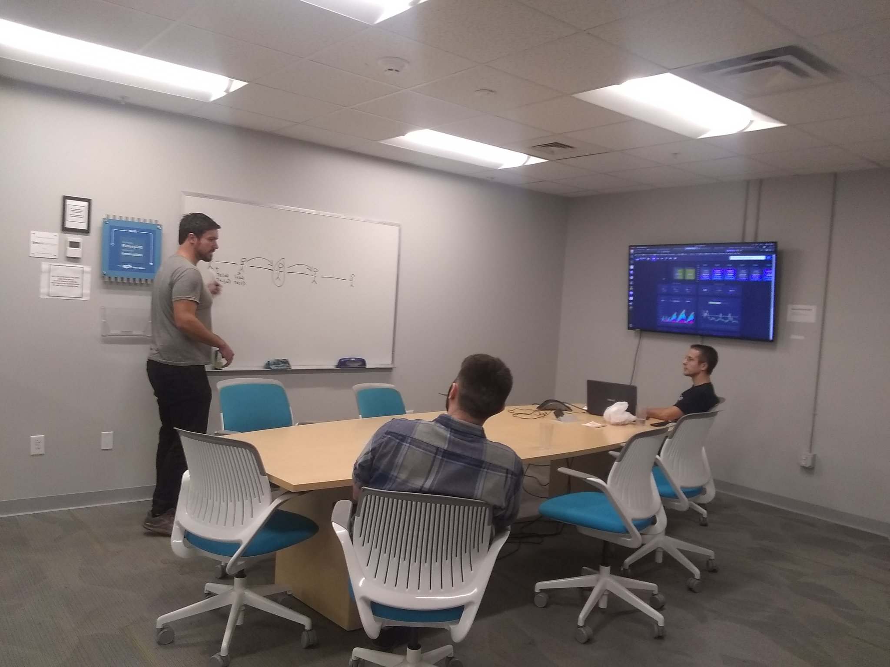

+++
date = '2025-02-19T07:27:26-05:00'
draft = false
title = 'About'
+++

<h1 class="align-center"><i>Welcome to Bitcoin Chattanooga!</i></h1>

Run by long-time Bitcoin educator, <a href="#jason-sellers">Jason Sellers</a>, Bitcoin Chattanooga (often called "Bitcoin Chatt") is turning the Chattanooga area into a Bitcoin circular economny. 

It does this by providing:

<h3>Bitcoin Workshops for Businesses and Communities</h3>

Attend our in-person classes to learn about Bitcoin, ask all your questions, and start using the future of money.

<h3>Tools for Businesses that Accept Bitcoin</h3>

From setting up Bitcoin Point of Sale systems to promoting your business to local Bitcoiners, Bitcoin Chattanooga has you covered!

<h3>White-Glove Support for All Your Bitcoin Needs</h3>

Have a general question about Bitcoin, or need help improving your Bitcoin security? Members enjoy 24/7 access to Jason's expertise, no matter what the issue is.

Together, we’re onboarding Chattanooga to the future of money. <i>Nothing stops this train!</i>

 

<h2>Bitcoin Chatt's Story</h2>

Bitcoin Chatt began as a humble meetup on <a href="https://mempool.space/block/00000000000000000004730cacd16909b9e2323eeceab1305c31edae2af07537">October 1, 2021</a>, when its organizer, Jason Sellers, saw a need for local Bitcoiners to connect and educate new Bitcoiners who visit. In January 2025, Jason visited El Salvador—the first nation to officially adopt bitcoin as money—and saw the hope that Bitcoin brought to the people there. This hope turned into a movement that spread from a small beach town, to become a national phenomenon. Inspired by this, and by those who were continuing this peaceful revolution in their own countries, he returned to the US to replicate that transformation.

We have a long way to go before this train reaches its destination, but by using Bitcoin, you can play an important role in building a future of liberty and personal responsibility, of savings and hope, and of peace and prosperity. Start today by [learning all about Bitcoin](/new-to-bitcoin), accepting bitcoin at your business—<i>we'll include you on our [map](/map) and tell Bitcoiners in the area to choose your business over others—</i>and by asking the businesses you visit to start accepting it.

[Contact](/contact) Jason to schedule an in-person or virtual meeting. And [subscribe](/join) to the newsletter for announcements, education, and a chance to win free sats (tiny pieces of bitcoin) each week!

 

<h2 id="jason-sellers">Who is Jason Sellers?</h2>

Bitcoin Chattanooga’s organizer, Jason Sellers, discovered Bitcoin in 2015, and spent years learning about it through audiobooks and podcasts while delivering packages in Soddy Daisy. In 2018, he began teaching others about Bitcoin through online groups he created and managed, and telling as many people about it as he could.

From 2022 to 2023, Jason led community growth at <a href="https://www.noah.com/">Noah</a>, a compnay that designed a wallet app for those in developing countries to use bitcoin. He was then the Community Manager at the Spirit of Satoshi, a Large Language Model built on all Bitcoin knowledge, making it the ultimate AI expert on the topic.

In early 2024, Jason published <a href="https://a.co/d/0mcMtUC">"21 Questions: A Beginner's Guide to Bitcoin"</a>, a book that offers reliable answers to the top 21 Bitcoin-related questions from some of the most knowledgeable voices in the space. Following that, he worked as the Ambassador Concierge at <a href="https://www.satlantis.io/">Satlantis</a>, a Trip-Advicor-like social app. And then, in February 2025, he turned all his time and attention to turning the Chattanooga area into a circular economy.

Jason and his wife Leigh Ann live in Rossville, Georgia, with their 6 homeschooled children. Follow him on <a href="https://www.x.com/geekigai">Twitter/X</a> and <a href="https://njump.me/npub1693220pmp0a4c04a0p7hkz874vsxkyfrvtk2yk4zjyj3e4c0ugjs3r4j0c">Nostr</a>.

