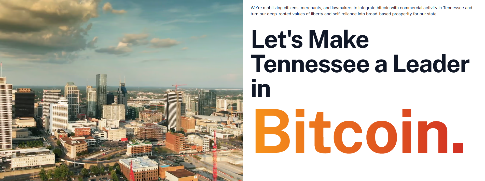

The Bitcoin Chatt
=================

#### The weekly newsletter on the Bitcoin scene in Chattanooga, TN

Saturday, 12 July 2025
---------------------

### *Issue 10*

Local Bitcoin News
------------------

### Bitcoin Chatt Joins the Tennessee Bitcoin Alliance!

On Wednesday, July 9th, Bitcoin Chatt's Founder, Jason Sellers, attended the launch party for the [Tennessee Bitcoin Alliance](https://www.tnbitcoinalliance.org/), an initiative to turn the state of Tennessee into a leader in Bitcoin adoption. Jason will continue working with it to educate lawmakers and the general public about Bitcoin, and help onboard individuals, businesses, and even our elected officials to the future of money.

 

This type of development is often met with mixed feelings among Bitcoiners. After all, isn't Bitcoin supposed to *separate* money and state? Why are we celebrating and encouraging political leaders getting into Bitcoin, when Bitcoin is all about rules without rulers?

Part of the reason is simply that this is an inevitability: eventually, *everyone* will own bitcoin, as each person, company, and political party gets some at the prices they each deserve. Additionally, this will not give the state more power, but is actually part of their capitulation to a power that will forever be greater than them, namely Bitcoin.

So when a politician starts using bitcoin, understand that rather than this being another action that gives them more power, it's an action that represents their submission to the unbreakable laws of physics, mathematics, and immutable code. It's just another essential step in freedom's unstoppable march to victory.

---

Global Bitcoin News
-------------------

### Bitcoin Hits New All Time Highs!

Also on Wednesday, July 9th, Bitcoin's price barely surpassed its previous all time high of $112,000. And then on Thursday and Friday, it *blasted* past that point, to reach a new all time high (as of the writing of this newsletter) of just under $119,000. Due to the rate of newly mined bitcoins being cut in half approximately every 4 years, Bitcoin's price experiences a massive bull market about every 4 years, so these current moves have been expected, and are happening right on time.

 

Past bull markets ended with *extreme* enthusiasm and upward momentum, but we're nowhere near that right now. Of course, no one knows the future, so this timeless wisdom still holds true: *treat your bitcoin like a long-term savings account, for money that you don't plan to touch for at least 4 years.* As you learn more about Bitcoin's inherent benefits—like its absolute scarcity, its censorship resistance, and the ease of taking custody of it yourself—you'll see why demand for it will always rise, and why as that ever-rising demand meets Bitcoin's fixed supply, its price can only go up, on a long enough time scale. That's when you'll realize that Bitcoin is the only escape from the collapsing fiat system, and then you'll never look back.

---

### Introducing GLOK: the Essential Safety App for Bitcoiners

Last Monday, July 7th, a new app for Bitcoiners was [announced on X](https://x.com/GlokApp/status/1942164642450543012) and [Nostr](https://primal.net/e/nevent1qqspx6p954pjdu0dwzklsv4l8wfcxwk5kezmv6yphcfnv0rzjmjglzqddcme8), called [GLOK](https://glok.me/) (not to be confused with X's AI, G*r*ok). Since Bitcoin's inception, many methods have been employed to attempt to steal bitcoin from those who hold it. From malware to phishing attacks, it seems like thieves have tried everything, and their techniques have evolved as Bitcoin has grown in price, usage, and security. But when all else fails, desperate attackers have been known to resort to [using pure force](https://xkcd.com/538/) on someone to get them to give up their private key. Using a multi-sig wallet—a wallet app that requires at least 2 separate private keys in order to access and send any of the bitcoin—can help mitigate against this, but even if it keeps your bitcoin safe, it may not stop you from getting hurt, or worse.

 

That's where GLOK comes in. [GLOK](https://glok.me/announcing-glok-the-next-chapter-in-bitcoiners-arms-race/) is an open source, private, Nostr-native geolocation app that enables you to instantly call for help when you find yourself in a potentially dangerous situation. It doesn't track you when you don't need help, but as soon as you press the big red button in the app, it pinpoints your phone's location and immediately alerts your list of family and friends in the app, so they can come to your rescue. It's still in development, but you can sign up to be among their first users at [glok.me](https://glok.me/).

 

---

Your Bitcoin Tip
----------------

### This Week's Essential Bitcoin Knowledge

Whether you're just getting started with Bitcoin, or you've been using it for some time, a great wallet to use is one called [Manna Wallet](https://mannabitcoin.com/). This is a new type of wallet that integrates on-chain bitcoin, the Lightning Network, and the Liquid Network in one app, with one unified balance. It's self-custodial, open source, and allows you to choose your own Lightning Address (i.e., "[your username here]@mannabitcoin.com"), which looks like an email address, but is used for receiving bitcoin over the Lightning Network. We talk about Lightning on our [Intro to Bitcoin](https://www.bitcoinchatt.com/new-to-bitcoin/intro-to-bitcoin/) and [How to Use Bitcoin](https://www.bitcoinchatt.com/new-to-bitcoin/how-to-use-bitcoin/) pages, and we'll go into it more in future newsletters, but what exactly is the *Liquid* Network?

 

The Liquid Network is known as a "sidechain", and while it's *connected* to Bitcoin's blockchain, it's separate from it. Liquid is designed to make Bitcoin transactions faster and more private, without needing to create and manage channels, as one needs to do when using Lightning self-custodially. Instead, users to lock their bitcoin in a transaction on the main blockchain, and create an equal amount of "Liquid Bitcoin" (L-BTC) on Liquid's ledger. These L-BTC can then be sent quickly and privately on the Liquid sidechain, with the option to unlock them on Bitcoin's foundational ledger later. Unlike Bitcoin's main blockchain, Liquid uses a different system and a smaller group of participants to confirm transactions, which speeds things up and hides the amounts being sent.

Several wallet apps, like [Manna](https://mannabitcoin.com/), [Aqua](https://aqua.net/), and [CoinOS](https://coinos.io/), use Liquid's sidechain as a bridge between the main blockchain and the Lightning Network. This gives the wallet greater interoperability with other wallets, as well as privacy and simplicity without having to manage one's own Lightning channels. And in the case of wallets like Manna, Aqua, and [Blockstream](https://blockstream.com/app/) (formerly "Green Wallet"), it also gives the user complete custody over their funds. This  often means the wallet needs to take an additional fee when sending or receiving bitcoin, but that's a small price to pay for simplicity, interoperability, and self sovereignty.

---

Recommended Resource
--------------------

Want to learn more about Bitcoin, but are unsure where to begin? You can always complete our [New to Bitcoin](https://www.bitcoinchatt.com/new-to-bitcoin) course, but if you're looking for something different, here's our suggested educational resource for this week:

 

Ben Perrin, a.k.a. BTC Sessions, recently published his "Zero to Hero Bitcoiner in One Page", and it's absolute fire! 🔥 This page has videos covering *everything* about Bitcoin, from the most basic to the most technical. Check it out at [BTCSessions.ca/learn]().

---

Meme of the Week
----------------

 

See a larger version of this meme [here](https://i.nostr.build/ZJsUEB8Csfbnhuwe.png).

And see where "Forever, Laura" came from [here](https://www.youtube.com/watch?v=zTPoRDrtc0s).

---

Closing Thoughts
----------------

Several weeks ago, back in Issue 003 of his newsletter, I wrote a summary of the discussion we had at the Bitcoin Chatt meetup on May 17th. In it, I explained that the discussion turned toward how I plan to continue supporting my family while the Bitcoin Chattanooga nonprofit isn't receiving many donations. I said that I knew when I would need to start looking for a job to pay the bills, first as something part-time, alongside my efforts with Bitcoin Chatt, and then as a complete full-time replacement, should that ever be needed. Fortunately, it still has not reached that point. But a very flexible, part-time opportunity presented itself (cleaning AirBNBs on a very flexible schedule), which will not only allow me to extend the time that I'll be able to keep the nonprofit running, but may also be the first step in a larger goal that I have for Bitcoin Chattanooga.

The end goal for Bitcoin Chatt has always been and will always be turning the Chattanooga area into a Bitcoin circular economy, but this goes far beyond teaching locals about Bitcoin and freely advertising for businesses that start accepting it for payment. There's another problem that Bitcoin solves, but that many aren't yet able to take advantage of: saving for the future. Recent surveys have shown that roughly 40% of people in the Chattanooga area have no savings at all, and are living paycheck-to-paycheck. They're literally just *one* layoff, *one* recession, or *one* bad management change away from complete destitution. They could start getting paid in bitcoin and pay for everything with bitcoin, but after all is paid for, they'd still have nothing left over to save with.

 

That's why my plan is to start an initiative as part of Bitcoin Chattanooga that I'm calling *"Proof of Work"*. My idea is to provide access to short-term "gigs"—like picking up litter in a park or along the side of a highway—that people can do on the side, and get paid for it with bitcoin. It would be an extra source of income that could go straight to their savings, KYC-free. Or, if someone needs fiat right away so they can pay off an outstanding bill, they can opt to get paid with dollars, instead. With everything else I've been working on, though, I wasn't sure how I was going to start this Proof of Work initiative, but now my own "side hustle" of cleaning AirBNBs once on a flexible basis *might* end up kickstarting this initiative. The owner of the cleaning company has told me she's very interested in learning more about Bitcoin, so it looks promising!

We need to remember that the most important thing about Bitcoin isn't the technology, or even how we can use it to save for our own futures; it's about how it can affect the lives of those with the greatest needs in very real ways. In other words, ***if we're not fixing the money in order to fix the world by first fixing the lives of individuals around us, then what are we fixing the money for?*** There are many people who would love to start hodling bitcoin, but life's circumstances are preventing them from being able to do so. Part of Bitcoin Chattanooga's mission through "Proof of Work" is to help fix that for anyone willing to learn about Bitcoin and do the work required to earn it.

 

See you all at Bitcoin Chatt next week.

Jason

