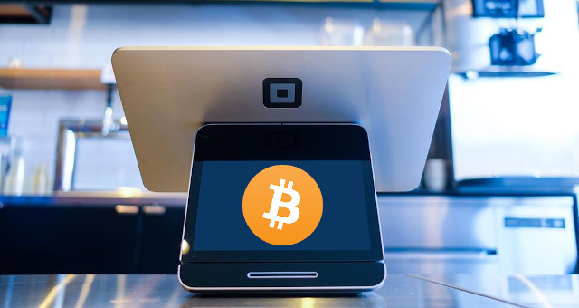

The Bitcoin Chatt
=================

#### The weekly newsletter on the Bitcoin scene in Chattanooga, TN

Saturday, 26 July 2025
---------------------

### *Issue 12*

Local Bitcoin News
------------------

### Bitcoin Chattanooga is No Longer a Nonprofit

As was mentioned in last week's email, those in attendance at the Bitcoin Chatt meetup discussed whether Bitcoin Chattanooga should remain a nonprofit, or switch to a different structure. The decision was made unanimously by everyone there—and later by the rest of the board of directors—to dissolve Bitcoin Chattanooga as a nonprofit. It will continue forward in its mission to turn the Chattanooga area into a Bitcoin circular economy, but it will go about that from a new angle. This train isn't stopping; it's just upgrading its fuel source.

 

Jason had initially set up Bitcoin Chattanooga as a nonprofit so that new Bitcoiners could pay what they felt their Bitcoin education was worth, in a "value-for-value" model, and so long-time Bitcoiners freely support our mission. There were many problems with this method, though, such as placing the burden of valuing Bitcoin education on those who knew the least about it, as well as submitting to government overreach to we could use tax deductions as an incentive for donations. Running Bitcoin Chattanooga as a nonprofit proved to be financially unsustainable and incompatible with our ethos.

So from now on, Jason will run Bitcoin Chattanooga as a for-profit business, charging a consultation fee when meeting with business owners and onboarding their teams, and a tiered monthly subscription for open access to his white-glove user support service. He will not only teach Bitcoin basics like self-custody and how to send/receive bitcoin transactions, but also how to mine, run a node, and manage one's bitcoin security. He's still working on the specific prices for each service, so watch for those to be announced on the website and in this newsletter shortly.

 

And speaking of the website, its URL is now [BitcoinChatt***.com***](https://www.bitcoinchatt.com/), instead of ending with *.org*, and BitcoinChatt.org redirects to BitcoinChatt.com, though, so everything with the URL on it, from the business cards to the t-shirts, will still lead to the right place.

---

Global Bitcoin News
-------------------

### Square, Inc. Rolls Out Bitcoin Compatibility to All Its Terminals

As of July 23, 2025, Square, Inc., a leading point-of-sale provider under Block, Inc., has begun enabling Bitcoin payments across its network of over 4 million merchants. The rollout, which leverages the Bitcoin Lightning Network for near-instant, low-cost, final-settlement transactions, allows businesses to accept Bitcoin directly through existing Square terminals without additional hardware. Merchants can choose to hold the Bitcoin or instantly convert it to fiat, shielding them from price volatility while offering customers a seamless payment experience via a simple QR code scan at checkout.

 

This move marks a significant step toward making Bitcoin a practical, everyday currency, aligning with Square’s mission to empower businesses with flexible payment options. With transactions processed swiftly and fees significantly lower than traditional credit card systems, merchants can retain more revenue, as demonstrated by early adopters like Steak ‘n Shake, which reported a 50% decrease in payment processing costs. The rollout is starting with select merchants, but will expand to all eligible merchants by early 2026.

### Western Union CEO Embraces Bitcoin with New On/Off Ramp Services

Western Union CEO Embraces Bitcoin with New On/Off Ramp ServicesOn July 21, 2025, Western Union CEO Devin McGranahan announced the company’s bold move to integrate bitcoin on- and off-ramp services, a transformative step for the global remittance leader. Recognizing that Western Union’s traditional model risks following Blockbuster's path to obsolescence, the company is adopting the old adage, “If you can’t beat ‘em, join ‘em.” The initiative leverages the Bitcoin Lightning Network, allowing customers to convert bitcoin to fiat currency and vice versa across Western Union’s extensive network.

 

This integration positions Western Union as a vital link between legacy finance and Bitcoin, seamlessly incorporating bitcoin into remittances and daily transactions. By embracing Bitcoin’s rising dominance, the company anticipates much lower fees, compared to traditional wire transfers, enabling a cost-effective solution for sending money globally. However, many Bitcoiners anticipate that, with time, Bitcoin will make businesses like Western Union completely irrelevant, as more people realize they no longer need an intermediary to transfer money for them. Western Union's Bitcoin-based services are currently set to launch in select markets by late 2025, with plans for a broader rollout by mid-2026.

---

Your Bitcoin Tip
----------------

### This Week's Essential Bitcoin Knowledge

Bitcoiners like to say, *"Not your keys, not your coins."* But why? What is it about your private key that makes it so whoever owns it has access to the bitcoin connected to it?

Your Bitcoin private key is the backup for the bitcoin in your wallet, giving you full control over your funds, even if your device is lost or broken. It's often presented as 12 or 24 random English words called a seed phrase, which you need to write down and keep somewhere safe from potential damage or theft. This seed phrase is generated by your wallet app or signing device, and acts as the master key to sign your transactions, proving you own the bitcoin you want to send.

Unlike a bank account where you ask permission and rely on a bank to manage your money, your private key enables you—and *only* you—to control your Bitcoin. Nobody else, not even a government or a hacker, can touch it unless they physically get their hands on those 12 or 24 words. So you need to guard your private key carefully, offline, and either on paper (though that's not recommended) or engraved in metal.

 

The security of Bitcoin private keys comes from their incredible randomness and the sheer number of possible combinations. Bitcoin seed phrases are randomly chosen from a list of 2,048 words, and listed in a particular order (the word order of your seed phrase matters!). For a 12-word phrase, there are about 3.4 x 10^38 possible combinations—that’s a 3 followed by *38 zeros*! Since each seed phrase generates a unique private key, the total number of possible private keys is a whopping 2^256, or roughly 1.15 x 10^77, or a 1 followed by *77 zeros*! 🤯 To put that in perspective, guessing a specific private key is like correctly choosing a single atom from all the atoms in the observable universe, which is estimated to have “only” about 10^80 atoms. 😳 This means brute-forcing a single private key—or even guessing one using a quantum computer—is practically impossible, as even the fastest supercomputers would take *billions* of years to do so.

But all this security depends on you keeping your private key safe. If someone steals your seed phrase, they can access your bitcoin. That’s why you should *never* store it online (like in a screenshot or on a cloud service) or share it with *anyone*. For extra protection, you can use a signing device (also called a hardware wallet), which keeps your private key offline, or even a multisig setup, where multiple keys are needed to authorize a transaction. These methods make it even harder for your bitcoin to be compromised, and ensures your funds remain secure, as long as you take responsibility for protecting your private key. If it's ever lost or stolen, then there is no way to get it back, and your bitcoin will be gone forever. Bitcoin gives us a lot of freedom, but the unavoidable other side of that coin (no pun intended) is personal responsibility.

 

---

Recommended Resource
--------------------

Want to learn more about Bitcoin, but are unsure where to begin? You can always complete our [New to Bitcoin](https://www.bitcoinchatt.com/new-to-bitcoin) course, but if you're looking for something different, here's our suggested educational resource for this week:

 

In a clear and engaging breakdown, Dan Alexander unveils Bitcoin piece by piece, and shows it to be a revolutionary financial system that uses its its unique, equitable rules to bypass banks, governments, and inflation. [His introduction to Bitcoin](https://www.youtube.com/watch?v=0g0IWuVUJUE) focuses on how it empowers all its users, everywhere, to rethink the meaning of wealth and financial freedom.

---

Meme of the Week
----------------

 

---

Closing Thoughts
----------------

With bitcoin usage comes higher levels of personal responsibility (and freedom, of course); with greater responsibility comes more spiritual (and often physical) growth; with more growth comes greater peace; and with greater peace, we have a better world, even if by just a little.

Looking back over the decade that I've been in Bitcoin, I can see that I've grown a *lot*. The following is pretty personal, so I hope you're respectful about it, but I used to struggle a lot with depression, and feeling like I'm nothing but a burden on those around me, but I don't anymore. I also used to get sucked into cult-like groups while trying to find my true purpose, but I've left them all behind. And I used to be too afraid to simply require payment for a service I rendered and the time it took me to provide it. I was scared that someone's rejection in response to my asking them to do something in return for my work was somehow an indication that I had fundamentally failed as a human being.

For that last one, I subconsciously told myself that allowing a customer or a boss to choose how much/whether to pay me, or outsourcing that responsibility to someone else somehow made me a better, kinder, and more humble person. But **I'm here to tell you now that that is just not true;** it was pure cowardice, not courage or any other virtue.

 

Courage requires other virtues, while it also strengthens them. And the fact of the matter is that I have not been a very courageous person throughout my 4 decades of life. I know that I'm judging myself harshly by looking back at my past, and one day I'll likely say something similar about the person I am today. But comparing our past with our present is how we can measure our growth. And looking back, my personal growth began to significantly accelerate shortly after I dove head-first down the Bitcoin rabbit hole, and began seeing it for what it really is (as much as that's possible for any of us).

For those of you who are new to Bitcoin, and wondering what on Earth Jason is talking about, I don't blame you. I'm sure I sound like a lunatic right now, even to some of the long-time Bitcoiners reading this. 😅 But it's not a new idea that sound money has a positive effect on the minds of those who use it. For example, in the days of the gold standard and before the Federal Reserve, men and women became strong and created wonderful times. We're still feeling the results of those times today, in nearly every technology and convenience we enjoy. And gold was *pretty* sound as a money, but not *perfectly* sound, like Bitcoin.

 

If the gold standard set us on a trajectory that still led to all the innovations of the last century and more, despite all the headwinds of the fiat system slowing us down, then what kind of trajectory could the *bitcoin* standard set us on? It's fun to imagine, but living it will be even better.

See you next week,

Jason

