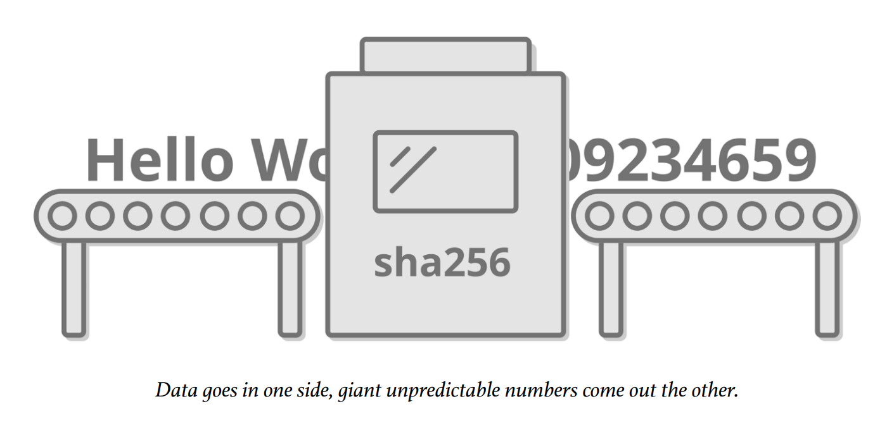
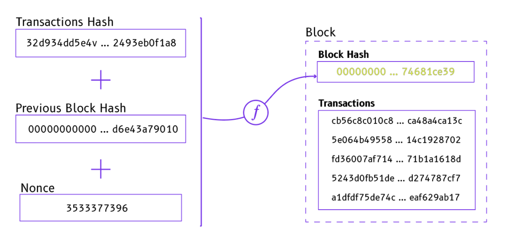
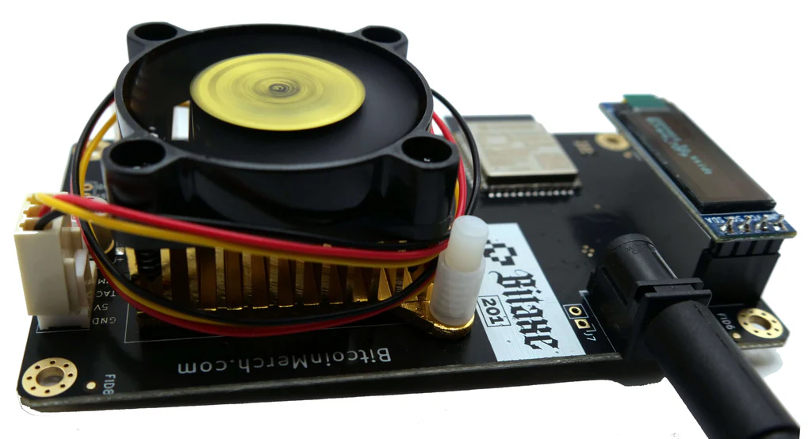

The Bitcoin Chatt
=================

#### The weekly newsletter on the Bitcoin scene in Chattanooga, TN

Saturday, 2 August 2025
---------------------

### *Issue 13*

Local Bitcoin News
------------------

### Bitcoin Remnant Meetup Today!

Are you part of the hidden remnant of free thinkers, who are ready to step outside the fiat Matrix? Join us today from 12-2PM, at Divine Design Natural Health, located at <a href="https://maps.app.goo.gl/Xyy7auT8GaV3E9FV6" target="_blank">3800 Keith St NW in Cleveland</a>, for the Bitcoin Remnant meetup! Whether you're new to Bitcoin or you've been using it for a long time, this meetup is a great opportunity to meet like-minded individuals from around the Chattanooga and Cleveland area, and get all your Bitcoin-related (and natural-health-related) questions answered.

 

Jason Sellers is planning on being there, and among other things, he and Dr. Spradlin will discuss ways that <a href="https://www.solosatoshi.com/" target="_blank">you can mine Bitcoin from your own home!</a> It's incredibly easy these days. Bitcoin mining is like playing the lottery, except there's no "house" that always wins, no taxes on your rewards, and your participation helps secure freedom money for all of Bitcoin's users around the world. We'll discuss this and more at today's Bitcoin Remnant meetup!

---

Global Bitcoin News
-------------------

### PayPal Merchants Now Accepting Bitcoin Payments

On July 28, 2025, PayPal announced that merchants using its platform can now accept bitcoin payments! The integration, powered by Bitcoin's Lightning Network, enables over 30 million PayPal merchants to process Bitcoin transactions with near-instant settlement and minimal fees, all through their existing PayPal accounts. Merchants can opt to hold bitcoin or convert it to fiat currency instantly. This ensures flexibility while offering customers a smooth checkout experience via a simple QR code scan.

 

This development accelerates Bitcoin’s journey toward everyday use, aligning with PayPal’s goal of modernizing global commerce. By slashing transaction costs—early adopters like Urban Outfitters reported saving up to 40% compared to credit card fees, and Steak 'n Shake reported saving 50%—merchants can boost profitability while embracing Bitcoin’s growing popularity. For those aiming to live on a bitcoin standard, this makes purchasing everything from clothing to coffee simpler and more accessible. The feature is rolling out to U.S. merchants first, with global expansion planned for early 2026.

### SEC Chair Defends Americans' Right to Self-Custodial Bitcoin

On July 31, 2025, SEC Chairman Paul Atkins <a href="https://x.com/btc_archive/status/1950979915974676817" target="_blank">made a landmark statement</a>, affirming that Americans have a fundamental right to custody their own bitcoin, without having to trust a third party—a principle at the heart of Bitcoin’s purpose and design. This validates the human rights that Bitcoin was built to protect, especially when compared to past regulatory challenges that often targeted self-custodial practices.

 

Atkins’ stance marks a significant shift from previous SEC leadership, which frequently scrutinized self-custody as a potential regulatory concern. His support for this right is a game-changer, reinforcing Bitcoin’s role as a tool for financial sovereignty and personal autonomy. This development is particularly crucial for those aiming to live on a bitcoin standard, as it removes a major hurdle to using bitcoin for everyday transactions without the fear of regulatory overreach. Finally, the regulatory landscape in the most powerful nation in the world is starting to align with Bitcoin’s core values.

---

Your Bitcoin Tip
----------------

### This Week's Essential Bitcoin Knowledge

You've probably heard of Bitcoin mining, but what exactly is it, how does it work, and can you actually make a lot of money from it? Many describe Bitcoin mining as running powerful computers to solve complex math problems, but that’s not quite right. It’s more like a lottery, where specialized computers—called ASICs, or "**A**pplication-**S**pecific **I**ntegrated **C**ircuits"—are built to do one thing extremely well: rapidly guess huge numbers until they find one that fits Bitcoin’s rules.

 

Bitcoin uses a cryptographic algorithm called SHA-256, or "Secure Hash Algorithm - 256." It takes any data, whether a short phrase like "Hello world" or an entire movie, and "hashes" it into a unique 256-bit output of random letters and numbers. Changing even a tiny part of the input drastically alters the output, making it easy to hash data into gibberish but impossible to reverse the process. For example, hashing "Hello world." (without quotes) through SHA-256 produces:

*aa3ec16e6acc809d8b2818662276256abfd2f1b441cb51574933f3d4bd115d11*

But tweaking just one character, like changing the period to an exclamation point ("Hello world!"), completely changes the output:

*c0535e4be2b79ffd93291305436bf889314e4a3faec05ecffcbb7df31ad9e51a*

Miners take the data from the most recent block of transactions, combine it with a random number they’re guessing (called a "nonce"), and hash it using this algorithm. If the output starts with a specific number of zeros (currently at least 19 zeros, but this changes occasionally—more on this next week), then the miner has found a valid hash. The miner who finds it first gets to add the next block to Bitcoin’s blockchain, including whichever transactions they choose, and collects those transactions' fees, plus newly issued bitcoin (currently 3.125 bitcoin per block).

 

This process secures transactions in older blocks, protecting them with the immense computational energy required to find the nonce. If someone tried to alter a recent transaction—for example, to steal back money they just spent—changing that one transaction would completely alter the block’s hash. So they’d need to find a new nonce for that block before another miner adds the next block. If they fall behind, they’d have to redo the work for every subsequent block, as each block includes the hash of the previous one. This makes Bitcoin transactions increasingly permanent over time. In fact, describing them as "set in stone" would be a massive understatement!

So, Bitcoin mining is a lottery that safeguards everyone’s transactions from being reversed. Miners are rewarded with new bitcoin and transaction fees for their efforts. Do miners get rich quick? Rarely. The cost of ASICs and electricity often eats into profits, but some miners get creative, tapping into cheap or renewable energy sources, or using the heat generated by ASICs to offset the cost of warming their home in the winter, or even to heat a hot tub! So with affordable mining equipment, low electricity costs, repurposed heat, and a little bit of luck, you can stack a modest amount of sats while supporting the network!

 

Want to learn more about mining, and how you can get started with it? Join us at the Bitcoin Remnant meetup today!

---

Recommended Resource
--------------------

Want to learn more about Bitcoin, but are unsure where to begin? You can always complete our [New to Bitcoin](https://www.bitcoinchatt.com/new-to-bitcoin) course, but if you're looking for something different, here's our suggested educational resource for this week:

 

Dive into "The Bitcoin Standard" microcourse at <a href="https://www.geniusgroup.ai/courses/the-bitcoin-standard/" target="_blank">Genius Academy</a>, where bestselling author Dr. Saifedean Ammous unravels the history of money and, in just 40 minutes, reveals why Bitcoin is a game-changer for our entire society. This fast-paced, engaging course explores how Bitcoin’s digital scarcity and decentralization can secure your financial future. Earn up to 10,000 GEMs while gaining insights that could redefine your approach to wealth.

---

Meme of the Week
----------------

 

---

Closing Thoughts
----------------

 

Yesterday was the 8th anniversary of <a href="https://www.youtube.com/watch?v=ui9JwnB1d-k" target="_blank">Bitcoin Independence Day</a>, when Bitcoin faced a critical test—and almost failed—but was saved by its users. Leading up to August 1st, 2017, a heated debate had escalated into an all-out war over how Bitcoin could scale to serve billions of users. With blocks capped at 1MB, Bitcoin could only process about 7 transactions per second on average—far too few to support global adoption. Two solutions emerged from the seemingly endless online battles: one was to increase the block size to 2MB and keep doubling it as usage grew, while the other was to activate an upgrade called Segregated Witness (SegWit), which would optimize transactions and enable second-layer solutions like the Lightning and Liquid networks. But which approach was better, and who would decide which one would be implemented?

Big-block supporters argued that second-layer solutions wouldn’t scale Bitcoin fast enough to handle the expected influx of new users. SegWit advocates countered that larger blocks would bloat the blockchain, making it too costly for individuals to run nodes, which would lead to centralization—and likely to Bitcoin's eventual destruction. For both sides, this wasn’t just about protecting financial investments; it was about safeguarding humanity’s best (and arguably last) shot at escaping tyranny and building a future based on freedom.

 

This conflict, now called the <a href="https://a.co/d/4kfweXk" target="_blank">Blocksize War</a>, split the community into two camps. On the big-block side were over 80% of Bitcoin’s miners, all the major exchanges, and prominent figures like Roger Ver (once dubbed “Bitcoin Jesus” for his early evangelism). On the SegWit side were the users running full nodes, or computers that enforce Bitcoin’s rules and store its entire transaction history. What it really boiled down to, though, was the question of who really controls Bitcoin: the miners or nodes?

In May 2017, the New York Agreement (NYA) was proposed, in which the largest miners and businesses in the Bitcoin space colluded and agreed to activate SegWit while also increasing the block size to 2MB via a hard fork (SegWit2x). However, many node-running users distrusted this deal, arguing the hard fork would prioritize miner control and centralize Bitcoin. In response, a grassroots movement pushed for a User Activated Soft Fork (UASF) to force SegWit activation on August 1st, 2017, without miner consensus. This UASF would separate witness data from transactions, freeing up block space and enabling second-layer scaling, all while keeping Bitcoin’s future decentralized in the hands of its users.

 

The UASF was a bold move, to say the least. If nodes enforced it but miners didn’t follow, the chain could split, risking chaos. Yet miners faced a bigger threat: ignoring the UASF could render their blocks invalid to node runners, wasting their energy and profits. It was like a high-stakes game of chicken, with nodes holding the stronger hand, and miners having much more at risk. As August 1st approached, miners saw the writing on the wall. Many signaled support for SegWit, and on July 21st, 2017, enough miners locked in SegWit, ensuring its activation before the UASF deadline. On August 1st, the UASF went live, and SegWit officially activated later that month, cementing a victory for the grassroots movement of users defending Bitcoin’s decentralized future.

Early in the Blocksize War, I was a big-blocker, since it seemed like the obvious choice, but thanks to many prominent Bitcoiners who knew much more about Bitcoin than I did, I was soon educated enough to rally behind the UASF, and I spun up my first node to support it. Before August 1st, 2017, Bitcoin’s claim of being decentralized was likely true, but it was still just an untested claim, not a proven fact. But that day, 8 years and 1 day ago, it was proven beyond any doubt that Bitcoin is controlled by its users, and not by any centralized entity. And thanks to SegWit, which paved the way for protocols like Lightning and Liquid, Bitcoin can scale for a global userbase while staying true to its decentralized roots.

It's amazing to think of how far we've come in the last 8 years, but I believe that will pale in comparison to what the next 8 years will bring. Onward!

Jason

