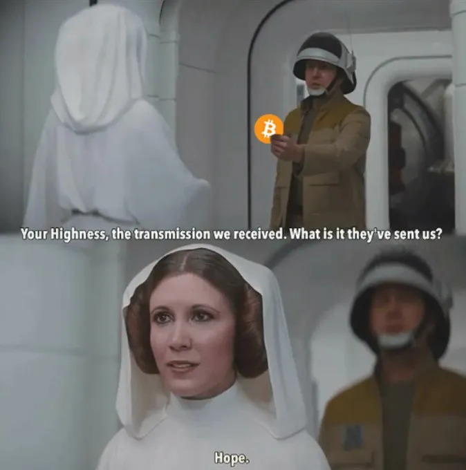

The Bitcoin Chatt
=================

#### The weekly newsletter on the Bitcoin scene in Chattanooga, TN

Saturday, 16 August 2025
---------------------

### *Issue 15*

Local Bitcoin News
------------------

### Bitcoin Chatt Field Trip Today!

We hope you'll join us today at <a href="https://maps.app.goo.gl/UCnU9eEfmLFQL47H7" target="_blank">the Brickyard</a> from noon to 2pm, as we take a field trip to a nearby mining facility, as see Bitcoin mining in action! We'll carpool from the Brickyard at about 12:15pm, to give everyone a chance to arrive, drive for 5-10 minutes to the mining facility, take a quick tour, and then carpool back to the Brickyard for the rest of the meetup.

 

Feel free to invite your family members and friends, but make sure they're prepared for the mining facility to be loud! For this reason, young children should not join us on this field trip.

See you in a few hours!

---

Global Bitcoin News
-------------------

### Google’s Bitcoin Wallet U-Turn: A Victory for Self-Custody

On Wednesday, the 13th, Google initially delisted self-custodial Bitcoin wallets from its Play Store, sparking outrage among Bitcoiners and a significant selloff in Google’s stock. The move was part of a broader policy requiring wallet apps to obtain licenses like FinCEN MSB or MiCA, which many saw as a threat to Bitcoin’s core principle of holding and managing one's own bitcoin without needing to trust it to a third party. After intense pressure from Bitcoiners globally, and a sharp drop in Alphabet, Inc's market value, Google reversed its decision, restoring access to these wallets, and causing its stock price to rebound almost instantly. In an attempt to mitigate the damage, they stated that they never intended to target non-custodial wallet apps.

 

Self-custodial wallets are essential for Bitcoiners. They ensure that only you have access to your bitcoin, much like holding cash in your own wallet rather than relying on a bank to hold it for you. Google’s reversal is a win for Bitcoin’s future, as this makes it easier for Android users to download apps like <a href="https://bluewallet.io/" target="_blank">BlueWallet</a>, <a href="https://muun.com/" target="_blank">Muun</a>, and <a href="https://mannabitcoin.com/" target="_blank">Manna Wallet</a>, which let you manage your own private keys, exactly as Bitcoin was always meant to be used.

### Another 180° Flip: U.S. Treasury Secretary’s Damage Control Following Public Backlash

It seems that U-turns are the theme for global news stories this week, as another high-profile 180° turn came from U.S. Treasury Secretary Scott Bessent on Thursday the 14th. Initially, Bessent stated that the U.S. government would not acquire more bitcoin for its planned Strategic Bitcoin Reserve, relying solely on confiscated assets, instead. Backlash to this statement was swift, with Bitcoiners arguing that such a stance undermined the reserve’s potential to position the U.S. as a global leader in the Bitcoin space. In response, Bessent quickly walked back his previous statements, saying that the government would still build the reserve through “budget-neutral” methods, such as leveraging existing confiscated bitcoin and exploring innovative acquisition strategies without using taxpayer funds.

 

If you're new to bitcoin, or to the idea of a Strategic Bitcoin Reserve, it's is like a national stockpile of bitcoin, similar to a country's gold reserves. While many Bitcoiners are supportive of such a reserve—since it will likely cause bitcoin's fiat price to rise significantly—others saw Bessent's *first* statement as the better news. They argue that the U.S. government and other large and powerful entities stand in opposition to everything Bitcoin was created for: individual sovereignty, prosperity, and hope. While it's inevitable that business and government leaders will eventually see why bitcoin is so valuable, the longer it takes for those closest to the money printer to start stacking sats, the more time you will have to stack more sats at these low prices.

---

Your Bitcoin Tip
----------------

### This Week's Essential Bitcoin Knowledge

It's often said that Bitcoin is controlled by its users, and while that's true in a broad, free-market sense, it's not entirely precise from a technical perspective. To actively enforce Bitcoin's protocol, you must run your own node.

Bitcoin nodes are computers running software that implements the Bitcoin protocol, maintaining a complete record of all on-chain transactions since Satoshi Nakamoto launched the network in 2009. When a miner finds a valid nonce to create a block's hash and gathers pending transactions for the next block, nodes verify the hash's validity and audit the transactions to ensure they comply with all of Bitcoin's rules. A new block is added to the blockchain, and the miner receives transaction fees and newly minted bitcoin *only when* ***all*** *nodes agree that the block adheres to the protocol.* This verification and consensus usually only takes a fraction of a second.

 

Every Bitcoin transaction—whether on-chain or via second-layer solutions like Lightning, Liquid, or others—relies on at least one node to facilitate the transaction and reflect the current state of Bitcoin's ledger. If you're not running your own node to verify your transactions, you're relying on someone else's. This is okay if you're still just getting started, but as you use bitcoin more, you may want greater control over how the network is governed. Running a node also enhances privacy and enables you to operate second-layer protocols directly on your own machine.

To run a node, you'll need a computer that remains powered on and connected to the internet 24/7. Some users repurpose an old laptop or use a Raspberry Pi, while others choose to purchase a prebuilt node. You'll also need sufficient storage for Bitcoin's blockchain, which is currently around 775GB, so a 1TB or 2TB hard drive is recommended. For better performance and durability, use a Solid State Drive (SSD), which lacks the moving parts of Hard Disk Drives (HDDs), so it'll probably last longer.

Here are some of the best options for running a Bitcoin node:

<a href="https://start9.com/" target="_blank">Start9</a> 
<a href="https://parmanode.com/" target="_blank">Parmanode</a> 
<a href="https://mynodebtc.com/" target="_blank">MyNode</a> 

Each of these can be bought prebuilt, or downloaded and installed on your own computer hardware.

 

Not everyone can run a node, but doing so strengthens Bitcoin's decentralization and empowers you to independently verify your transactions as a truly sovereign individual.

---

Recommended Resource
--------------------

Want to learn more about Bitcoin, but are unsure where to begin? You can always complete our [New to Bitcoin](https://www.bitcoinchatt.com/new-to-bitcoin) course, but if you're looking for something different, here's our suggested educational resource for this week:

 

This <a href="https://www.swanbitcoin.com/canon/bitcoin-101/" target="_blank">Bitcoin 101</a> course, created by the <a href="https://www.swanbitcoin.com/" target="_blank">Swan Bitcoin</a> team, is a great place to start learning all about Bitcoin! From an "Introduction to Bitcoin" video by Andreas Antonopoulos, to an article written by Cory Klippsten that explains our dire need for Bitcoin, this website is a great place to start your deep dive into what Bitcoin is, how it works, and why it's important.

---

Meme of the Week
----------------

 

---

Closing Thoughts
----------------

This newsletter is really only about Bitcoin, but recently there's been some talk about a 51% attack on another cryptocurrency, Monero, and I wanted to share my thoughts on it, and then apply i to us who are Bitcoin-only. First, I want to say that, in my opinion, Monero is one of the few (if not the only) other cryptocurrencies that were created with an honest intent and purpose. From its inception, Monero was built on privacy, and was never intended to be a means of extorting the ignorant masses through cheap gimmicks, as virtually all other cryptocurrencies do (though Monero's privacy was <a href="https://moneroleaks.xyz/" target="_blank">recently found</a> to be lacking, but that's another matter). So while I will never own any Monero, I have a lot of respect for the currency and the community around it.

Second, I should point out that Monero is not actually undergoing a 51% attack. Yes, a single mining pool is approaching the 51% mark, and they're already reorganizing transactions in some blocks when they can, but they don't yet have a *majority* control over Monero's block creation. Here are a couple excellent videos by Matthew Kratter that explain this really well:

 

 

 

That being said, it's important to understand why Bitcoin is inherently superior to Monero. There are many reasons, such as the market price and the security of each network via their respective hashrates, but they all boil down to this: Bitcoin prioritizes the most important qualities of sound money, with the option to add privacy to it, while Monero prioritizes privacy at the expense of sound monetary properties, which can't be added afterward. Like a house, it doesn't matter what special features it may have above the surface if the foundation lacks strength.

The point of these closing thoughts is not to dunk on Monero, though. **The point is to call all Bitcoiners to be more vigilant.** Bitcoin is *not* immune to mining centralization, 51% attacks, and other issues. Such things wouldn't mean the end for Bitcoin, but it could prove difficult to fix. Here's what Andreas Antonopoulos had to say about it, several years ago:

 

So yes, attacking Bitcoin's network the way Monero has been getting attacked would require a lot of work for very little payoff, but rallying Bitcoiners to "kick those b@stards off the network, [and] rework the protocol around them," would likely be *extremely* difficult, and perhaps impossible. Why? Because with so many new Bitcoiners lately, very few have the vigilance necessary to defend the network from such an attack. For an example of this, look no farther than Bitcoin's recent inundation with spam from the very same scammers that made fortunes selling jpegs. Many Bitcoiners are standing up, switching their nodes from using Bitcoin Core's software to Bitcoin Knots, and educating others on why they should do the same. But many others see Bitcoin's price hitting new all time highs, and seem to think that because of that, all is well.

 

Bitcoin relies on 3 things: physics, math, and game theory (i.e., human incentives). If any one of those fails, Bitcoin will fail. I have *absolute* confidence that physics and math will forever work as they always have, but the one question that remains is whether Bitcoin's game theoretical dynamics will be strong enough to encourage its users to defend the network against all kinds of attacks. Thus far, with both the ongoing spam attacks and mining centralization, I have been *far* from impressed, but I have faith that things could still turn around for the better.

Maybe people haven't felt enough pain to want to turn things around, and so will need to touch the stove a few times before they'll be vigilant about defending Bitcoin. If that's the case, then I hope and pray we'll be able to get Bitcoin back on track after the pain is felt. Of course, it would be much better for Bitcoiners to *choose* to be vigilant, rather than have the pain from complacency thrust upon them.

 

So let's do everything we can to defend Bitcoin from spam (run a node using Bitcoin Knots) and mining centralization (buy a <a href="https://bitaxe.org/" target="_blank">Bitaxe</a> and join the <a href="https://ocean.xyz/" target="_blank">Ocean</a> mining pool), and tell others to do the same.

See you later today (hopefully!).

Jason

