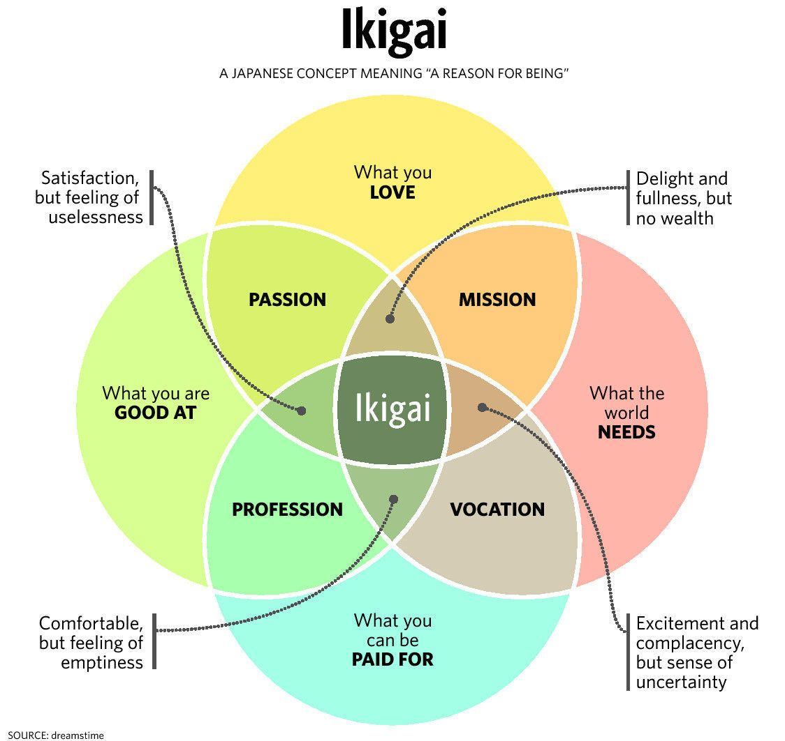

The Bitcoin Chatt
=================

#### The weekly newsletter on the Bitcoin scene in Chattanooga, TN

Saturday, 23 August 2025
---------------------

### *Issue 16*

Local Bitcoin News
------------------

### BREAKING NEWS: 1 bitcoin = 1 bitcoin

Back in April of 2022, Bitcoin Chatt's creator, Jason Sellers, attended the Bitcoin Conference in Miami. It was his first Bitcoin conference, and despite its broader inclusion of all crypto, it was still a major positive turning point in his life. At the conference, he received a t-shirt that made the prediction that on August 23rd 2025 (it was just a random date; other shirts had the same image but a different random date), the price of 1 bitcoin would equal 1 bitcoin. In all that time, *he has not worn the shirt even once*, but deliberately waited until today to finally put it on. So as you read this, you can be sure that he's finally wearing it.

 

Admittedly, this news item is just for fun, but the truth remains: *1 bitcoin = 1 bitcoin*. This is a call for all of us to stop measuring bitcoin in volatile fiat, slowly inflating gold, or anything else. Money is the language of value, and Bitcoin is the inevitable money of the future, so the best time to start learning the future language of value is today.

---

Global Bitcoin News
-------------------

### Jack Dorsey’s Block Unveils First U.S.-Made Bitcoin Mining ASIC

Last week, on the 14th, Jack Dorsey's Block, Inc. announced the first US-made Bitcoin mining ASIC (**A**pplication-**S**pecific **I**ntegrated **C**ircuit), set for nationwide release by early 2026. This advanced hardware optimizes Bitcoin mining with superior efficiency for securing the Bitcoin network. Unlike general-purpose chips, ASICs are designed solely for guessing a large, random number (known as the "nonce") to validate Bitcoin transactions and earn rewards. By producing these in the US, Block reduces reliance on China, improving Bitcoin's decentralization.

 

For US Bitcoin miners, the Proto ASIC is a game-changer, diversifying the supply chain, aligning itself with Bitcoin’s ethos of individual sovereignty, and ensuring no single region controls Bitcoin’s hardware. Its modular design lets miners swap out broken hash boards, saving 15-20% per upgrade and extending hardware life to a *decade* or more. Whether you're a veteran or new to proof-of-work, Block’s innovation simplifies securing the Timechain while supporting American manufacturing.

---

### PricedInBitcoin21.com Goes Live Again After Extended Downtime

On Wednesday, the 20th, [PricedInBitcoin21.com](https://www.pricedinbitcoin21.com/landing) was fully restored and improved after being offline for several months, due to technical issues with its hosting provider. The website tracks the prices of stocks, commodities, and pretty much anything else in terms of sats (each a 100 millionth of a bitcoin), and it now boasts a revamped interface and faster updates, making it easier to see how traditional investments compare to bitcoin’s fixed supply. Originally launched to highlight bitcoin’s growing purchasing power, its return strengthens the case for using bitcoin as a unit of account, free from fiat inflation.

 

Now with a more robust backend, the updated [PricedInBitcoin21.com](https://www.pricedinbitcoin21.com/landing) ensures accurate prices denominated in bitcoin by pulling live data from major exchanges. So whether you’ve been hodling for years or you're just dipping your toes into Bitcoin, this tool helps reshape your perspective to think of prices in terms of sats. Check it out at [PricedInBitcoin21.com](https://www.pricedinbitcoin21.com/landing) and see why bitcoin’s scarcity makes the price of everything else fall over time.

---

Your Bitcoin Tip
----------------

### This Week's Essential Bitcoin Knowledge

Money serves three key functions, and any new form of money attains these in this order: **store of value** (it can hold its worth over time), **medium of exchange** (you can use it to buy goods and services), and finally **unit of account** (prices are primarily measured with it). Most of us think of prices in dollars, euros, or other fiat currencies, but these lose value due to inflation, making life more expensive every year in fiat terms. But Bitcoin, with its fixed supply of just under 21 million coins, turns this dynamic around. By retraining your mind to see prices in bitcoin (or sats, where 1 bitcoin equals 100 million sats), you can start using it as your unit of account, revealing a world where costs trend *downward* over time, as bitcoin’s purchasing power grows.

Start small: next time you buy something, check its price in sats on a site like [PricedInBitcoin21.com](https://www.pricedinbitcoin21.com/landing), which, as mentioned above, was recently revamped to show real-time prices of assets and everyday goods in bitcoin. If a coffee costs 10K sats (0.0001 bitcoin) today, it might cost 5K sats (0.00005 bitcoin) in a year as bitcoin’s value continues to rise against fiat, and against the value of the coffee itself. This shift in perspective—thinking in terms of sats instead of dollars—helps you see bitcoin’s disinflationary nature, or a gradual drop in prices over time. Unlike fiat, where prices climb due to money printing, bitcoin’s scarcity means goods and services become cheaper over time, rewarding those who choose to save and defer gratification.

As you make bitcoin your unit of account, you’ll notice an exciting pattern: everything from cars, to food, to houses, to everything else will require fewer sats over time as bitcoin’s value grows. The mental shift required to understand this is what's needed to get off the fiat treadmill—where you have to run faster and faster just to *barely* make ends meet—and onto a monetary standard that makes life get easier over time. By adopting bitcoin as your unit of account, you align your financial thinking with a system built for sovereignty and immutable truth, where the cost of living falls, and your time and energy are better preserved for the future.

 

---

Recommended Resource
--------------------

Want to learn more about Bitcoin, but are unsure where to begin? You can always complete our [New to Bitcoin](https://www.bitcoinchatt.com/new-to-bitcoin) course, but if you're looking for something different, here's our suggested educational resource for this week:

 

Julian Figueroa's account on Instagram, [kineticfinance](https://www.instagram.com/kineticfinance/), is an excellent resource for Bitcoin education when you need something that comes in short, small doses. Julian's extensive wit and knowledge will help you understand Bitcoin much faster than a 2-hour documentary, while also being *much* more entertaining. He has plenty of videos about other topics, as well, so check out his Instagram channel for all the Bitcoin education you could ever want, or the [Get Based](https://www.youtube.com/@getbasedtv/shorts) YouTube channel, which also hosts many of his short videos.

---

Meme of the Week
----------------

 

---

Closing Thoughts
----------------

As stated above in the Local Bitcoin News section, I received the 1 bitcoin = 1 bitcoin shirt over 3 years ago, and I'm *finally* wearing it, even as you read these words. Back in 2022, I wanted so badly to help onboard people to bitcoin and take custody of their wealth, but I thought that I could only do that as a hobby in my spare time (which, with 6 children, is extremely scarce), and that the only way I could work for a Bitcoin company would be if I could code. I already knew that educating about Bitcoin was my *ikigai* (a Japanese term for one's life mission and purpose), but I couldn't find any real opportunities to make that ikigai a reality (thought Bitcoin Chatt meetup I had started in October 2021 was a big help).

 

Then, less than a week before the Miami conference, I heard that a Bitcoin wallet company called [Noah](https://noah.com/en) was looking for volunteers to work at their booth during the conference. Normally, I would have passed that up, but a little voice in my head gently nudged me to jump on this opportunity. It would involve a 13-hour road trip with my wife and kids (including stopping for breaks along the way), all for a volunteer opportunity that would probably not lead to anything else. But at the end of the conference, I was offered a job as Noah's Community Manager, which I didn't even know they were hiring for!

After being the Community Manager for Noah for about a year-and-a-half, I became the Community Manager for the [Spirit of Satoshi](https://www.spiritofsatoshi.org/), until our team switched gears to work on [Satlantis](https://www.satlantis.io/place), and I worked as its Ambassador Concierge. And now, I'm a freelance Bitcoin consultant, helping individuals and businesses get started with Bitcoin, and take freedom into their own hands. And this whole journey started because I listened to the little "nudge", and took a leap of faith.

 

I am profoundly grateful, beyond words, that I can now spread Bitcoin knowledge every day to whoever will listen. If you'd like to make a career change and earn a living while giving back to the Bitcoin community, check out [BitcoinerJobs.com](https://bitcoinerjobs.com/) and look through the job postings there. Many of them require technical skills, of course, but some of them don't. If you, like me, also feel a deep sense of gratitude for Bitcoin and the Bitcoiners you've built relationships with, and you're ready to make a change in your life, I would recommend searching the jobs there, but also consider volunteering occasionally for Bitcoin companies that may need help in one way or another. If they see your passion, dedication, and work ethic, you may be surprised how quickly they'll want to hire you. It's just an idea.

Until next week, friends.

Jason

