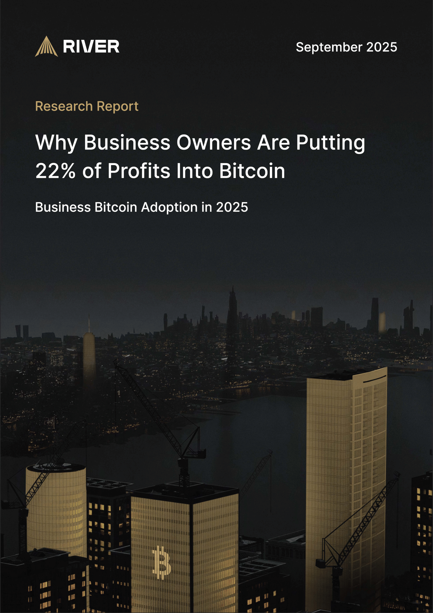

The Bitcoin Chatt
=================

#### The weekly newsletter on the Bitcoin scene in Chattanooga, TN

Saturday, 6 September 2025
---------------------

### *Issue 18*

---

Local Bitcoin News
------------------

### Bitcoin Remnant Meetup Today

Today, from 12-2 PM, the Bitcoin Remnant meetup will gather at [Divine Design Natural Health](https://www.divinedesignnaturalhealth.com/), located at [3800 Keith St NW in Cleveland](https://maps.app.goo.gl/t1VGZctTBEZFrQeBA). Hosted by Dr. Brett Spradlin, this roundtable discussion dives deep into Bitcoin’s power to secure financial freedom, and opens the door for all other ways you can become a sovereign individual. Whether you’re new or a long-time Bitcoiner, come connect, share ideas, and learn how Bitcoin reshapes our world!

 

For those new to the idea of the “remnant”, that term refers to those few who choose to embrace absolute truth, like the verifiable truths on which Bitcoin is based. If that describes you, then RSVP on Meetup.com, bring your questions, and join fellow freedom-lovers and truth-seekers as we dive down the Bitcoin rabbit hole. Don’t miss this chance to strengthen our local Bitcoin community!

---

### No Bitcoin Chatt Meetup on September 20

Our regular Bitcoin Chatt meetup, held every third Saturday at [The Agora Food Club](https://theagorafoodclub.com/) at [6112 Hixson Pike](https://maps.app.goo.gl/ZgAkcm2dhpPAFctG6), won’t happen on September 20th, as Jason will be at the [Imagine IF Summit in Nashville](https://bitcoinpark.com/imagineif/index_imagineif.html). We’ll miss our usual Hixson gathering, but we’re gearing up for a big celebration in a few weeks!

 

Join us on October 4th, from 12-2 PM, at the Bitcoin Remnant meetup at Divine Design Natural Health, for a celebration of Bitcoin Chatt’s 4th anniversary! The next Bitcoin Chatt meetup will then follow on October 18h, also from 12-2 PM (it used to be 2-4 PM, but 12-2 PM will probably work better for everyone), at The Agora. Visit BitcoinChatt.com for updates as we keep building our circular Bitcoin economy!

---

Global Bitcoin News
-------------------

### River Report: Business Bitcoin Adoption is Surging

River's latest research report, ["Why Business Owners Are Putting 22% of Profits Into Bitcoin,"](https://river.com/learn/files/river-business-report-2025.pdf) dives into the explosive rise of Bitcoin in the private sector throughout 2025, building on foundational shifts we saw in 2024. Inflows have reached $43.5 billion in the first eight months, which is already more than all of 2024's $31 billion, and trending toward $66.9 billion by year-end. Collectively, businesses now hold about 6.2% of Bitcoin's total supply, or about 1.3 million bitcoin, which is a 21x increase since January 2020.

 

The report spotlights Bitcoin treasury companies, which account for 76% of purchases since early 2024, and acquired and average of roughly 1,400 bitcoin daily. It then notes that these treasury companies appeal to investors who face barriers to direct bitcoin ownership, like high taxes in Japan or unavailable ETFs in the UK. Yet, it also emphasizes the quieter adoption by conventional businesses of all kinds, with River supporting over 3,000 U.S. clients alone. If you own a business, and aren't adding it to your treasury or accepting it for payment, you might want to consider doing that, because it seems to be catching on.

---

### Jobs Report Sparks 99% Odds of Fed Rate Cut, Bullish for Bitcoin

Yesterday morning, the Federal Reserve issued a jobs report that has propelled the probability of a rate cut this month to 99%, signaling a weakening labor market and sealing the case for monetary easing at their upcoming meeting on September 16-17. With job growth falling short of expectations and unemployment ticking up, markets are pricing in at least a 25-basis-point reduction, though odds of a larger 50-basis-point cut remain low at around 10%. This shift of probability reflects growing concerns over economic slowdown, prompting the Fed to inject liquidity and support growth.

 

Historically, rate cuts like this tend to boost prices by increasing market liquidity and encouraging investment. It also accelerates inflation and devalues the dollar, which usually drives people to seek refuge in unprintable assets, like gold and bitcoin. Lower borrowing costs could drive more capital into Bitcoin, taking us to new all-time highs, as seen in past cycles. At about $111K at the time of writing, Bitcoin is still unbelievably cheap, so now is the time to stack sats.

---

Your Bitcoin Tip
----------------

### This Week's Essential Bitcoin Knowledge

You probably already know that Bitcoin’s supply is capped at just under 21 million coins, but how is this limit enforced? Could someone hack it to add more? Bitcoin’s fixed supply comes from its code, which sets a strict schedule for the rate at which new coins are awarded to miners for securing everyone's transactions. These miners compete in a global lottery, expending energy to protect past transactions, making them nearly impossible to undo. Their reward is made of transaction fees (which vary in size according to the number of pending transactions and the speed at which users want them confirmed) and newly mined bitcoin. The rate that new bitcoin is mined follows a precise, unchangeable plan that totals just under 21 million bitcoin.

 

When Bitcoin launched in 2009, miners earned 50 bitcoin per block. Every 210,000 blocks (roughly every four years), this reward is automatically cut in half, in an event called the “halving.” From blocks 0 to 209,999, miners got 50 bitcoin when they found a block, totaling 10.5 million bitcoin at the time of the first halving. From blocks 210,000 to 419,999, the miners received 25 bitcoin with each block, which adds up to 5.25 million bitcoin during that time. The next epoch yielded 2.625 million bitcoin at 12.5 bitcoin per block, and so on. By halving repeatedly, with rewards eventually too small to divide further (due to Bitcoin’s smallest unit, the satoshi), the total supply stops just shy of 21 million around the year 2140.

Fun fact: after the first halving epoch, when 50 new bitcoin were being mined with each block, 50% of all bitcoin remained unmined. After the second epoch, when 25 new bitcoin were being award to the miners with each block, 25% remained. This pattern will continue until 2140, when 0% will remain, and exactly 20,999,999.9769 bitcoin will be in circulation. No one can add even a single sat without changing the issuance rate in the code, and Bitcoin’s users, who run the network and verify the code, would immediately catch and reject such a change.

 

This is the genius of Bitcoin: its 21 million cap is enforced by math, code, and a global network of users who verify every block. You don’t need to trust anyone; you can check the math and the code yourself. Bitcoin’s scarcity is mathematically certain, and ensures its value will continue to grow as demand for an absolutely scarce, censorship resistant, and permissionless money rises. So keep stacking sats and learning—your future self will thank you!

---

Recommended Resource
--------------------

Want to learn more about Bitcoin, but are unsure where to begin? You can always complete our [New to Bitcoin](https://www.bitcoinchatt.com/new-to-bitcoin) course, but if you're looking for something different, here's our suggested educational resource for this week:

 

A [free ebook](https://www.swanbitcoin.com/inventing-bitcoin/) of *Inventing Bitcoin*, by [Yan Pritzker](https://x.com/skwp), is being offered by [Swan Bitcoin](https://www.swanbitcoin.com/). This book explains how Bitcoin works in a completely easy-to-understand, non-technical way, as it walks you through the process of inventing Bitcoin from the ground up, as if *you* were the one inventing it. This is highly recommended for anyone who wants to better understand what's happening when they make a bitcoin transaction, or even just wants to impress their friends with how much they know about Bitcoin's inner workings. Alternatively, you can purchase a physical copy of this book on [Amazon](https://www.amazon.com/dp/1794326316?ref=cm_sw_r_ffobk_cp_ud_dp_9W6RVF3PT0XTBKX7Y9K2&bestFormat=true).

---

Meme of the Week
----------------

 

---

Closing Thoughts
----------------

 

I’ve been reflecting on the debate stirring the Bitcoin community over Bitcoin Core v30, set to go live in October, which will remove the 80-byte limit on OP_RETURN data. If you’re new to this, OP_RETURN is a small space in a Bitcoin transaction where you can add non-financial data, like text, to be stored permanently once confirmed by the miners. Core v30 will massively increase this from 80 bytes to 100,000 bytes, allowing much larger data in node mempools—temporary holding areas in computers that run the Bitcoin software (nodes) that verify pending transactions. This change could flood mempools with non-monetary data, relayed across nodes, risking the propagation of illicit content, which is a deal-breaker for me when it comes to Bitcoin’s purpose as sound money, and could lead to fewer operating nodes and greater centralization for those who enforce Bitcoin's rules.

The primary issue isn’t just what ends up on the blockchain, but the non-monetary data being stored in mempools and passed between nodes. Another implementation of Bitcoin's protocol, Bitcoin Knots, offers a solution by letting node runners retain the freedom that Core is giving them until v30, which is to set their own mempool filters, thereby rejecting data-heavy transactions that don’t serve Bitcoin’s financial mission. Core v30, however, will force them to relay massive data loads that could potentially include unethical content. And simply refusing to upgrade to Core v30 isn’t a safe option either, as that will mean missing out on critical security updates. Knots empowers users to keep Bitcoin lean, and focused on being immutable money.

 

Despite my faith in Bitcoiners being tested through this debate, the community’s response has truly been inspiring: Knots nodes have jumped to over 18% of the network in the last few months, as more Bitcoiners are following their incentives and choosing to protect the Bitcoin network. Running a node, especially with Knots, lets you verify transactions yourself and enforce its protocol rules, which helps keep Bitcoin decentralized. It’s a simple act that ensures the network stays true to its roots as money, not as permanent file storage.

This debate is proving once again that **Bitcoin belongs to its users**. By running Knots nodes, we guard ourselves against relaying spam, and ensure Bitcoin will continue to be the most powerful tool for our financial freedom, and by extension all other freedoms. Every node, every transaction, every sat stacked takes us one step closer to a society rooted in honest money. So let’s keep meeting up, keep learning, and keep showing others the way. Together, we’re forging a future of prosperity, hope, and freedom.

See you at the Bitcoin Remnant meetup!

Jason

