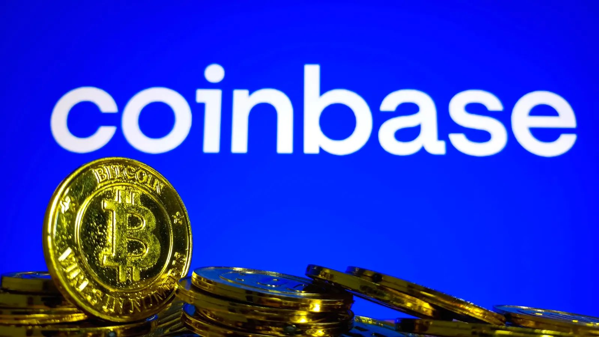

The Bitcoin Chatt
=================

#### Your weekly newsletter on the Bitcoin scene in Chattanooga, TN

Saturday, 17 May 2025
---------------------

### *Issue 002*

---

Local Bitcoin News
------------------

### 4 New Locations Accepting Bitcoin for Payment!

As was reported last week, Steak 'n Shake is now accepting bitcoin for payments at all locations! We have 4 Steak 'n Shakes in our area: On Battlefield Pkwy in Fort Oglethorpe, on Gunbarrel Rd in Chattanooga, on W Walnut Ave in Dalton, and on Paul Huff Pkwy NW in Cleveland. Steak 'n Shake is taking a bold new step into the future of money, so let's support them with a steakburger and tallow fries, paid for with bitcoin!

We also updated our [map](https://www.bitcoinchatt.com/map/) of businesses in the area that accept bitcoin, to reflect this change from Steak 'n Shake. Select the map below to interact with it and find relevant information for each business listed.

Know of any other businesses in the area that accept bitcoin? [Let us know](https://www.bitcoinchatt.com/contact/), and we'll add them to our map!

---

Global Bitcoin News
-------------------

### Coinbase Customer Information Data Leak

On May 15th, Coinbase disclosed that some of their overseas support agents were bribed by cybercriminals and leaked sensitive customer data like names, addresses, and IDs of approximately 97,000 users, which is less than 1% of its monthly users. This wasn’t a case of a system hack, as was initially reported, but of a betrayal of trust from a popular exchange. Coinbase is now facing between $180 million and $400 million in cleanup costs while promising to compensate affected users accordingly.

This leak is a perfect example of why you should avoid KYC (Know Your Customer)-compliant exchanges like Coinbase, when you can: they're honeypots of personal data and custodied bitcoin that's just asking for trouble like this. Stick to Bitcoin-only, non-KYC platforms like <a href="http://hodlhodl.com/" target="_blank">Hodl Hodl</a> or <a href="https://learn.robosats.org/" target="_blank">RoboSats</a>, and always move your bitcoin to a self-custodial wallet, which can be an app or device that gives you a set of 12 or 24 random words as your private key, and acts as a backup for your bitcoin. If you’re a Coinbase user, we recommend you turn on two-factor authentication, stay alert for phishing attempts, and consider switching to more private methods for acquiring bitcoin, for added security.

### 15th Anniversary of Bitcoin Pizza Day

15 years ago this coming Thursday, May 22nd, a man named Laszlo Hanyecz bought 2 pizzas from Papa Johns for 10,000 bitcoin. That's worth a lot now (well over *$1 billion!*), but at the time, 1 bitcoin was barely worth anything, and nothing had ever been bought with it yet. In hindsight, it might seem like a colossal waste of money, but the first purchase had to happen sometime, and due to Bitcoin's fixed supply and ever-rising demand, everything bought with bitcoin will someday seem extremely expensive by future standards.

For example, have you ever heard someone much older than you comment about how, when they were young, a can of soda cost 5¢? Or how candy bars used to be larger and only cost a dime? On an inflationary system like what we have today, goods and services gradually get more expensive, smaller, and lower quality with every passing year. But on a sound money standard like Bitcoin, the exact opposite occurs: just as we think it's crazy that someone paid 10,000 bitcoin for 2 pizzas, one day it will be seen as equally crazy to pay approximately 34,000 sats (0.00034 bitcoin) for 2 pizzas—which is roughly the current price, as of the writing of this newsletter.

This is why many Bitcoiners choose to save as many sats as they can, and only buy things that they *really* need. It's just one way that Bitcoin is encouraging personal responsibility and deferring gratification, which improves quality of life for everyone, and is how civilization started in the first place.

---

Local Business Spotlight
------------------

Every week, we shine a spotlight on a business in the area that accepts bitcoin for payments. Given recent news, it should come as no surprise that this week's business is:

### Steak 'n Shake

Steak 'n Shake, a classic American fast-food chain, is redefining dining convenience across its four Chattanooga-area locations in Fort Oglethorpe, Chattanooga (on Gunbarrel Road), Dalton, and Cleveland, serving up its iconic steakburgers and hand-dipped milkshakes while blazing a trail in the future of money. 

Operated locally by the award-winning Debo’s Diners, these restaurants prioritize a sense of community, offering freshly prepared meals that have earned them a loyal following and national recognition. By accepting bitcoin for payments, Steak 'n Shake is empowering customers to use freedom money as it was always intended. If you're looking to support businesses that challenge conventional systems while enjoying a memorable dining experience, Steak 'n Shake should be your first choice.

Want *your* business in a future Spotlight? [Let us know](https://www.bitcoinchatt.com/contact/) if you already accept bitcoin, or if you would like us to get you set up, and we'll feature your business in an upcoming newsletter, as well as on our map!

---

Your Bitcoin Tip
----------------

### This Week's Essential Bitcoin Knowledge

As explained in the Coinbase news above, it's vital that you learn how to take custody of your own bitcoin, so you don't have to trust anyone else to hold it for you. That was one of the reasons why Satoshi Nakamoto created Bitcoin in the first place. He once said: *"The root problem with conventional currency is all the trust that's required to make it work. The central bank must be trusted not to debase the currency, but* ***the history of fiat currencies is full of breaches of that trust."*** Bitcoin solves this problem of trust by being money that's even better than gold, but doesn't require you to trust someone else to hold it for you.

Bitcoin wallets can be sorted into two groups: custodial and noncustodial. A custodial wallet is typically an app or a website that holds bitcoin for you on your behalf. Like with fiat banks, custodial wallets require you to trust the owner of the app/website to take care of your bitcoin, not lose it, not run away with it, and allow you to use it when you want. The main perk for most custodial wallets is their ease of use, but since you never know when another breach of trust might occur, it's worth taking the time to learn how to self-custody your bitcoin.

Noncustodial—or self-custodial—wallets can sometimes seem less convenient, and you'll have sole responsibility over your funds, but you can rest easy at night, knowing that no one else has the private key to your bitcoin, so your bitcoin can never be seized or stolen (provided you guard your private key well enough). A Bitcoin private key often looks like 12 or 24 random words from <a href="https://gist.github.com/DMeechan/9761fea1031c95f71c39ac2b80884bc5" target="_blank">this list</a>, and noncustodial wallets, whether software or hardware, typically walk you though the process of writing your words down on a piece of paper (not anywhere connected to the internet, so it can't be hacked). The learning curve is much less steep than it used to be, and controlling your own money is one of the reasons why Bitcoin exists, so it's absolutely worth the time required to learn everything you can about it.

---

Recommended Resource
--------------------

Want to learn more about Bitcoin, but are unsure where to begin? You can always complete our New to Bitcoin course, but if you're looking for something different, here's our suggested educational resource for this week:

In the video above, Isabella (or just "Isa") gives her 5 reasons for saving in bitcoin, and why you should, too. Since fiat money is constantly draining you of purchasing power, it's increasingly evident that the only way to just get by is to invest in a host of assets, and hope for the best. But who has time for that? Bitcoin, on the other hand, continues to outperform ***everything else***, and since it's just money, using it like a savings account while you live well within your means is a great way to not only have enough to live on, but to simplify your life and thrive in every part of it!

---

Meme of the Week
----------------

---

Closing Thoughts
----------------

Whether you plan on enjoying a steakburger, eating a slice of pizza, or just stacking more sats against an uncertain future (and custodying them with your own private key, of course), there's so much going on in Bitcoin, both locally and globally. It may not feel like it, but these are still the early days of Bitcoin, and only the first few rays of its orange sunrise are beginning to gleam on the horizon. This is the beginning of a new era defined by the adoption of sound money, as more nations, businesses, and individuals use it every day. The best time to [learn about it](https://www.bitcoinchatt.com/new-to-bitcoin/) was in 2009, but the second best time is right now.

Bitcoin is a revolution, but unlike many other revolutions, Bitcoin is peaceful. Rather than destroying the old system, it offers a new system built on verifiable truth, real-world work, and borderless value communication through time and space. Any of us can opt into it whenever we're ready, and in so doing become part of this historical movement to make tomorrow better than yesterday.

I hope to see you at [today's meetup](https://www.bitcoinchatt.com/calendar/), but if you can't be there, then I'll catch you in next week's newsletter.

Until next week,

Jason

