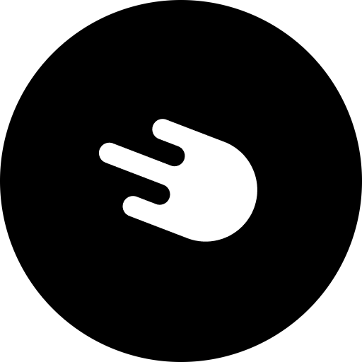

+++
date = '2025-03-06T19:54:18-05:00'
draft = false
underConstruction = false
title = 'Exchanges and Wallets'
+++

<h1 style="text-align:center">Exchanges and Wallets</h1>

 

<h2 style="text-align:left">Recommended Exchanges</h2>

<h3 class="align-left" style="display: inline-block">Strike</h3>

<a target="_blank" href="https://invite.strike.me/IEU8IW">Strike</a> is a versatile Bitcoin exchange that lets you buy, sell, pay, and even get paid in bitcoin. Set up recurring buys to dollar-cost average effortlessly, perfect for beginners and seasoned users alike. Its intuitive app makes Bitcoin accessible, offering a smooth way to embrace the future of money without added complexity.

<b>Fees</b>
 
Strike keeps fees low at just 0.3% per bitcoin purchase, making it ideal for frequent buyers or bigger stacks. There are no fees for receiving Bitcoin, and withdrawals to your own wallet are free, since Strike encourages its users to take custody of their own bitcoin. This cost-effective structure beats many competitors, so Strike is best for keeping costs down as you grow your stash.

<b>KYC</b>
 
Strike’s KYC (Know Your Customer) process, as required by law, involves giving them your full name, email, phone number, and a government-issued ID to set up your account. In some case you’ll need to provide proof of address, too. Link your bank account or debit card, and once verified, you’re ready to buy bitcoin securely.

<b>Referrals</b>
 
Join Strike with Bitcoin Chattanooga’s referral link, and after your first Bitcoin purchase, you’ll unlock the ability to trade up to $500 with zero fees. Bitcoin Chattanooga will likewise get $500 in fee-free trading. This generous perk eliminates many costs right away, letting you stack more sats while enabling Bitcoin Chattanooga to move forward with its mission to onboard our community to a Bitcoin standard.

<h3 class="align-left" style="display: inline-block">River</h3>

<a target="_blank" href="https://river.com/signup?r=3ODI6556F4">River</a> is a user-friendly Bitcoin exchange built for simplicity and security, perfect for newcomers eager to dive into Bitcoin. You can buy Bitcoin easily with your bank account, and their customer support team is always there to help when you need them. River also provides educational tools to boost your Bitcoin knowledge, making it an inviting starting point for anyone ready to improve their future with the world’s best money.

<b>Fees</b>
 
River charges a clear 1.2% fee on Bitcoin purchases, with no hidden surprises. That’s a competitive rate compared to many platforms, letting you focus on building your Bitcoin stash without worrying about sneaky costs eating into your savings. Clarity like this is why River stands out, and why we recommend them at Bitcoin Chattanooga.

<b>KYC</b>
 
According to KYC (Know Your Customer) laws, River will need to gather your personal information before you can start buying bitcoin. The process is quick and secure, though, requiring your full name, email, phone number, and a government-issued ID. You’ll also need to link a bank account to your River account, so you can easily buy bitcoin whenever you want. Once you’re verified, you can start stacking sats!

<b>Referrals</b>
 
Sign up for River with Bitcoin Chattanooga’s referral link, and after your first purchase, you’ll receive $10 in bitcoin once you’ve spent $1,000 on bitcoin within 180 days, and Bitcoin Chattanooga will get $10 in bitcoin, as well. This straightforward bonus gives you extra sats while supporting our efforts to turn Chattanooga into a Bitcoin circular economy.

<h3 class="align-left" style="display: inline-block">Bitcoin Well</h3>

<a target="_blank" href="https://bitcoinwell.com/referral/geekigai">Bitcoin Well</a> makes buying and selling bitcoin simple and secure. With its Bitcoin-only focus, and its emphasis on security and compliance, it offers a user-friendly platform that’s perfect for beginners and seasoned users alike. Whether you’re dipping your toes into bitcoin or trading regularly, Bitcoin Well lets you exchange dollars for bitcoin straight from your bank account.

<b>Fees</b>
 
Bitcoin Well charges a flat 1% fee for buying and selling bitcoin on their online platform, ensuring you’ll always know what your additional costs will be upfront. When you withdraw bitcoin to your own wallet, Bitcoin Well charges no extra fees—only the standard mining transaction fees apply. This transparent and simple fee structure makes it easy to budget and guarantees you’re getting a fair deal every time.

<b>KYC</b>
 
To get started with Bitcoin Well, you’ll need to create an account and complete their KYC (Know Your Customer verification process. This includes submitting a government-issued ID, like a passport or driver’s license, and possibly proof of address to unlock higher limits. The process is quick and user-friendly, aligning with government regulations. Once verified, you’re all set to start exchanging your dollars for bitcoin.

<b>Referrals</b>
 
Sign up for Bitcoin Well using our referral link, and you’ll earn a $10 Bitcoin bonus after you spend $100 or more. Bitcoin Chattanooga will also receive a $10 bonus at that point, which gives you a little extra to kick off your Bitcoin journey while supporting Bitcoin Chattanooga’s efforts to educate and grow the local Bitcoin community.

<h3 class="align-left" style="display: inline-block">Hodl Hodl</h3>

<a target="_blank" href="https://hodlhodl.com/join/QPXV">Hodl Hodl</a> is a peer-to-peer Bitcoin exchange that champions privacy and keeping you in control, ideal for those wary of centralized platforms. It doesn’t hold your funds—instead, it uses multisig escrow for direct trades between users, minimizing risks of exchange hacks. If you value decentralization and want to buy bitcoin on your terms, Hodl Hodl offers a secure, autonomous path to stack sats without middlemen getting in the way.

<b>Fees</b>
 
Hodl Hodl charges a maximum 0.5% fee per trade for standard users, split evenly between buyer and seller at 0.25% each, though referrals and active referrers enjoy a reduced 0.45% rate (more on that below). There are no hidden costs or custody fees—just a clear, competitive rate that outdoes many centralized exchanges. Since your Bitcoin stays in escrow until the trade completes, there are no withdrawal fees, making it a cost-effective and private way to swap dollars for sats directly.

<b>KYC</b>
 
Hodl Hodl is a decentralized exchange, so it has no KYC (Know Your Customer) requirements. Create an account with just an email address, and start trading right away. No ID is needed for basic use, but for bigger trades or extra features, you might need to provide some kind of verification, but it’s optional.

<b>Referrals</b>
 
Join Hodl Hodl with Bitcoin Chattanooga’s referral link, and you’ll lock in a discounted trading fee of 0.45% for life—slightly lower than the standard 0.5%. Bitcoin Chattanooga will also earn a percentage of the trading fees from your completed trades, scaling from 5% to 10% based on the number of active traders we refer. This setup saves you money on every trade while supporting our mission to turn Chattanooga into a Bitcoin circular economy.

<h3 class="align-left" style="display: inline-block">Swan Bitcoin</h3>

<a target="_blank" href="https://www.swanbitcoin.com/jsellers">Swan</a> is a Bitcoin-only exchange tailored for long-term savers, helping you build a disciplined bitcoin stash with ease. With Swan, you can set up automatic recurring buys to dollar-cost average over time, making it perfect for beginners aiming to grow wealth steadily. And with personalized support and plenty of educational resources, Swan empowers you to understand Bitcoin deeply.

<b>Fees</b>
 
Swan’s fees range from 0.99% to 2.29%, based on purchase frequency and volume—regular or larger buys are rewarded with lower fees—and their “Swan Force” program offers even cheaper fees. This tiered setup favors committed savers, ensuring you keep more Bitcoin as you stack. It’s a fair deal that aligns with a long-term hodling mindset, not quick trades.

<b>KYC</b>
 
Swan’s KYC (Know Your Customer) process asks for your full name, email, phone number, and a government-issued ID to get started, since it’s required by law. Proof of address might be needed in some cases, too. Link your bank account, and once verified, you’ll be set to buy bitcoin securely.

<b>Referrals</b>
 
Use our referral link for Swan, and both you and Bitcoin Chattanooga will get $10 in bitcoin after your first purchase. This straightforward bonus jumpstarts your savings while backing our work to educate and connect our community.

<h3 class="align-left" style="display: inline-block">Cash App</h3>

<a target="_blank" href="https://cash.app/app/ZBHJXGR">Cash App</a> is a popular app that makes it easy to buy, sell, and hold bitcoin, so it’s a good choice for beginners seeking simplicity. It allows you to instantly purchase bitcoin with your bank account or debit card, set up recurring buys to stack sats effortlessly, and even send sats to friends with a tap. Its extensive KYC (Know Your Customer) process is often a deal-breaker for Bitcoiners, though, which is why we included it last on our list.

<b>Fees</b>
 
Cash App’s bitcoin fees vary from 1% to 2%, depending on market conditions and transaction size. It’s not the cheapest out there, but for new users prioritizing convenience over the lowest costs, it’s a fair price to pay. You’ll know the fee upfront, so you can stack sats without surprises.

<b>KYC</b>
 
Cash App’s KYC process requires you to provide your full name, email, phone number, date of birth, and the last four digits of your Social Security number. For higher limits, a government-issued ID might also be required. It’s not ideal for many Bitcoiners, but it’s compliant with regulations, and gets you exchanging dollars for sats securely.

<b>Referrals</b>
 
Sign up for Cash App with our referral link, and after sending $5 worth to a friend, Cash App will gift you and Bitcoin Chattanooga $5 each in bitcoin. This perk gives you a small Bitcoin boost to start while aiding our mission to spread Bitcoin knowledge and adoption.

 

<h3 syle="text-align:left">Exchanges to Avoid</h3>

 

As you can see from the exchanges listed above, none of them are created equal, but those are the ones we would recommend. There are some that are downright terrible, though. Unfortunately, these tend to be some of the most well-known, since they make a lot of money from uninformed customers, which they can then spend on marketing. These include exchanges like Coinbase, Robinhood, and Crypto.com, but many others, as well. Expand the full list below to see the top 21 exchanges that we suggest you avoid.

 

<h3 class="align-left" style="display: inline-block">List of Exchanges to Avoid</h3>

<ol>
<li>Coinbase</li>
<li>Robinhood</li>
<li>Crypto.com</li>
<li>Kraken</li>
<li>Gemini</li>
<li>Binance</li>
<li>eToro</li>
<li>Bitstamp</li>
<li>Uphold</li>
<li>Paxful</li>
<li>KuCoin</li>
<li>Bittrex</li>
<li>CEX.io</li>
<li>BitMart</li>
<li>CoinEx</li>
<li>Bitpanda</li>
<li>Changelly</li>
<li>ShapeShift</li>
<li>Poloniex</li>
<li>Coinmama</li>
<li>Bybit</li>
</ol>

 

All these exchanges promote multiple cryptocurrencies as if they were gambling tokens, so they’re less like true exchanges, and more like casinos. Users are known to lose a lot of money to crypto insiders when they pull the rug out from under them, but like any casino, “the house always wins,” so despite unethical and in some cases illegal activities, these exchanges continue to grow their user base.

It’s worth mentioning here that every cryptocurrency other than Bitcoin is run by its own group of decision makers at the top, making them more like reinventions of the central banks that Bitcoin was created to replace than like Bitcoin itself. So using an exchange that supports them is, by extension, supporting some of the greatest enemies to Bitcoin and the freedom and prosperity it was always designed to give us. That's why we can’t stress enough the importance of staying away from these exchanges at all costs.

 

 

 

<h2 syle="text-align:left">Recommended Wallets</h2>

Here's a list of all the Bitcoin-only wallets we could find that are available in our area, along with all the most important details about each. Choose any of these according to your needs:

 

  <table style="color: white; border: 1px grey; border-collapse: collapse;">
    <tr>
      <td style="border: 1px grey; border-collapse: collapse; background-color: #000000;"><b>Wallets</b></td>
      <td style="border: 1px grey; border-collapse: collapse; background-color: #000000;"><b>Difficulty</b></td>
      <td style="border: 1px grey; border-collapse: collapse; background-color: #000000;"><b>Type</b></td>
      <td style="border: 1px grey; border-collapse: collapse; background-color: #000000;"><b>Custody</b></td>
      <td style="border: 1px grey; border-collapse: collapse; background-color: #000000;"><b>Open Source?</b></td>
      <td style="border: 1px grey; border-collapse: collapse; background-color: #000000;"><b>Supports</b></td>
      <td style="border: 1px grey; border-collapse: collapse; background-color: #000000;"><b>Node Required</b></td>
      <td style="border: 1px grey; border-collapse: collapse; background-color: #000000;"><b>Compatibility</b></td>
    </tr>
    <tr>
      <td style="border: 1px grey; border-collapse: collapse; background-color: #000000;"><a target="_blank" href="https://www.getalby.com"><b>Alby</b></a></td>
      <td style="border: 1px grey; border-collapse: collapse; background-color: #FF9900;">Intermediate</td>
      <td style="border: 1px grey; border-collapse: collapse; background-color: #000000;">Software</td>
      <td style="border: 1px grey; border-collapse: collapse; background-color: #023020;">Noncustodial</td>
      <td style="text-align: center; border: 1px grey; border-collapse: collapse; background-color: #023020;">Yes</td>
      <td style="border: 1px grey; border-collapse: collapse; background-color: #000000;">On-chain & Lightning</td>
      <td style="text-align: center; border: 1px grey; border-collapse: collapse; background-color: #FF9900;">Optional</td>
      <td style="border: 1px grey; border-collapse: collapse; background-color: #000000;">iOS, Android, Browser extension</td>
    </tr>
    <tr>
      <td style="border: 1px grey; border-collapse: collapse; background-color: #000000;"><a target="_blank" href="https://www.bitkit.to"><b>Bitkit</b></a></td>
      <td style="border: 1px grey; border-collapse: collapse; background-color: #023020;">Beginner</td>
      <td style="border: 1px grey; border-collapse: collapse; background-color: #000000;">Software</td>
      <td style="border: 1px grey; border-collapse: collapse; background-color: #023020;">Noncustodial</td>
      <td style="text-align: center; border: 1px grey; border-collapse: collapse; background-color: #023020;">Yes</td>
      <td style="border: 1px grey; border-collapse: collapse; background-color: #000000;">On-chain & Lightning</td>
      <td style="text-align: center; border: 1px grey; border-collapse: collapse; background-color: #023020;">No</td>
      <td style="border: 1px grey; border-collapse: collapse; background-color: #000000;">iOS, Android</td>
    </tr>
    <tr>
      <td style="border: 1px grey; border-collapse: collapse; background-color: #000000;"><a target="_blank" href="https://www.blitz-wallet.com"><b>Blitz Wallet</b></a></td>
      <td style="border: 1px grey; border-collapse: collapse; background-color: #023020;">Beginner</td>
      <td style="border: 1px grey; border-collapse: collapse; background-color: #000000;">Software</td>
      <td style="border: 1px grey; border-collapse: collapse; background-color: #023020;">Noncustodial</td>
      <td style="text-align: center; border: 1px grey; border-collapse: collapse; background-color: #023020;">Yes</td>
      <td style="border: 1px grey border-collapse: collapse; background-color: #000000;">On-chain, Lightning, & Liquid</td>
      <td style="text-align: center; border: 1px grey; border-collapse: collapse; background-color: #023020;">No</td>
      <td style="border: 1px sgrey; border-collapse: collapse; background-color: #000000;">iOS, Android</td>
    </tr>
    <tr>
      <td style="border: 1px grey; border-collapse: collapse; background-color: #000000;"><a target="_blank" href="https://www.bluewallet.io"><b>BlueWallet</b></a></td>
      <td style="border: 1px grey; border-collapse: collapse; background-color: #023020;">Beginner</td>
      <td style="border: 1px grey; border-collapse: collapse; background-color: #000000;">Software</td>
      <td style="border: 1px grey; border-collapse: collapse; background-color: #023020;">Noncustodial</td>
      <td style="text-align: center; border: 1px grey; border-collapse: collapse; background-color: #023020;">Yes</td>
      <td style="border: 1px grey; border-collapse: collapse; background-color: #000000;">On-chain (without a node)</td>
      <td style="text-align: center; border: 1px grey; border-collapse: collapse; background-color: #023020;">No</td>
      <td style="border: 1px grey; border-collapse: collapse; background-color: #000000;">iOS, Android</td>
    </tr>
    <tr>
      <td style="border: 1px grey; border-collapse: collapse; background-color: #000000;"><a target="_blank" href="https://www.boardwalkcash.com/setup"><b>Boardwalk</b></a></td>
      <td style="border: 1px grey; border-collapse: collapse; background-color: #FF9900;">Intermediate</td>
      <td style="border: 1px grey; border-collapse: collapse; background-color: #000000;">Software</td>
      <td style="border: 1px grey; border-collapse: collapse; background-color: #023020;">Noncustodial</td>
      <td style="text-align: center; border: 1px grey; border-collapse: collapse; background-color: #023020;">Yes</td>
      <td style="border: 1px grey; border-collapse: collapse; background-color: #000000;">Lightning & eCash</td>
      <td style="text-align: center; border: 1px grey; border-collapse: collapse; background-color: #023020;">No</td>
      <td style="border: 1px grey; border-collapse: collapse; background-color: #000000;">All (Web-based)</td>
    </tr>
    <tr>
      <td style="border: 1px grey; border-collapse: collapse; background-color: #000000;"><a target="_blank" href="https://breez.technology"><b>Breez</b></a></td>
      <td style="border: 1px grey; border-collapse: collapse; background-color: #FF9900;">Intermediate</td>
      <td style="border: 1px grey; border-collapse: collapse; background-color: #000000;">Software</td>
      <td style="border: 1px grey; border-collapse: collapse; background-color: #023020;">Noncustodial</td>
      <td style="text-align: center; border: 1px grey; border-collapse: collapse; background-color: #023020;">Yes</td>
      <td style="border: 1px grey; border-collapse: collapse; background-color: #000000;">On-chain & Lightning</td>
      <td style="text-align: center; border: 1px grey; border-collapse: collapse; background-color: #023020;">No</td>
      <td style="border: 1px grey; border-collapse: collapse; background-color: #000000;">iOS, Android</td>
    </tr>
    <tr>
      <td style="border: 1px grey; border-collapse: collapse; background-color: #000000;"><a target="_blank" href="https://www.github.com/thesimplekid/cashcrab"><b>Cashcrab</b></a></td>
      <td style="border: 1px grey; border-collapse: collapse; background-color: #FF0000;">Expert</td>
      <td style="border: 1px grey; border-collapse: collapse; background-color: #000000;">Software</td>
      <td style="border: 1px grey; border-collapse: collapse; background-color: #023020;">Noncustodial</td>
      <td style="text-align: center; border: 1px grey; border-collapse: collapse; background-color: #023020;">Yes</td>
      <td style="border: 1px grey; border-collapse: collapse; background-color: #000000;">Lightning & eCash</td>
      <td style="text-align: center; border: 1px grey; border-collapse: collapse; background-color: #023020;">No</td>
      <td style="border: 1px grey; border-collapse: collapse; background-color: #000000;">iOS, Android</td>
    </tr>
    <tr>
      <td style="border: 1px grey; border-collapse: collapse; background-color: #000000;"><a target="_blank" href="https://www.github.com/cashubtc/cashu-feni"><b>Cashu Feni</b></a></td>
      <td style="border: 1px grey; border-collapse: collapse; background-color: #FF0000;">Expert</td>
      <td style="border: 1px grey; border-collapse: collapse; background-color: #000000;">Software</td>
      <td style="border: 1px grey; border-collapse: collapse; background-color: #023020;">Noncustodial</td>
      <td style="text-align: center; border: 1px grey; border-collapse: collapse; background-color: #023020;">Yes</td>
      <td style="border: 1px grey; border-collapse: collapse; background-color: #000000;">Lightning & eCash</td>
      <td style="text-align: center; border: 1px grey; border-collapse: collapse; background-color: #023020;">No</td>
      <td style="border: 1px grey; border-collapse: collapse; background-color: #000000;">macOS, Windows, Linux</td>
    </tr>
    <tr>
      <td style="border: 1px grey; border-collapse: collapse; background-color: #000000;"><a target="_blank" href="https://wallet.cashu.me/"><b>Cashu.me</b></a></td>
      <td style="border: 1px grey; border-collapse: collapse; background-color: #FF9900;">Intermediate</td>
      <td style="border: 1px grey; border-collapse: collapse; background-color: #000000;">Software</td>
      <td style="border: 1px grey; border-collapse: collapse; background-color: #023020;">Noncustodial</td>
      <td style="text-align: center; border: 1px grey; border-collapse: collapse; background-color: #023020;">Yes</td>
      <td style="border: 1px grey; border-collapse: collapse; background-color: #000000;">Lightning & eCash</td>
      <td style="text-align: center; border: 1px grey; border-collapse: collapse; background-color: #023020;">No</td>
      <td style="border: 1px grey; border-collapse: collapse; background-color: #000000;">All (web-based)</td>
    </tr>
    <tr>
      <td style="border: 1px grey; border-collapse: collapse; background-color: #000000;"><a target="_blank" href="https://www.coinos.io"><b>CoinOS</a> - On-chain</b></td>
      <td style="border: 1px grey; border-collapse: collapse; background-color: #023020;">Beginner</td>
      <td style="border: 1px grey; border-collapse: collapse; background-color: #000000;">Software</td>
      <td style="border: 1px grey; border-collapse: collapse; background-color: #023020;">Noncustodial</td>
      <td style="text-align: center; border: 1px grey; border-collapse: collapse; background-color: #023020;">Yes</td>
      <td style="border: 1px grey; border-collapse: collapse; background-color: #000000;">On-chain</td>
      <td style="text-align: center; border: 1px grey; border-collapse: collapse; background-color: #023020;">No</td>
      <td style="border: 1px grey; border-collapse: collapse; background-color: #000000;">All (Web-based)</td>
    </tr>
    <tr>
      <td style="border: 1px grey; border-collapse: collapse; background-color: #000000;"><a target="_blank" href="https://www.coinos.io"><b>CoinOS</a> - Layer 2</b></td>
      <td style="border: 1px grey; border-collapse: collapse; background-color: #023020;">Beginner</td>
      <td style="border: 1px grey; border-collapse: collapse; background-color: #000000;">Software</td>
      <td style="border: 1px grey; border-collapse: collapse; background-color: #FF0000;">Custodial</td>
      <td style="text-align: center; border: 1px grey; border-collapse: collapse; background-color: #023020;">Yes</td>
      <td style="border: 1px grey; border-collapse: collapse; background-color: #000000;">Lightning, Liquid, & eCash</td>
      <td style="text-align: center; border: 1px grey; border-collapse: collapse; background-color: #023020;">No</td>
      <td style="border: 1px grey; border-collapse: collapse; background-color: #000000;">All (Web-based)</td>
    </tr>
    <tr>
      <td style="border: 1px grey; border-collapse: collapse; background-color: #000000;"><a target="_blank" href="https://www.coldcard.com"><b>Coldcard</b></a></td>
      <td style="border: 1px grey; border-collapse: collapse; background-color: #FF0000;">Expert</td>
      <td style="border: 1px grey; border-collapse: collapse; background-color: #000000;">Hardware</td>
      <td style="border: 1px grey; border-collapse: collapse; background-color: #023020;">Noncustodial</td>
      <td style="text-align: center; border: 1px grey; border-collapse: collapse; background-color: #023020;">Yes</td>
      <td style="border: 1px grey; border-collapse: collapse; background-color: #000000;">On-chain</td>
      <td style="text-align: center; border: 1px grey; border-collapse: collapse; background-color: #023020;">No</td>
      <td style="border: 1px grey; border-collapse: collapse; background-color: #000000;">Windows, macOS, Linux</td>
    </tr>
    <tr>
      <td style="border: 1px grey; border-collapse: collapse; background-color: #000000;"><a target="_blank" href="https://www.covebitcoinwallet.com"><b>Cove Wallet</b></a></td>
      <td style="border: 1px grey border-collapse: collapse; background-color: #023020;">Beginner</td>
      <td style="border: 1px grey; border-collapse: collapse; background-color: #000000;">Software</td>
      <td style="border: 1px grey; border-collapse: collapse; background-color: #023020;">Noncustodial</td>
      <td style="text-align: center; border: 1px grey; border-collapse: collapse; background-color: #023020;">Yes</td>
      <td style="border: 1px grey; border-collapse: collapse; background-color: #000000;">On-chain</td>
      <td style="text-align: center; border: 1px grey; border-collapse: collapse; background-color: #FF0000;">Yes</td>
      <td style="border: 1px grey; border-collapse: collapse; background-color: #000000;">iOS, Android</td>
    </tr>
    <tr>
      <td style="border: 1px grey; border-collapse: collapse; background-color: #000000;"><a target="_blank" href="https://www.electrum.org"><b>Electrum</b></a></td>
      <td style="border: 1px grey; border-collapse: collapse; background-color: #FF9900;">Intermediate</td>
      <td style="border: 1px grey; border-collapse: collapse; background-color: #000000;">Software</td>
      <td style="border: 1px grey; border-collapse: collapse; background-color: #023020;">Noncustodial</td>
      <td style="text-align: center; border: 1px grey; border-collapse: collapse; background-color: #023020;">Yes</td>
      <td style="border: 1px grey; border-collapse: collapse; background-color: #000000;">On-chain & Lightning</td>
      <td style="text-align: center; border: 1px grey; border-collapse: collapse; background-color: #FF9900;">Optional</td>
      <td style="border: 1px grey; border-collapse: collapse; background-color: #000000;">Windows, macOS, Linux, Android</td>
    </tr>
    <tr>
      <td style="border: 1px grey; border-collapse: collapse; background-color: #000000;"><a target="_blank" href="https://www.enuts.cash"><b>eNuts</b></a></td>
      <td style="border: 1px grey; border-collapse: collapse; background-color: #FF9900;">Intermediate</td>
      <td style="border: 1px grey; border-collapse: collapse; background-color: #000000;">Software</td>
      <td style="border: 1px grey; border-collapse: collapse; background-color: #023020;">Noncustodial</td>
      <td style="text-align: center; border: 1px grey; border-collapse: collapse; background-color: #023020;">Yes</td>
      <td style="border: 1px grey; border-collapse: collapse; background-color: #000000;">Lightning & eCash</td>
      <td style="text-align: center; border: 1px grey; border-collapse: collapse; background-color: #023020;">No</td>
      <td style="border: 1px grey; border-collapse: collapse; background-color: #000000;">iOS, Android</td>
    </tr>
    <tr>
      <td style="border: 1px grey; border-collapse: collapse; background-color: #000000;"><a target="_blank" href="https://www.github.com/elnosh/gonuts"><b>Gonuts</b></a></td>
      <td style="border: 1px grey; border-collapse: collapse; background-color: #FF0000;">Expert</td>
      <td style="border: 1px grey; border-collapse: collapse; background-color: #000000;">Software</td>
      <td style="border: 1px grey; border-collapse: collapse; background-color: #023020;">Noncustodial</td>
      <td style="text-align: center; border: 1px grey; border-collapse: collapse; background-color: #023020;">Yes</td>
      <td style="border: 1px grey; border-collapse: collapse; background-color: #000000;">Lightning & eCash</td>
      <td style="text-align: center; border: 1px grey; border-collapse: collapse; background-color: #023020;">No</td>
      <td style="border: 1px grey; border-collapse: collapse; background-color: #000000;">macOS, Windows, Linux</td>
    </tr>
    <tr>
      <td style="border: 1px grey; border-collapse: collapse; background-color: #000000;"><a target="_blank" href="https://www.blockstream.com/green"><b>Green Wallet</b></a></td>
      <td style="border: 1px grey; border-collapse: collapse; background-color: #023020;">Beginner</td>
      <td style="border: 1px grey; border-collapse: collapse; background-color: #000000;">Software</td>
      <td style="border: 1px grey; border-collapse: collapse; background-color: #023020;">Noncustodial</td>
      <td style="text-align: center; border: 1px grey; border-collapse: collapse; background-color: #023020;">Yes</td>
      <td style="border: 1px grey; border-collapse: collapse; background-color: #000000;">On-chain</td>
      <td style="text-align: center; border: 1px grey; border-collapse: collapse; background-color: #023020;">No</td>
      <td style="border: 1px grey; border-collapse: collapse; background-color: #000000;">iOS, Android, Windows, macOS, Linux</td>
    </tr>
    <tr>
      <td style="border: 1px grey; border-collapse: collapse; background-color: #000000;"><a target="_blank" href="https://www.blockstream.com/jade"><b>Jade</b></a></td>
      <td style="border: 1px grey; border-collapse: collapse; background-color: #FF9900;">Intermediate</td>
      <td style="border: 1px grey; border-collapse: collapse; background-color: #000000;">Hardware</td>
      <td style="border: 1px grey; border-collapse: collapse; background-color: #023020;">Noncustodial</td>
      <td style="text-align: center; border: 1px grey; border-collapse: collapse; background-color: #023020;">Yes</td>
      <td style="border: 1px grey; border-collapse: collapse; background-color: #000000;">On-chain</td>
      <td style="text-align: center; border: 1px sgrey; border-collapse: collapse; background-color: #023020;">No</td>
      <td style="border: 1px grey; border-collapse: collapse; background-color: #000000;">Windows, macOS, Linux, Android</td>
    </tr>
    <tr>
      <td style="border: 1px grey; border-collapse: collapse; background-color: #000000;"><a target="_blank" href="https://macadamia.cash"><b>Macadamia</b></a></td>
      <td style="border: 1px grey; border-collapse: collapse; background-color: #FF9900;">Intermediate</td>
      <td style="border: 1px grey; border-collapse: collapse; background-color: #000000;">Software</td>
      <td style="border: 1px grey; border-collapse: collapse; background-color: #023020;">Noncustodial</td>
      <td style="text-align: center; border: 1px grey; border-collapse: collapse; background-color: #023020;">Yes</td>
      <td style="border: 1px grey; border-collapse: collapse; background-color: #000000;">Lightning & eCash</td>
      <td style="text-align: center; border: 1px grey; border-collapse: collapse; background-color: #023020;">No</td>
      <td style="border: 1px grey; border-collapse: collapse; background-color: #000000;">iOS</td>
    </tr>
    <tr>
      <td style="border: 1px grey; border-collapse: collapse; background-color: #000000;"><a target="_blank" href="https://minibits.cash"><b>Minibits</b></a></td>
      <td style="border: 1px grey; border-collapse: collapse; background-color: #FF9900;">Intermediate</td>
      <td style="border: 1px grey; border-collapse: collapse; background-color: #000000;">Software</td>
      <td style="border: 1px grey; border-collapse: collapse; background-color: #023020;">Noncustodial</td>
      <td style="text-align: center; border: 1px grey; border-collapse: collapse; background-color: #023020;">Yes</td>
      <td style="border: 1px grey; border-collapse: collapse; background-color: #000000;">Lightning & eCash</td>
      <td style="text-align: center; border: 1px grey; border-collapse: collapse; background-color: #023020;">No</td>
      <td style="border: 1px grey; border-collapse: collapse; background-color: #000000;">Android</td>
    </tr>
    <tr>
      <td style="border: 1px grey; border-collapse: collapse; background-color: #000000;"><a target="_blank" href="https://github.com/ngutech21/moksha"><b>Moksha</b></a></td>
      <td style="border: 1px grey; border-collapse: collapse; background-color: #FF0000;">Expert</td>
      <td style="border: 1px grey; border-collapse: collapse; background-color: #000000;">Software</td>
      <td style="border: 1px grey; border-collapse: collapse; background-color: #023020;">Noncustodial</td>
      <td style="text-align: center; border: 1px grey; border-collapse: collapse; background-color: #023020;">Yes</td>
      <td style="border: 1px grey; border-collapse: collapse; background-color: #000000;">Lightning & eCash</td>
      <td style="text-align: center; border: 1px grey; border-collapse: collapse; background-color: #023020;">No</td>
      <td style="border: 1px grey; border-collapse: collapse; background-color: #000000;">macOS, Windows, Linux</td>
    </tr>
    <tr>
      <td style="border: 1px grey; border-collapse: collapse; background-color: #000000;"><a target="_blank" href="https://www.muun.com"><b>Muun</b></a></td>
      <td style="border: 1px grey; border-collapse: collapse; background-color: #023020;">Beginner</td>
      <td style="border: 1px grey; border-collapse: collapse; background-color: #000000;">Software</td>
      <td style="border: 1px grey; border-collapse: collapse; background-color: #023020;">Noncustodial</td>
      <td style="text-align: center; border: 1px grey; border-collapse: collapse; background-color: #023020;">Yes</td>
      <td style="border: 1px grey; border-collapse: collapse; background-color: #000000;">On-chain & Lightning</td>
      <td style="text-align: center; border: 1px grey; border-collapse: collapse; background-color: #023020;">No</td>
      <td style="border: 1px grey; border-collapse: collapse; background-color: #000000;">iOS, Android</td>
    </tr>
    <tr>
      <td style="border: 1px grey; border-collapse: collapse; background-color: #000000;"><a target="_blank" href="https://www.nunchuk.io"><b>Nunchuck</b></a></td>
      <td style="border: 1px grey; border-collapse: collapse; background-color: #023020;">Intermediate</td>
      <td style="border: 1px grey; border-collapse: collapse; background-color: #000000;">Software</td>
      <td style="border: 1px grey; border-collapse: collapse; background-color: #023020;">Noncustodial</td>
      <td style="text-align: center; border: 1px grey; border-collapse: collapse; background-color: #023020;">Yes</td>
      <td style="border: 1px grey; border-collapse: collapse; background-color: #000000;">On-chain</td>
      <td style="text-align: center; border: 1px grey; border-collapse: collapse; background-color: #FF9900;">Optional</td>
      <td style="border: 1px grey; border-collapse: collapse; background-color: #000000;">Windows, macOS, Linux, iOS, Android</td>
    </tr>
    <tr>
      <td style="border: 1px grey; border-collapse: collapse; background-color: #000000;"><a target="_blank" href="https://github.com/cashubtc/nutshell"><b>Nutshell</b></a></td>
      <td style="border: 1px grey; border-collapse: collapse; background-color: #FF0000;">Expert</td>
      <td style="border: 1px grey; border-collapse: collapse; background-color: #000000;">Software</td>
      <td style="border: 1px grey; border-collapse: collapse; background-color: #023020;">Noncustodial</td>
      <td style="text-align: center; border: 1px grey; border-collapse: collapse; background-color: #023020;">Yes</td>
      <td style="border: 1px grey; border-collapse: collapse; background-color: #000000;">Lightning & eCash</td>
      <td style="text-align: center; border: 1px grey; border-collapse: collapse; background-color: #023020;">No</td>
      <td style="border: 1px grey; border-collapse: collapse; background-color: #000000;">macOS, Windows, Linux</td>
    </tr>
    <tr>
      <td style="border: 1px grey; border-collapse: collapse; background-color: #000000;"><a target="_blank" href="https://nutstash.app"><b>Nutstash</b></a></td>
      <td style="border: 1px grey; border-collapse: collapse; background-color: #FF9900;">Intermediate</td>
      <td style="border: 1px grey; border-collapse: collapse; background-color: #000000;">Software</td>
      <td style="border: 1px grey; border-collapse: collapse; background-color: #023020;">Noncustodial</td>
      <td style="text-align: center; border: 1px grey; border-collapse: collapse; background-color: #023020;">Yes</td>
      <td style="border: 1px grey; border-collapse: collapse; background-color: #000000;">Lightning & eCash</td>
      <td style="text-align: center; border: 1px grey; border-collapse: collapse; background-color: #023020;">No</td>
      <td style="border: 1px grey; border-collapse: collapse; background-color: #000000;">All (Web-based)</td>
    </tr>
    <tr>
      <td style="border: 1px grey; border-collapse: collapse; background-color: #000000;"><a target="_blank" href="https://www.foundationdevices.com"><b>Passport</b></a></td>
      <td style="border: 1px grey; border-collapse: collapse; background-color: #FF9900;">Intermediate</td>
      <td style="border: 1px grey; border-collapse: collapse; background-color: #000000;">Hardware</td>
      <td style="border: 1px grey; border-collapse: collapse; background-color: #023020;">Noncustodial</td>
      <td style="text-align: center; border: 1px grey; border-collapse: collapse; background-color: #023020;">Yes</td>
      <td style="border: 1px grey; border-collapse: collapse; background-color: #000000;">On-chain</td>
      <td style="text-align: center; border: 1px grey; border-collapse: collapse; background-color: #023020;">No</td>
      <td style="border: 1px grey; border-collapse: collapse; background-color: #000000;">Various</td>
    </tr>
    <tr>
      <td style="border: 1px grey; border-collapse: collapse; background-color: #000000;"><a target="_blank" href="https://phoenix.acinq.co"><b>Phoenix</b></a></td>
      <td style="border: 1px grey; border-collapse: collapse; background-color: #FF9900;">Intermediate</td>
      <td style="border: 1px grey; border-collapse: collapse; background-color: #000000;">Software</td>
      <td style="border: 1px grey; border-collapse: collapse; background-color: #023020;">Noncustodial</td>
      <td style="text-align: center; border: 1px grey; border-collapse: collapse; background-color: #023020;">Yes</td>
      <td style="border: 1px grey; border-collapse: collapse; background-color: #000000;">On-chain & Lightning</td>
      <td style="text-align: center; border: 1px grey; border-collapse: collapse; background-color: #023020;">No</td>
      <td style="border: 1px grey; border-collapse: collapse; background-color: #000000;">iOS, Android</td>
    </tr>
    <tr>
      <td style="border: 1px grey; border-collapse: collapse; background-color: #000000;"><a target="_blank" href="https://www.primal.net"><b>Primal Wallet</b></a></td>
      <td style="border: 1px grey; border-collapse: collapse; background-color: #023020;">Beginner</td>
      <td style="border: 1px grey; border-collapse: collapse; background-color: #000000;">Software</td>
      <td style="border: 1px grey border-collapse: collapse; background-color: #FF0000;">Custodial</td>
      <td style="text-align: center; border: 1px grey; border-collapse: collapse; background-color: #023020;">Yes</td>
      <td style="border: 1px grey; border-collapse: collapse; background-color: #000000;">Lightning</td>
      <td style="text-align: center; border: 1px grey; border-collapse: collapse; background-color: #023020;">No</td>
      <td style="border: 1px grey; border-collapse: collapse; background-color: #000000;">iOS, Android</td>
    </tr>
    <tr>
      <td style="border: 1px grey; border-collapse: collapse; background-color: #000000;"><a target="_blank" href="https://www.proton.me/wallet"><b>Proton Wallet</b></a></td>
      <td style="border: 1px grey; border-collapse: collapse; background-color: #023020;">Beginner</td>
      <td style="border: 1px grey; border-collapse: collapse; background-color: #000000;">Software</td>
      <td style="border: 1px grey; border-collapse: collapse; background-color: #023020;">Noncustodial</td>
      <td style="text-align: center; border: 1px grey; border-collapse: collapse; background-color: #FF0000;">No</td>
      <td style="border: 1px grey; border-collapse: collapse; background-color: #000000;">On-chain</td>
      <td style="text-align: center; border: 1px grey; border-collapse: collapse; background-color: #023020;">No</td>
      <td style="border: 1px grey; border-collapse: collapse; background-color: #000000;">iOS, Android, web</td>
    </tr>
    <tr>
      <td style="border: 1px grey; border-collapse: collapse; background-color: #000000;"><a target="_blank" href="https://satoshi.money/"><b>Satoshi Wallet</b></a></td>
      <td style="border: 1px grey; border-collapse: collapse; background-color: #023020;">Beginner</td>
      <td style="border: 1px grey; border-collapse: collapse; background-color: #000000;">Software</td>
      <td style="border: 1px grey; border-collapse: collapse; background-color: #023020;">Noncustodial</td>
      <td style="text-align: center; border: 1px grey; border-collapse: collapse; background-color: #FF0000;">No</td>
      <td style="border: 1px grey; border-collapse: collapse; background-color: #000000;">On-chain & Lightning</td>
      <td style="text-align: center; border: 1px grey; border-collapse: collapse; background-color: #023020;">No</td>
      <td style="border: 1px grey; border-collapse: collapse; background-color: #000000;">iOS, Android</td>
    </tr>
    <tr>
      <td style="border: 1px grey; border-collapse: collapse; background-color: #000000;"><a target="_blank" href="https://www.seedsigner.com"><b>Seed Signer</b></a></td>
      <td style="border: 1px grey; border-collapse: collapse; background-color: #FF0000;">Expert</td>
      <td style="border: 1px grey; border-collapse: collapse; background-color: #000000;">Hardware</td>
      <td style="border: 1px grey; border-collapse: collapse; background-color: #023020;">Noncustodial</td>
      <td style="text-align: center; border: 1px grey; border-collapse: collapse; background-color: #023020;">Yes</td>
      <td style="border: 1px grey; border-collapse: collapse; background-color: #000000;">On-chain</td>
      <td style="text-align: center; border: 1px grey; border-collapse: collapse; background-color: #023020;">No</td>
      <td style="border: 1px grey; border-collapse: collapse; background-color: #000000;">Various</td>
    </tr>
    <tr>
      <td style="border: 1px grey; border-collapse: collapse; background-color: #000000;"><a target="_blank" href="https://sbw.app"><b>Simple Bitcoin Wallet</b></a></td>
      <td style="border: 1px grey; border-collapse: collapse; background-color: #023020;">Beginner</td>
      <td style="border: 1px grey; border-collapse: collapse; background-color: #000000;">Software</td>
      <td style="border: 1px grey; border-collapse: collapse; background-color: #023020;">Noncustodial</td>
      <td style="text-align: center; border: 1px grey; border-collapse: collapse; background-color: #023020;">Yes</td>
      <td style="border: 1px grey; border-collapse: collapse; background-color: #000000;">On-chain</td>
      <td style="text-align: center; border: 1px grey; border-collapse: collapse; background-color: #023020;">No</td>
      <td style="border: 1px grey; border-collapse: collapse; background-color: #000000;">Android</td>
    </tr>
    <tr>
      <td style="border: 1px grey; border-collapse: collapse; background-color: #000000;"><a target="_blank" href="https://www.sparrowwallet.com"><b>Sparrow Wallet</b></a></td>
      <td style="border: 1px grey; border-collapse: collapse; background-color: #023020;">Intermediate</td>
      <td style="border: 1px grey; border-collapse: collapse; background-color: #000000;">Software</td>
      <td style="border: 1px grey; border-collapse: collapse; background-color: #023020;">Noncustodial</td>
      <td style="text-align: center; border: 1px grey; border-collapse: collapse; background-color: #023020;">Yes</td>
      <td style="border: 1px grey; border-collapse: collapse; background-color: #000000;">On-chain</td>
      <td style="text-align: center; border: 1px grey; border-collapse: collapse; background-color: #FF9900;">Optional</td>
      <td style="border: 1px grey; border-collapse: collapse; background-color: #000000;">Windows, macOS, Linux</td>
    </tr>
    <tr>
      <td style="border: 1px grey; border-collapse: collapse; background-color: #000000;"><a target="_blank" href="https://zeusln.app"><b>Zeus Wallet</b></a></td>
      <td style="border: 1px grey; border-collapse: collapse; background-color: #023020;">Intermediate</td>
      <td style="border: 1px grey; border-collapse: collapse; background-color: #000000;">Software</td>
      <td style="border: 1px grey; border-collapse: collapse; background-color: #023020;">Noncustodial</td>
      <td style="text-align: center; border: 1px grey; border-collapse: collapse; background-color: #023020;">Yes</td>
      <td style="border: 1px grey; border-collapse: collapse; background-color: #000000;">On-chain & Lightning</td>
      <td style="text-align: center; border: 1px grey; border-collapse: collapse; background-color: #FF0000;">Yes</td>
      <td style="border: 1px grey; border-collapse: collapse; background-color: #000000;">iOS, Android</td>
    </tr>
  </table>

 

If you have any questions about these, or notice something we’re missing or a detail that’s incorrect, please <a href="https://www.BitcoinChatt.org/contact">let us know</a>, and we’ll take care of it ASAP!

<h3 syle="text-align:left">Wallets to Avoid</h3>

 

Just as there are many exchanges to avoid, there are many wallets to avoid, too. All the wallets above have different strengths and weaknesses, but there are many others that are simply dangerous to use. Like with many of the worst exchanges, these wallets also tend to be some of the most popular, and for many of the same reasons: they support cryptocurrencies that only exist to take advantage of uninformed users, and then allocate their profits toward marketing. Some of the most well-known of these include Coinbase’s wallet, MetaMask, and Trust Wallet, but there are others, which you can review by expanding the list below.

 

<h3 class="align-left" style="display: inline-block">List of Wallets to Avoid</h3>

<ol>
<li>Coinbase Wallet</li>
<li>MetaMask</li>
<li>Trust Wallet</li>
<li>Ledger</li>
<li>Blockchain.com Wallet</li>
<li>Exodus</li>
<li>Trezor</li>
<li>Coinomi</li>
<li>Aqua Wallet</li>
<li>Jaxx Liberty</li>
<li>Edge Wallet</li>
<li>ZenGo</li>
<li>Abra</li>
<li>Enjin Wallet</li>
<li>KeepKey</li>
<li>BitBox02</li>
<li>Ellipal Titan</li>
<li>SafePal S1</li>
<li>Ballet Wallet</li>
<li>CoolWallet</li>
<li>Tangem Wallet</li>
</ol>

 

 

 

All these wallets support multiple cryptocurrencies, which make them honeypots for hackers. Worse still, the underlying codes for many of the cryptos interact with each other in unpredictable ways, creating security holes that can be—and sometimes are—exploited. And like the casinos that masquerade as exchanges, these wallets constantly tempt you with more ways to gamble, so they can earn a cut from your losses.

When you understand Bitcoin, you can’t help but see it as the money of the future, still in its earliest phases. That makes all the other cryptos a distraction, at best. It also trains you to defer gratification—something that Bitcoiners and economists call “lowering your time preference”—which means you won’t care about the newest thing promising instant riches, but will prefer to steadily stack sats over time. That’s the perspective that we promote here at Bitcoin Chattanooga, which is why we strongly discourage everyone from using these wallets.

 

