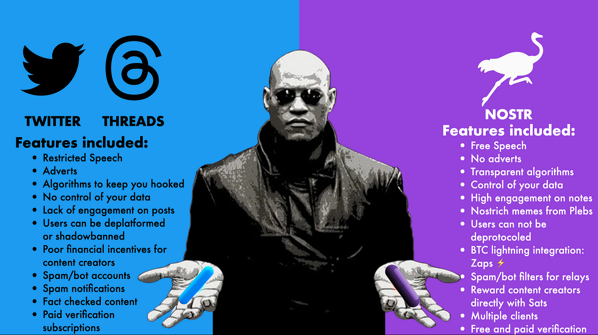

+++
date = '2025-03-06T07:41:05-05:00'
draft = false
underConstruction = false
title = 'How to Use Bitcoin'
+++

<h1 style="text-align:center">How to Use Bitcoin</h1>

<h2 class="align-left" style="display: inline-block">Key Points</h2>

<h3 style="bullet-heading">Acquire bitcoin by exchanging for it or working for it.</h3>

 

<h3 style="bullet-heading">Use a noncustodial wallet, not a custodial one.</h3>

 

<h3 style="bullet-heading">Your private key <i>is</i> your bitcoin.</h3>

 

<h3 style="bullet-heading">On-chain transactions require a fee to be confirmed on the Timechain.</h3>

 

<h3 style="bullet-heading">It’s best to check the traffic of pending transactions in the <a target="_blank" href="http://mempool.space">mempool</a> before making a payment.</h3>

 

<h3 style="bullet-heading">There are 4 different types of on-chain receiving addresses.</h3>

 

<h3 style="bullet-heading">For better privacy, use a different receiving address every time you receive bitcoin.</h3>

 

<h3 style="bullet-heading">UTXOs are the “coins” of Bitcoin, and can be made of any number of sats.</h3>

 

<h3 style="bullet-heading">More UTXOs in a transaction mean higher fees, so consolidate them once in a while, when fees are low.</h3>

 

<h3 style="bullet-heading">The Lightning Network is the most popular second layer on Bitcoin, but it has its downsides.</h3>

 

<h3 style="bullet-heading">Nostr makes it easy to receive sats for the content you create.</h3>

 

<h3 style="bullet-heading">Other payment layers solve for Lightning’s downsides.</h3>

 

<h3 style="bullet-heading">Keep learning; there is no end to the Bitcoin rabbit hole.</h3>

 

<h3 style="bullet-heading">Participate in Bitcoin by running a node and/or miner, contributing to its code, or accepting bitcoin for payments.</h3>

 

<h3 style="bullet-heading">Tell others about Bitcoin and our initiative; not for you, but for them.</h3>

 

 

Now that we’ve explored the essential characteristics of money, its history, and the groundbreaking innovation of Bitcoin, it’s time to put that knowledge into action. If you don’t own any bitcoin yet, that will be the first thing you need to take care of.

 

<h3 syle="text-align:left">Acquiring Bitcoin</h3>

 

 

 

As mentioned previously, there are several straightforward ways to obtain some bitcoin. You can exchange your dollars for it online or in-person, accept it as payment for goods or services, or even earn it through work. For most people, buying Bitcoin from a reputable exchange is the easiest entry point. Review our <a href="https://www.BitcoinChatt.org/new-to-bitcoin/exchanges-and-wallets">Exchanges and Wallets</a> page for a full list of good online exchanges, but <a target="_blank" href="https://river.com/signup?r=3ODI6556F4">River</a> and <a target="_blank" href="https://invite.strike.me/IEU8IW">Strike</a> are two of the best. Signing up through those referral links will give you certain benefits, but will benefit Bitcoin Chattanooga, as well.

Alternatively, you might acquire bitcoin by accepting it as payment, a method that’s especially appealing if you run a business. Specially-built Bitcoin Point of Sale systems will soon be available in our <a href="https://www.BitcoinChatt.org/store">Store</a>, and they can help you seamlessly integrate bitcoin into your transactions, attracting customers who understand that bitcoin is the future of money.

 

 

 

You could also earn bitcoin through participating in community service with Bitcoin Chattanooga, or by arranging with your employer to receive at least part of your wages in bitcoin. Since convincing your employer might prove difficult at this time, and you’ll likely want some dollars for your immediate needs, using something like <a target="_blank" href="https://invite.strike.me/IEU8IW">Strike</a> makes it easy to receive direct deposits that land in your account as any ratio of dollars and bitcoin that you prefer.

 

<h3 syle="text-align:left">Managing Your Bitcoin</h3>

 

Regardless of how you acquire your bitcoin, it’s typically best to transfer it to a personal wallet that you control, so you don’t have to trust anyone else to custody it for you, or risk losing it through confiscation, hacks, or a dishonest custodian. <b>This will require more responsibility from you,</b> since <i>any bitcoin you lose can never be recovered,</i> but <b>responsibility is the key to freedom.</b> So your choice is really between relying on a custodian that will give you an <i>appearance</i> of security with no actual freedom, or doing the work to manage your own security as the custodian of your bitcoin, and with maximum freedom to use it as you will. Choose wisely.

 

 

 

There are two types of noncustodial wallets, or wallets that give you complete control over your bitcoin: “hot” wallets and “cold” wallets. Hot wallets are called that because, like a hot electric wire, they are hosted on devices with a live connection to the internet. These include apps on your phone and programs on your computer that hold your private key in an encrypted format so it’ll be safe from potential hackers. Cold wallets, by contrast, are physical devices that are <i>never</i> connected to the internet, so the private key(s) they hold can only be accessed through physical possession of the device, and often with a required passcode, as well.

Since cold wallets cost money, and using them takes a few additional steps, they’re primarily good for long-term storage of large amounts of bitcoin that need the highest security. Hot wallets, on the other hand, are free and much easier to set up, so they’re good for holding bitcoin that you want to save, but can still access on-the-go now and then. Everyone’s situation and risk tolerance is different, though, so as the custodian of your own bitcoin, you decide what’s best for you.

A full list of our recommended hot and cold wallets is on our <a href="https://www.BitcoinChatt.org/new-to-bitcoin/exchanges-and-wallets">Exchanges and Wallets</a> page, but they all generate your private key in similar ways, as either 12 or 24 random common English words from <a target="_blank" href="https://github.com/bitcoin/bips/blob/master/bip-0039/english.txt">this list</a>. Here’s an example of a real bitcoin private key:

 

<b>boil today beyond salon poverty wood radio unit settle talk pepper uniform</b>

 

 

<b>Warning:</b> Do <i>NOT</i> use this private key! If you do, your funds <i>WILL</i> be lost!

Whether you set up a hot wallet on your phone, or purchase a signing device for cold storage, you’ll need to write down this 12- or 24-word seed phrase on something like a piece of paper, or anything else that is <i>not</i> connected to the internet (unlike what we did above). For extra security against time and the elements, many choose to engrave their seed phrase on steel or titanium. Whatever you do, <i>do not store your private key on your computer, in cloud storage, or anywhere online!</i> <b>Your private key <i>is</i> your bitcoin,</b> so keep it somewhere safe, just as you would if it were gold.

 

 

 

<h3 syle="text-align:left">Sending and Receiving Bitcoin On-Chain</h3>

 

As you may recall, Bitcoin’s Timechain (commonly called the “blockchain”) is the unchangeable ledger where bitcoin transactions are permanently recorded. Each block is like a new page that’s added to a ledger book every 10 minutes on average, and is limited in the amount of data it can hold. The average interval of 10 minutes is to allow for any internet latency issues as miners find new blocks and broadcast the proof of their work to nodes around the world, and the limited capacity in each block keeps nodes small and light, so Bitcoin can remain decentralized.

 

 

 

Because of these time and capacity restrictions, though, not all pending transactions can be included in each new block. Many have to wait for hours, days, weeks, or even longer, depending on Bitcoin’s global usage at any given time. So early in Bitcoin’s history, a fee structure developed organically, in which a user would offer the miners a small payment of bitcoin to add their transaction in the next block. Naturally, the miners choose to include transactions with the highest fees for the amount of data they’ll be storing, as measured in “sats per vbyte”—a <i>virtual</i> byte, or a byte of bitcoin transaction data, minus the signature info from the coin’s sender.

When preparing to make a transaction on the Timechain, it’s a good idea to first check <a target="_blank" href="http://mempool.space">mempool.space</a>—a visual Timechain explorer—and see what the current fee rate is for the next couple blocks. Unpredictable things could still happen—miners could find several blocks in a row that are only seconds apart from each other, an influx of new transactions offering a higher fee rate could push your transaction back, or anything else—but this will give you a general idea of the fee rate you should set for your transaction. Whether you need it to be confirmed ASAP, you can wait a little while, or you don’t care when it goes through, it’s entirely up to you, and most wallets will allow you to set your fee rate accordingly.

To send an on-chain transaction, you’ll need the other party’s receiving address. This is a unique string of letters and numbers that’s cryptographically derived from the public key, which itself is derived from the private key. While all wallets are different, generating a receiving address is generally pretty simple: select “Receive” in your wallet of choice, and the address will appear, often with or in the form of a QR code. There are several different types of address formats you might see. They are:

<ol>
<li><b>Legacy</b> addresses start with “1”. They use an older version of Bitcoin’s software, and their fees are costlier.</li>
<li><b>SegWit-Compatible</b> addresses start with “3”. They use a newer version of Bitcoin’s software (an upgrade called “Segregated Witness”, or “SegWit” for short), and they have lower fees than Legacy Addresses.</li>
<li><b>Native SegWit</b> addresses start with “bc1q”. They also use the SegWit update, and make on-chain fees even lower. This tends to be the most popular kind of address format.</li>
<li><b>Taproot</b> addresses start with “bc1p”. They use an even newer update to Bitcoin’s software, called Taproot, which provides advanced privacy features and negligibly lower fees than Native SegWit. However, there aren’t many wallets that support Taproot addresses, yet.</li>
</ol>

As an example, here’s a Native SegWit bitcoin address that’s connected to Bitcoin Chatt’s wallet:

 

<b>bc1qnn35dt7vr4s7yxdpytknjxx5u66ex8033uk797</b>

 

 

If you were to donate sats to Bitcoin Chatt (<a href="https://www.BitcoinChatt.org/donate">please do!</a>), you could copy that address, open your bitcoin wallet, select “Send”, paste that address in the appropriate line for it, set the amount you’d want to send, choose your fee rate, confirm that all the details are correct, and then send the transaction.

Alternatively, scanning this QR code will give you that same receiving address:

 

 

 

Most wallets will create a QR code of the receiving address for you, making sending bitcoin on-chain as easy as: <b>scan→set the amount→set the fee rate→confirm details→send.</b> The receiver can even set the amount they want to be sent to them, saving the sender that step before the QR code is even scanned.

Remember how Bitcoin’s Timechain is fully transparent and auditable? If you donate using the address or QR code above, then you can follow <a target="_blank" href="https://mempool.space/address/bc1qnn35dt7vr4s7yxdpytknjxx5u66ex8033uk797">this link</a> to see your transaction either waiting in the mempool or confirmed on the Timechain. You’ll also be able to see all other donations from people using that particular address to donate to us. Normally, this would cause many privacy-related problems, since using only one receiving address would reveal all the bitcoin we’ve ever been given. That’s why, on our <a href="https://www.BitcoinChatt.org/donate">Donate</a> page, we will <b>automatically use a new receiving address for every transaction</b>, and you should ensure that whatever wallet you use automatically does that, too.

Once the transaction is sent, you just need to wait for it to be confirmed. While miners are searching for the nonce (an astronomically huge number that’s smaller than a preset threshold, and is the solution to a cryptographic puzzle that can only be solved through guess-and-check), they are also collecting pending transactions to include in the next block, typically by choosing the ones that will pay them the most in transaction fees. If you send a donation using the address above, then after following the link to see your transaction, you’ll be able to select your Transaction ID (TXID), and watch your transaction get confirmed and added forever to the Timechain. Here’s an example of a Transaction ID:

 

<b>a1075db55d416d3ca199f55b6084e2115b9345e16c5cf302fc80e9d5fbf5d48d</b>

 

 

<b>Fun Fact:</b> That’s the TXID for the very first real-world purchase using bitcoin, when a man named Laszlo Hanyecz bought two pizzas for 10,000 full bitcoin.

 

 

 

<h3 syle="text-align:left">Managing Your Bitcoin: Understanding UTXOs</h3>

 

The “coins” of Bitcoin are called UTXOs, which stands for “Unspent Transaction Outputs”. That term may sound technical, but a “Transaction Output” is basically a fancy word for the change received from a previous transaction, and it’s “Unspent” because, as the word implies, it hasn’t been spent yet. The best comparison for UTXOs is the coins and bills that make up the dollar system. Dollars have 12 types of UTXOs: 1¢, 5¢, 10¢, 25¢, 50¢, $1, $2, $5, $10, $20, $50, and $100. In contrast, Bitcoin’s UTXOs can be any amount, ensuring you will always receive exact change back when you use a UTXO that’s larger than the amount needed to pay.

Why does this matter? Transaction fees are not determined by the amount of bitcoin being sent, but largely by the amount of bytes of data (excluding the signature data) in the transaction itself. Each UTXO is a certain number of bytes in size, so the more UTXOs you spend with, the more you’ll have to pay for your transaction fee.

For example, if you pay someone 1 bitcoin using 3 UTXOs—one that’s 0.23985286 bitcoin, another that’s 0.30198243 bitcoin, and another that’s 0.50087254 bitcoin—then all 3 UTXOs would need to be included in the transaction data, and a small amount—let’s say 1000 sats, though that’s likely unrealistic—would go to the miners as a transaction fee, so you would receive a UTXO of 0.04269783 bitcoin back as change. Or, if you’re able to pay with just a single UTXO of 2 bitcoin, then the fees would be much less, and you would receive the rest back as change.

 

 

 

Here is an example of UTXOs in a real Bitcoin transaction. In fact, <a target="_blank" href="https://mempool.space/tx/db6d2ec5dfeca8f50b8ee973e39f1f356a29ddb488e5c2580bbd70f273f4ce4f">this particular transaction</a> is one of the many times when the government of El Salvador bought 1 bitcoin each day, and moved it into cold storage. The exchange they’re buying the bitcoin from appears to also be using this opportunity to merge 4 UTXOs, likely to allow for cheaper fees later. These were combined, and then just 4,508 sats were sent to the miners (notice the virtual size of this transaction in the lower left; when that’s multiplied by the chosen fee rate, it equals the total fee paid), 1 full bitcoin was sent to El Salvador’s wallet, and the other ‎214.02704354 bitcoin was sent back to the exchange.

As for occasionally consolidating your own UTXOs, it’s important to understand that you can send them to yourself, using a receiving address that your own wallet generates. When doing this, it helps to think of your bitcoin as a large chunk of gold that you can easily split up precisely—to the exact atom—and that you can also melt back together. If you had hundreds of gold pieces the size of grains of sand, then accounting for each and every one in a transaction would be a lot of work; in Bitcoin, it would be a lot of information that needs to fit into a limited space, and other users are competing for that space.

So every so often, when the fee rate is low and you have a lot of small UTXOs, take that opportunity to consolidate them. When the fee rate rises again, your future self will thank you.

 

<h3 syle="text-align:left">Lightning Network Transactions</h3>

 

 

 

Due to the necessary constraints on the Timechain that keep Bitcoin decentralized and its users in consensus about who owns how much bitcoin, it can’t scale to global uses on its own. Like the internet, which uses layers to scale from initially only sending packets of small bits of data from Point A to Point B, to now letting us stream entire movies to our phones, Bitcoin is also scaling in layers. The first and currently the most popular of these additional layers is called the Lightning Network.

As the <a href="https://www.BitcoinChatt.org/new-to-bitcoin/intro-to-bitcoin">Introduction to Bitcoin</a> explained, the Lightning Network is a web of connections, or “channels”, between Bitcoiners, that enables instant and free or nearly-free transactions. These channels are created by a public transaction that opens a private connection between them, with a certain amount of bitcoin in their channel. Once the transaction opening the channel is confirmed, they can transact with each other instantly and freely, without the transaction ever touching the Timechain. They can also transact with others who are connected to their connections, as long as there's enough liquidity on the various sides of the channel to make a given transaction possible.

For instance, if Alice and Carol have a channel, and Carol has a channel with Ella, who also has a channel with Frank, then Alice would still be able to instantly send sats to Frank, even though they’re not directly connected. The sats would first be sent to Carol, whose Lightning Node would automatically send the same number of sats (minus any routing fees that Carol charges) to Ella, and her Lightning Node would automatically send the same amount (excluding any of Ella’s routing fees) to Frank. But if any of those connections don't have enough sats in them to bump to the other side of the channel, then the network would have to try to find a new route for the sender. And if no route can be found, then the transaction can't be completed using Lightning.

 

 

 

There are a few ways to transact using the Lightning Network, and they all require wallets that are compatible with Lightning. Our full list of Lightning-compatible wallets, both custodial and noncustodial, can be found on our <a href="https://www.BitcoinChatt.org/new-to-bitcoin/exchanges-and-wallets">Exchanges and Wallets</a> page. Given the difficulty that some have with running a noncustodial Lightning wallet on their phone, many choose to use a custodial Lightning wallet. If you choose to do this, remember the risks associated with trusting any custodian with your bitcoin. A good rule of thumb for such wallets is to only keep in there what you might normally carry as cash in your pocket. It’s less secure than a noncustodial wallet, but incredibly easy to use for everyday purchases, so decide for yourself whether to use one, and how much to hold in it.

The Lightning Network was started in 2018, after the SegWit upgrade the year prior, which was the solution to <a target="_blank" href="https://a.co/d/fNu8mcP">the Blocksize War</a> during the years before that. At first, the only way to transact on Lightning involved the recipient creating a new receiving address code, known as a “Lighting Invoice”. New invoices had to be created every time someone wanted to receive sats over Lightning, and they expired after a predetermined amount of time (often 10 minutes, but some would last for an hour or more), so it was impossible to send someone sats without their knowledge. Here’s an example of a Lightning Invoice, though by the time you’re reading this, it has long-since expired:

 

 

<b>lnbc10u1pn79srzsp5eckwgvflsmxky0tnrssht478a90jaskkmpr74q4xykywl6a5q3aspp5eqkfhaw0fq3z28kkhxauc9qak86j530hvpqaf9s8cxuhtm03talqhp5uwcvgs5clswpfxhm7nyfjmaeysn6us0yvjdexn9yjkv3k7zjhp2sxq9z0rgqcqpnrzjqwsl8t7kgmthhkh4ghxw4ureh2mq2l4w2trrrxmrkkqr6zvf66nj7rv03cqqpfcqqqqqqqqqqqqqqqqqjq9qxpqysgq47khqscxv76qdxk82nkfcdzm92luwq829qlzlftjjzgje7z4ql38rghnuuvuhnjm376p94rmntvdva504c2g3ddryey0ntwcfq95awcq8y2f32</b>

 

 

Later, the Lightning protocol was upgraded to support static Lightning payment codes. These could be shared and used any time—even when the recipient is sleeping—but it still involved a lengthy code that was not easy for humans to remember or share. Here’s an example of a static Lightning Payment code (and yes, this belongs to a Bitcoin Chatt wallet):

 

 

<b>lno1zrxq8pjw7qjlm68mtp7e3yvxee4y5xrgjhhyf2fxhlphpckrvevh50u0qwpcs54448nawn2vtrecz6247uan3wztz0rpum8c03vp3qywxcwzqqsrze3j8hf2sz4nmegpngr7qgt65rhv89pnhl5fm6726r6ypv35urwsqvapjz5ujha9yvkl2lrxrvn05gkqahaup6z3uk83s79z5te9hdmuqw6vm3w6p27wl8spd3m3xt0tkaawr2saqfx9gw0v8jyxxks9zqwsyhxeew0cxsfe7kj58f5rymgfwmglhqfzxqqsfgruwdfp9kw5s3986akzlrt4qg</b>

 

 

Then came a new development, called <a target="_blank" href="https://lightningaddress.com/">Lightning Addresses</a>. These look like email addresses, but they act as human-readable static payment codes, enabling you to send sats to anyone who has one, as easily as sending an email. Currently, the only noncustodial Lightning Wallet that offers this is <a target="_blank" href="https://phoenix.acinq.co/">Phoenix</a>, and it chooses the prefix (everything to the left of the @) for you. So Bitcoin Chatt opted to use a custodial wallet called <a target="_blank" href="http://coinos.io">CoinOS</a> (though we’re careful to not store a lot in it), and our Lightning Address is: <b>BitcoinChatt@coinos.io</b>

More recently, sending bitcoin over Lightning has gotten even easier! A new messaging protocol called “NOSTR” (<b>N</b>otes and <b>O</b>ther <b>S</b>tuff <b>T</b>ransmitted by <b>R</b>elays) has introduced “zaps”, which make sending sats to someone as easy as liking a post on social media. More on this below, but first, a little about Nostr.

 

 

 

Nostr is not a social media platform like Twitter/X or Instagram, but an entirely new protocol for sending and receiving messages; just like how email is a protocol, while gmail and protonmail are platforms built on that protocol. As the name implies, Nostr is a protocol for transmitting notes and any other data through small computers known as relays, instead of through central servers. This makes censorship on social media nearly impossible, and no one is in charge of it—two qualities that make it very attractive to Bitcoiners!

Regarding zaps, each Nostr app does it somewhat differently, but the overall concept is that you can send someone a few sats with the touch of a button, as a way to show your appreciation for their content. “Likes” are cheap; if you get real value from someone’s post, you should send them real value in return. Here’s an example, using a Nostr app called Amethyst:

 

 

 

<h3 syle="text-align:left">Other Payment Layers</h3>

 

While Lightning Network offers instant and cheap/free transactions, like any tool, it comes with its own tradeoffs. That’s why other payment layers have been developed, each designed with its own set of pros and cons to suit different situations and preferences. These additional payment layers include the Liquid Network, eCash Tokens, and the ARK Protocol, but more are in development, as Bitcoiners are eager to scale Bitcoin for global usage. So let’s take a look at these three.

<b><a target="_blank" href="https://liquid.net/">The Liquid Network</a></b> is a sidechain that offers faster and cheaper transactions. You lock your bitcoin on the Timechain and get a 1:1 ratio of Liquid Bitcoin (L-BTC) on the sidechain, where transactions settle in about two minutes, rather than 10 minutes. It’s run by a federation of well-known and trusted organizations, and it enables confidential transactions that hide the amounts being sent. Liquid also lets you create digital assets, like tokenized dollars, which are perfect for traders or businesses needing quick, flexible payments. The main tradeoff is that you need to rely on the federation to confirm and secure your transactions, but you can always unlock your bitcoin on the Timechain and regain full control.

<b><a target="_blank" href="https://cashu.space/">eCash Tokens</a></b> bring cash-like privacy to Bitcoin. A mint—someone you know well or a group you trust—holds the bitcoin and issues digital tokens at a 1:1 ratio that you can send to others, even offline. These tokens leave no trace on the Timechain, keeping your transactions private and unlinkable, and you can always redeem them for regular bitcoin whenever you want. The only catch is that this technology is still very new, so it may not be entirely stable. But like bitcoin, its protocol is open source, so you can always verify that everything is as it should be. If privacy is your main priority, eCash offers a simple solution that’s like using cash, just without the paper.

<b><a target="_blank" href="https://arklabs.to/">The Ark Protocol</a></b>, while currently undergoing an important testing phase, aims to simplify Bitcoin payments and optimize them for speed, privacy, and cost. Users pool bitcoin into shared UTXOs that are managed by an Ark Service Provider (ASP)—similar to a node on Bitcoin’s base layer, in the sense that they can coordinate everyone’s UTXOs, but they can’t steal them from anyone—which issues virtual UTXOs (vTXOs) for instant off-chain spending. You can pay anyone in the network, even if you don’t have a direct connection, and also make quick out-of-round payments—”rounds” are periodic on-chain updates to the pool of shared UTXOs when transaction fees are low—with ASP co-signing. Ark is also compatible with Lightning payments, further simplifying Bitcoin for everyday use.

 

 

 

<h3 syle="text-align:left">What’s Next</h3>

 

Congratulations! You’ve learned all the basics about Bitcoin, and you’re ready to move forward with using it as money, or at least as a means of saving without your hard work getting stolen through inflation.

Now what?

If you haven’t already, look through our <a href="https://www.BitcoinChatt.org/new-to-bitcoin/exchanges-and-wallets">Exchanges and Wallets</a> page, and choose ones that fit your needs best. 

If you’ve read everything and made it this far, you’ve already learned a lot about Bitcoin (to say nothing of economics, cryptography, etc). Keep going! This rabbit hole has no end, so you will never learn all there is to know about Bitcoin and the ways it affects us and our world. On the <a href="https://www.BitcoinChatt.org/new-to-bitcoin/resources">Other Resources</a> page, we’ve collected all the best educational material about Bitcoin that we could find on the internet. Undoubtedly, they contain many explanations that will make better sense to you than what we’ve said here, so look through them and decide for yourself. And if there’s a word or phrase that Bitcoiners use that you’re unfamiliar with, look it up in our <a href="https://www.BitcoinChatt.org/new-to-bitcoin/glossary">Glossary</a>.

 

 

 

As always, if you know of a Bitcoin term or an educational resource that we neglected to include, <a href="https://www.BitcoinChatt.org/contact">let us know</a>, and we’ll consider adding it. If you have questions, or need any 1-on-1 help with Bitcoin, reach out to us via our Contact page, and we’ll do our best to get back to you within 24 hours. And don’t forget to drop by our monthly social meetups, which you can RSVP for on our <a href="https://www.BitcoinChatt.org/calendar">Calendar</a>.

If you want to give back to the Bitcoin community, and help move Bitcoin adoption forward, there are several things you can do:

<b>Run a Node</b>

Most nodes cost a few hundred dollars, but they are not energy-intensive like miners. Running one helps to not only keep Bitcoin decentralized, but as long as you link it to your wallet, it also adds a layer of privacy to your transactions, and allows you to verify with certainty that the current state of the Timechain is completely accurate. If you’re interested in running a node and enforcing Bitcoin’s rules, a few of the best ones you should look into are <a target="_blank" href="https://store.start9.com/">Start9</a>, <a target="_blank" href="https://mynodebtc.com/">MyNode</a>, and <a target="_blank" href="https://umbrel.com/">Umbrel</a>.

<b>Run a Miner</b>

Miners usually run in the price range of several thousand dollars, and are very energy-intensive. When you mine, you’re contributing to a shield of pure energy that protects all Bitcoin transactions, so you get paid for it with newly mined bitcoin and transaction fees. If you choose to mine, make sure to use equipment that runs efficiently, and that the cost of your electricity is low. Here is a helpful <a target="_blank" href="https://tools.bitbo.io/mining-calculator/">calculator</a>, where you can check to see if it would be profitable for you. If you’re interested in mining bitcoin and protecting the Timechain from any kind of tampering, a few of the best miners you should look into are the <a target="_blank" href="https://bitaxe.org/">Bitaxe</a>, <a target="_blank" href="https://heatbit.com/?ref=jsellers">Heatbit</a>, and <a target="_blank" href="https://futurebit.io/products/apollo-ii">Futurebit</a>.

<b>Learn to Code</b>

Bitcoin is completely open source, which means the code can be checked by anyone, but it can also be altered by anyone, and anyone can choose whether to accept the altered code or not. All of Bitcoin’s upgrades start with the developers, before being reviewed and either accepted or rejected by the node runners and the general Bitcoin community. But there are precious few who know how to contribute to Bitcoin’s code, so more of them are always needed! If you’re interested in coding for Bitcoin, and play a part in creating its newest updates, a few of the best (<i>and free!</i>) educational resources are <a target="_blank" href="https://developer.bitcoin.org/">Bitcoin.org’s developer page</a>, Saylor Academy’s <a target="_blank" href="https://learn.saylor.org/enrol/index.php?id=500">Bitcoin for Developers I</a> course, and <a target="_blank" href="https://bitcoinedge.org/">Bitcoin Edge</a>.

<b>Accept Bitcoin for Payments</b>

Whether you run a business or you just run a garage sale now and then, accepting bitcoin for payments is a great way to stack sats without needing to register with an exchange. If you’re a business owner, then once you start accepting bitcoin (or if you already accept it), <a target="_blank" href="https://www.BitcoinChatt.org/contact">reach out to us</a>, and we’ll add you to our <a target="_blank" href="https://www.BitcoinChatt.org/map">Map</a>, and actively recommend your business to all Bitcoiners in the area. Bitcoin is quickly gaining more attention and gradually rising in value (with a few dips along the way), so the time to begin accepting it for payment is now, before your competitors catch on.

 

 

 

<b>Donate to Bitcoin Chattanooga</b>
We’re still working on getting registered with the IRS as a 501(c)(3), but once that’s complete and our <a target="_blank" href="https://www.BitcoinChatt.org/donate">Donate</a> page is active, you will be able to make a tax-deductible donation to Bitcoin Chattanooga. All donations, whether in the form of bitcoin or dollars, will go towards freely educating the Chattanooga community, onboarding businesses to accept it for payment, and rewarding participants for their work in our community service activities. If you want to help create a Bitcoin circular economy throughout the Chattanooga area, while simultaneously lifting people out of poverty by giving them an opportunity to build their savings, then please consider donating to our cause!

<b>Spread the Word</b>

 

 

 

If nothing else, one thing that anyone can do is tell their friends, family members, coworkers, neighbors, and anyone else about Bitcoin, and the circular economy Bitcoin Chattanooga is trying to build. A common concern is that Bitcoiners only “evangelize” about Bitcoin in order to make bitcoin’s price go up in dollar terms, but that’s based on a few misunderstandings:

First, Bitcoin is far too large for anyone you know to move the price in any noticeable way, even if they exchanged all their dollars for it. So telling them about Bitcoin and the problems it solves is not for <i>your</i> benefit, but theirs.

Second, anyone who knows enough about Bitcoin to want to tell others about it would not only know the first point, but would also understand that <b>the point of holding bitcoin is not for its users to sell it for more dollars, but to ultimately hold <i>less</i> dollars, and more of the only perfect money humanity has ever had.</b> No matter what Bitcoin’s price in fiat is today, it’s still indescribably cheap compared to what it will inevitably be in the future, and will continue to be so forever, for anyone who can hold onto it long enough.

 

 

 

And third, while Bitcoin was initially created to separate money from state, it leads to other changes, as well, especially within the hearts and minds of its users. That may sound strange, but remember that money is how we communicate value, and value is closely tied to our decision making. <b>When we use a store of value that can never be debased and continues to trend up in value over time, it affects the way we think, incentivizing us to sacrifice things that only offer short-lived gratification for things that bring long-lasting inner peace.</b> Many who measure the value of their time and labor in bitcoin have overcome addictions, started families, and found meaning and purpose for their lives for the first time. All from a little project started in 2008 by an anonymous individual on an obscure email list. Fascinating, isn’t it?

So go tell others about Bitcoin, and how Bitcoin Chattanooga can help them use it for better savings, payments, and valuations, but remember while doing so that this is not about improving life for <i>you</i>; it’s about improving the world for <i>everyone</i>.

 

 

 
