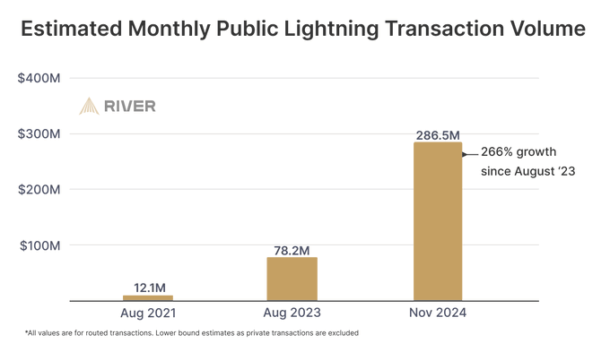

+++
date = '2025-03-06T07:40:05-05:00'
draft = false
underConstruction = false
title = 'Intro to Bitcoin'
+++

<h1 style="text-align:center">An Introduction to Bitcoin</h1>

<h2 style="text-align:center">

Key Points
</h2>

<h3 style="text-align:center">Bitcoin was created by an anonymous individual or group calling themselves “Satoshi Nakamoto”.</h3>

 

<h3 style="text-align:center">Satoshi disappeared in 2011, and has never been heard from since, nor have they used their bitcoin.</h3>

 

<h3 style="text-align:center">There will never be more than 21 million bitcoin.</h3>

 

<h3 style="text-align:center">Each bitcoin is divisible to the 100 millionth, called “satoshis” or just “sats”.</h3>

 

<h3 style="text-align:center">Bitcoin has all 7 ideal properties of money.</h3>

 

<h3 style="text-align:center">Bitcoin uses a Timechain (a.k.a. “blockchain”), which is a shared public ledger of all bitcoin transactions.</h3>

 

<h3 style="text-align:center">Bitcoin is decentralized, so the users are in charge.</h3>

 

<h3 style="text-align:center">Unlike with gold, more bitcoin miners does <i>not</i> mean more bitcoin will be mined faster.</h3>

 

<h3 style="text-align:center">About every 4 years, the rate of newly mined bitcoin is cut in half, and that will continue until the last sat is mined.</h3>

 

<h3 style="text-align:center">There are 2 kinds of wallets: custodial and noncustodial (noncustodial is best).</h3>

 

<h3 style="text-align:center">Acquire bitcoin by exchanging for it or working for it.</h3>

 

<h3 style="text-align:center">On-chain transactions are slow & sometimes expensive, but are the most secure, & not limited in the amount that can be sent.</h3>

 

<h3 style="text-align:center">Off-chain transactions are fast, cheap/free, still secure enough, but are sometimes limited in the amount that can be sent.</h3>

 

<h3 style="text-align:center">Dollars are the Titanic; Bitcoin is the lifeboat.</h3>

 

 

<h3 syle="text-align:left">Bitcoin’s Story</h3>

 

 

 

It’s often said that Bitcoin was the first cryptocurrency, but that’s actually not correct; Bitcoin is the first cryptocurrency that <i>worked</i>, and its origins go much farther back than its announcement in 2008. Bitcoin can be traced back to developments made in the 1970s, and a group of cryptography experts and coders that got together in the early 1990s, and dedicated themselves to advancing individual privacy and autonomy through technology, known as the Cypherpunks.

On October 31, 2008, an individual or group using the pseudonym “Satoshi Nakamoto” sent an email on the Cypherpunk mailing list, and published the <a target="_blank" href="https://bitcoin.org/bitcoin.pdf">Bitcoin Whitepaper</a>. This paper outlined a decentralized digital currency system independent of traditional financial intermediaries. Some in the Cypherpunk community expressed skepticism due to prior unsuccessful digital currency experiments, while others, including Hal Finney, supported Bitcoin’s development, and worked with Satoshi to get it started.

The Bitcoin network was officially activated on January 3, 2009, when Satoshi mined what has come to be known as the <a target="_blank" href="https://mempool.space/block/000000000019d6689c085ae165831e934ff763ae46a2a6c172b3f1b60a8ce26f">Genesis Block</a>. He permanently embedded the headline of that day’s London Times newspaper in that block, as both a statement of Bitcoin’s purpose as a solution to the deficiencies in the existing banking system, as well as proof that he did not secretly or dishonestly start Bitcoin before that date.

 

 

 

Following its inception, Bitcoin grew incrementally. A modest community of developers and early adopters began utilizing the software, conducting transactions of negligible economic value, as tests of the network’s capacity. A notable milestone occurred in 2010 when programmer Laszlo Hanyecz exchanged 10,000 bitcoin for two pizzas, illustrating for the first time its viability as a Medium of Exchange.

By 2011, Bitcoin had cultivated a small yet committed user base. That year, Satoshi Nakamoto withdrew from active involvement, stating that he had “moved on to other things”, and has never been heard from since, nor has he used any of his roughly 1 million bitcoin. Despite Satoshi’s anonymity and departure, the Bitcoin network persisted and expanded, sustained by a growing cohort of proponents who recognized its potential to reshape monetary systems.

 

 

 

<h3 syle="text-align:left">Bitcoin Basics</h3>

 

Bitcoin is a digital currency characterized by distinct features that differentiate it from traditional fiat currencies. Its total supply is permanently fixed to just under 21 million coins, which prevents inflationary devaluation. Each bitcoin can be divided into 100 million pieces—named “satoshis” after Bitcoin’s creator, or just “sats” for short—and even smaller if necessary, so precise transactions will always be possible. This duality of scarcity and divisibility positions Bitcoin as both a reliable Store of Value and a practical Medium of Exchange.

 

 

 

Bitcoin’s design resolves three fundamental shortcomings of conventional currencies. First, it facilitates permissionless transactions, allowing users to transfer funds without reliance on intermediaries that could censor payments or seize assets. Second, it removes any possibility of fraudulent transactions by rendering them irreversible upon confirmation, thereby eliminating the need for chargeback fees, saving money for both merchants and their customers. Third, its predetermined supply cap of 21 million coins makes debasement impossible, and when combined with the ever-rising demand for it, Bitcoin becomes the best long-term savings instrument humanity has ever seen.

Bitcoin is advancing toward fulfilling the three primary functions of money: Store of Value, Medium of Exchange, and Unit of Account. It has gained traction in the first two roles but has yet to achieve widespread adoption as a Unit of Account, where prices are denominated directly in bitcoin. This transition is anticipated to progress as general acceptance and familiarity continues to spread. Furthermore, Bitcoin uniquely embodies all seven ideal monetary attributes—<b>scarcity, durability, portability, divisibility, fungibility, verifiability,</b> and <b>immutability</b>—surpassing all prior forms of money, from primitive commodities to modern fiat systems, and establishing itself as <i>the most significant innovation in monetary history.</i>

 

 

 

<h3 syle="text-align:left">How Bitcoin Works</h3>

 

Bitcoin functions without any oversight from a central authority such as a government or corporation. Its operation is sustained by a global network of computers executing Bitcoin’s protocol. This structure is neither democratic nor hierarchical, but operates on a purely anarchical basis. Participants independently decide which software version to run, which updates to adopt, or whether to even participate at all. <b>This decentralization distinguishes Bitcoin as the sole digital currency free from centralized control.</b>

 

<h4 syle="text-align:left"><i>The Timechain and Mempools</i></h4>

The backbone of Bitcoin’s system is the Timechain, commonly known as a blockchain, which serves as a public, chronological ledger of all transactions since Bitcoin began. When transactions are initiated, they’re broadcast to the whole network, and placed with other pending transactions in a database called a Mempool. When transactions are  added to Bitcoin’s ledger, they’re cryptographically secured, rendering them completely unalterable by anything on Earth. This immutability underpins the system’s security by preventing double-spending and ensuring transaction finality.

To interact with a live view of the Timechain and a Mempool, go to <a target="_blank" href="https://mempool.space">mempool.space</a>

 

<h4 syle="text-align:left"><i>Nodes and Miners</i></h4>

The Bitcoin network relies on two critical groups of participants: nodes and miners. Nodes are computers—each is usually a simple laptop or a Raspberry Pi—run by volunteers around the world. They each maintain a full copy of the Timechain and the protocol’s rules, which they enforce by validating transactions, essentially making them the network’s overseers. They also each have their own Mempool, where they hold all the pending transactions that have been broadcast, until they’re added to the Timechain.

Miners, equipped with the most efficient computer hardware available, expend energy while repeatedly guessing large numbers, until they find one that works as the answer to a cryptographic puzzle. This concept is known as “Proof of Work”, since the fact that anyone has the correct number is proof that real-world work was done to obtain it. The first miner to do this adds a new “block”—think of it like a new page in Bitcoin’s public ledger—of transactions to the Timechain, along with all the pending transactions they can fit into the new block’s limited space. They earn a reward of new bitcoin for securing the ledger with the energy they used, and collect fees that were attached to the pending transactions as incentives for the miner to add the transactions to the next block. This computationally intensive process fortifies the network against manipulation, as altering the Timechain demands infeasible resources.

This clip from <i>Willy Wonka & the Chocolate Factory</i> (1971) is a good analogy of the roles that nodes and miners each play:

 

<video class="mobile-banner" src="./Node and Miners.mp4" controls style="width:40vw; display:block; margin:0 auto;"></video>

 

 

<h4 syle="text-align:left"><i>Cryptography</i></h4>

Bitcoin’s security is bolstered by basic cryptography. If you’re new to cryptography, it’s basically a field of mathematics with functions that can be easily verified in one direction, but are nearly impossible to solve in the other direction without repeated guessing and checking. <a target="_blank" href="https://youtu.be/YEBfamv-_do">This video</a> excellently described a metaphor to help you understand how cryptography works, using colo mixing. But you can watch the main clip here:

 

<video class="mobile-banner" src="./Encryption Explained.mp4" controls style="width:40vw; display:block; margin:0 auto;"></video>

 

 

For noncustodial wallets (more on that below), users are provided with a random <i>private</i> key, which is essentially a very large number that acts as a code to give you access to your bitcoin. The private key is then run through an algorithm to produce a <i>public</i> key, which is another large number that allows others to send bitcoin to the owner of the private key. This algorithm is a unidirectional cryptographic hash function; in other words, if the <i>private</i> key is known, then the <i>public</i> key can easily be found, but if only the <i>public</i> key is known, then it will be practically impossible to find the <i>private</i> key, even if all the computers on Earth worked together to do it.

However, anyone who has your public key will be able to check Bitcoin’s Timechain and see all the bitcoin that was ever sent to it. So, to improve your privacy, your public key is run through another algorithm to produce a practically infinite number of different receiving addresses. Reusing any of these addresses negates their very purpose, since it would allow anyone to see how much bitcoin you have, so it’s always best to use a new address when receiving bitcoin. This cryptographic framework provides a robust, secure, and private method for recording transactions to the Timechain.

 

<h4 syle="text-align:left"><i>The Difficulty Adjustment</i></h4>

Miners add new blocks to Bitcoin’s Timechain every 10 minutes, on average. As more miners are booted up, more guesses—or “hashes”—would be made to find the answer—a number known as a “nonce”—to the cryptographic puzzle, resulting in blocks coming in too quickly to be seen and validated by nodes around the world before another new block would be found. Like guessing the combination to a lock, two people working together would find the answer about twice as quickly as just one working on their own.

So every 2,016 blocks, or approximately every 2 weeks, Bitcoin’s protocol checks the amount of time it took for the last 2,016 blocks to be added, in a process known as the Difficulty Adjustment. If the average amount of time was <i>less</i> than 10 minutes, then the next set of 2,016 blocks will be harder to add; if the average amount of time was <i>more</i> than 10 minutes, then the next set of 2,016 blocks will be easier to add. This way, no matter how many miners join or leave the network, Bitcoin will always correct itself, and stay roughly on its predetermined issuance schedule.

 

 

 

<h4 syle="text-align:left"><i>The Halvings</i></h4>

The immovable limit of just under 21 million bitcoin (20,999,999.9769 bitcoin, to be precise) comes from the automatic schedule of new bitcoin rewarded to the miners. When Bitcoin began, miners received 50 new bitcoin for every block they added to the Timechain. After 210,000 of those blocks, or a little less than 4 years, that reward was automatically cut in half to 25 new bitcoin with each new block. 210,000 blocks—or almost 4 years—later, the reward was halved again, to 12.5 new bitcoin. It was halved again to 6.25 bitcoin, and then again to 3.125 bitcoin.

This process will continue for over a hundred more years. Sometime around the year 2136, the rate of newly mined bitcoin will be halved again from 0.00000002 bitcoin (2 sats), to just 0.00000001 bitcoin (1 sat) with every new block. Long before then, the primary source of compensation for miners will come from transaction fees. But then, after 210,000 blocks of a reward of just 1 sat with each new block, sometime around the year 2140, the last satoshi will be mined, and all bitcoin that will ever exist will be in circulation, and <b>there will never be any more.</b>

 

 

 

<h3 syle="text-align:left">Using Bitcoin</h3>

 

<h4 syle="text-align:left"><i>Wallets</i></h4>

To receive, hold, or spend bitcoin, you need a type of app or hardware device called a wallet. Wallet applications and devices manage your bitcoin by using private keys to send and secure funds, and public keys and addresses to receive them. There are two main kinds of wallets: <b>custodial</b> and <b>noncustodial</b>. Custodial wallets are hosted by third parties, like an exchange, and they retain control of the private keys. Like with fiat banks, you need to trust that the custodian isn’t claiming to hold more funds than they actually have, that they won’t run away with your money, and that they won’t get hacked. And also like fiat banks, <i>the history of custodial wallets is full of breaches of that trust.</i>

Noncustodial wallets, on the other hand, allow exclusive authority over the private keys, preserving financial autonomy for the user, while requiring greater responsibility from them. With most noncustodial wallets, the private key is represented by a 12 or 24 seed phrase made of common English words from <a target="_blank" href="https://github.com/bitcoin/bips/blob/master/bip-0039/english.txt">this list</a>, chosen at random. This phrase enables users to restore access to their funds if they lose access to their device, but it also grants control over all your bitcoin if someone else finds it. For all intents and purposes, <b>your private key <i>is</i> your bitcoin</b>, so it’s <i>imperative</i> that you learn how to protect it against water, fire, theft, loss, or anything else.

 

 

 

<h4 syle="text-align:left"><i>Acquiring Bitcoin</i></h4>

There are two ways to acquire bitcoin: <b>exchanging</b> dollars or goods/services for it, and <b>working</b> for it in your job or by mining. A third option would be <b>stealing</b> someone else’s private key, but we absolutely do <i>not</i> recommend that, of course, so we’ll just focus on the first two.

You can <i>exchange</i> your dollars for bitcoin (many call it "buying" bitcoin) at any of the online exchanges recommended for you on our <a href="https://www.bitcoinchatt.org/new-to-bitcoin/exchanges-and-wallets/">Exchanges and Wallets</a> page. You can also exchange in-person with someone you trust who currently owns bitcoin and is willing to trade it with you, but this is a legal grey area, so we generally don’t recommend this, either. And if you provide a good or service as part of your business, you can always accept bitcoin as payment for it (and if you do, be sure to <a href="https://www.bitcoinchatt.org/contact/">let us know</a>, and we’ll add you to our <a href="https://www.bitcoinchatt.org/map/">map</a>, and recommend your business to Bitcoiners in the area).

<iframe width="700" height="394" src="https://www.youtube.com/embed/jZpnNIPobPQ?si=IssCBnF1w7Xa_Dre" title="YouTube video player" frameborder="0" allow="accelerometer; autoplay; clipboard-write; encrypted-media; gyroscope; picture-in-picture; web-share" referrerpolicy="strict-origin-when-cross-origin" allowfullscreen></iframe>

You can <i>work</i> for bitcoin either by mining it, or getting paid with bitcoin by your employer. If your employer doesn’t want to pay you with bitcoin yet, you can set up an account on apps like <a target="_blank" href="https://invite.strike.me/IEU8IW">Strike</a> or <a target="_blank" href="https://cash.app/app/ZBHJXGR">Cash App</a>, start receiving direct deposits to it, and decide the percentages of it that you want to arrive as bitcoin or dollars.

However you acquire bitcoin, make sure to <i>always</i> move it from the custodial exchange or wallet to a wallet that <i>only you</i> control. You wouldn’t buy groceries only to leave them at the store, so bring your sats home by sending them to a wallet with a seed phrase that you’ve copied down on paper, steel, or something else that’s <i>not</i> connected to the internet. Only then is the bitcoin truly yours, and no one else’s.

 

<h4 syle="text-align:left"><i>Transactions</i></h4>

Bitcoin transactions occur both on the Timechain and off the Timechain. On-chain transactions are broadcast to all the nodes on the network, and then permanently embedded in a block by a miner. This offers unparalleled security and a transfer capacity that’s limited only by the amount you own, but it also involves long processing times and transaction fees that can get pricey when the network is busy, making on-chain transactions more suitable for large transactions, like purchasing a house or a car.

 

 

 

Off-chain transactions, enabled by technologies like the Lightning Network and others, bypass the Timechain for near-instantaneous, free or very-low-cost transfers, ideal for routine purchases like buying a coffee. However, like everything else they come with tradeoffs. The Lightning Network, for example, runs on a web of channels, each channel created by two Bitcoiners who embedded a transaction in the Timechain that opened a connection between them with a certain amount of bitcoin being shared between them. Once the channel is opened, they can transact with each other instantly and freely, without the transaction ever touching the Timechain.

For instance, if Alice has a channel open with Carol, who also has a channel open with Ella, who also has a channel open with Frank, then Alice would still be able to instantly send sats to Frank, even though they’re not directly connected. The sats would first be sent to Carol, whose Lightning Node would automatically send the same number of sats to Ella, and her Lightning Node would automatically send the same amount to Frank. Carol and Ella could even charge a small fee for facilitating the payment, if they wanted to.

 

 

 

No matter how many hops there are between the sender and receiver, the transaction will complete, provided there are enough sats in all the channels involved, and the sat are on the right sides of those channels. There’s always a possibility that there won’t be any open channels between the sender and receiver, or there won’t be enough sats in those channels, both everything has its tradeoffs, and those are the tradeoffs with the Lightning Network. But the Lightning Network is growing in size, capacity, and robustness every day, so this is becoming less of a problem.

 

 

 

<b>Bitcoin is the only perfect money,</b> as defined by the 7 ideal properties of money the Bitcoin exemplifies, but many people are still using it like an investment, to acquire more of an inferior type of money, the dollar. Trading your bitcoin for more fiat is like trading your seat on a lifeboat for a nicer room on the Titanic. The fiat system is sinking, and most people either haven’t noticed it yet, haven’t found the lifeboat yet, or haven’t realized the real value of their seat yet. From a fiat perspective, the price of bitcoin is climbing higher, though with some volatility along the way. But from a bitcoin perspective, the prices of everything else—gasoline, eggs, electronics, etc.—are <i>falling</i>, and with some volatility along the way. <i>When your life runs on bitcoin, <a target="_blank" href="https://www.pricedinbitcoin21.com/">everything else gets cheaper over time</a>.</i>

Next, we’ll dive into <a href="https://www.bitcoinchatt.org/new-to-bitcoin/how-to-use-bitcoin">How to Use Bitcoin</a> the way it was intended: <b>as money that allows you to save and transact without needing to trust anyone else.</b>

 

