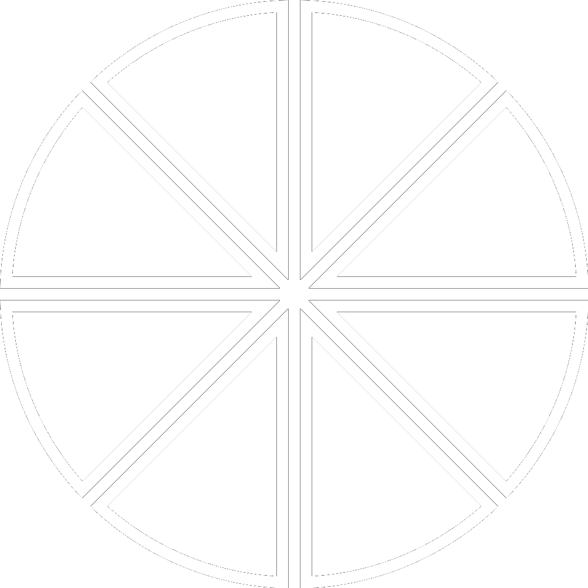

+++
date = '2025-03-06T07:38:41-05:00'
draft = false
underConstruction = true
title = 'What Is Money'
+++

<h1 style="text-align:center">What is Money?</h1>

<h2 style="text-align:center">And Why Do We Need It?</h2>

## What is Money?

We often take money for granted. We use it every day, but have you ever stopped to consider what it is fundamentally, beyond coins or bills? At its core, <b>money is a technology that turns our time, work, and resources into a form that can be easily saved and shared.</b> Without money, trade would have to rely on bartering, which is burdened with a problem known as the “coincidence of wants”—both sides must have what the other wants, or else no trade can occur.

Money resolves this issue by eliminating the need for perfect matches, enabling trade with anyone, anywhere. Just as written and spoken words enable us to communicate information, money acts like a language that allows us to express and transfer value with each other.

What do we mean by “value”? Value is never intrinsic to anything, but only ever exists in the eye of the beholder, according to how well the thing in question can fulfill their desires. The more a money can be relied upon to facilitate trade over both distance and time, the more valuable it will be; in other words, the more goods and services it can be exchanged for.

For a quick overview of this topic, this short video explains it really well:

<iframe width="560" height="315" src="https://www.youtube.com/embed/InwVM6s7WoY" title="YouTube video player" frameborder="0" allow="accelerometer; autoplay; clipboard-write; encrypted-media; gyroscope; picture-in-picture; web-share" referrerpolicy="strict-origin-when-cross-origin" allowfullscreen></iframe>

 
## The Functions of Money
Money plays three essential functions in the economy, each relying on the one before it: Store of Value, Medium of Exchange, and Unit of Account. In order for anything to become money, it must fulfill these roles in this sequence, as it earns society’s trust as money.

As a <b>Store of Value</b>, it must have purchasing power that can be preserved over time. Without this, no value can be exchanged today or stored for being exchanged tomorrow, leaving the would-be money without a solid foundation.

Only when it retains value can it become a <b>Medium of Exchange</b>, facilitating trade efficiently. Barter’s inefficiencies vanish as money lets us swap goods without needing our desires to match perfectly. This opens up trade, making it simple and accessible for everyone.

Finally, money acts as a <b>Unit of Account</b>, a standardized measure of value. This stage reflects maturity—when society intuitively grasps prices for anything in the new form of money, from a loaf of bread to a house. This is when money becomes the “language” of value, fully integrated into daily life.

 

 

 

Each function depends on its predecessor, forming a hierarchy of utility. A new money, like Bitcoin, must prove itself first as value storage, then as a medium for exchanging goods and services, before naturally becoming the standard for measuring the value of everything.

 
## The Properties of Ideal Money
For millennia, people have used various forms of money, and discovered the ideal qualities that money should have. Historically, none have possessed them all, but the more of these a money had, the more effectively it served humanity’s needs. These properties are:

 

### Scarcity

Money must be limited in supply and difficult to acquire, so the only way to make or find more of it is the same way that someone else would earn it from you: through hard work!

 

### Durability

Money must remain undamaged through time and use, resisting decay and destruction, preserving its value long after the work done to gain it is done.

 

### Divisibility

Money needs to be divisible into smaller units without loss, enabling precise transactions, whether you’re buying a house or a sandwich.

 

### Portability

Money must move easily across large geographic distances, unshackled by weight or bulk, so anyone anywhere can easily transact with each other.

 

### Fungibility

Each unit of the money must be equal to any other, and interchangeable without distinction, regardless of its physical condition (if the money is physical).

 

### Verifiability

It needs to be possible to quickly and easily authenticate whether a unit of money is real or not, since this guards against fraud and fosters trust between the buyer and seller.

 

### Immutability

Whichever of the above properties a money may have, this one locks them in so they stay fixed forever.

 

## A World Without Money
Science fiction writers and idealists have often spoken highly about a world without money, but once you understand what money is and its place in our society, it becomes clear how indispensable money is for a functioning civilization. Without it, we’d be forced to make direct exchanges for our needs, and our large, complex society would collapse.

Why is that? There’s a concept that anthropologists call “Dunbar’s Number”. The number itself is roughly 150, and it represents the maximum meaningful relationships individuals can maintain with others. This cognitive ceiling limits our trust to only those we know personally, reducing us to bartering in small groups. This would restrict us from sustainably expanding local populations much past that point, and conflict with other small villages would be common.

For an advanced society to prosper without money, everyone would have to always know everyone else’s desires, both present and future, perfectly. And then we would still need to find each other for every trade, even across vast distances, while somehow being able to trust everyone implicitly. Needless to say, it can’t be done.

Friedrich Hayek once observed, <i>“Money is one of the greatest instruments of freedom ever invented by man.”</i> It liberates us from these constraints, enabling cooperation and abundance on an unprecedented scale. Money isn’t optional; it’s the lifeblood of civilization itself.

Next, we’ll explore <a href=”https://www.bitcoinchatt.org//new-to-bitcoin/history-of-money”>the History of Money</a>—from shells to dollars—and see how they stack up against the ideal traits of money.

